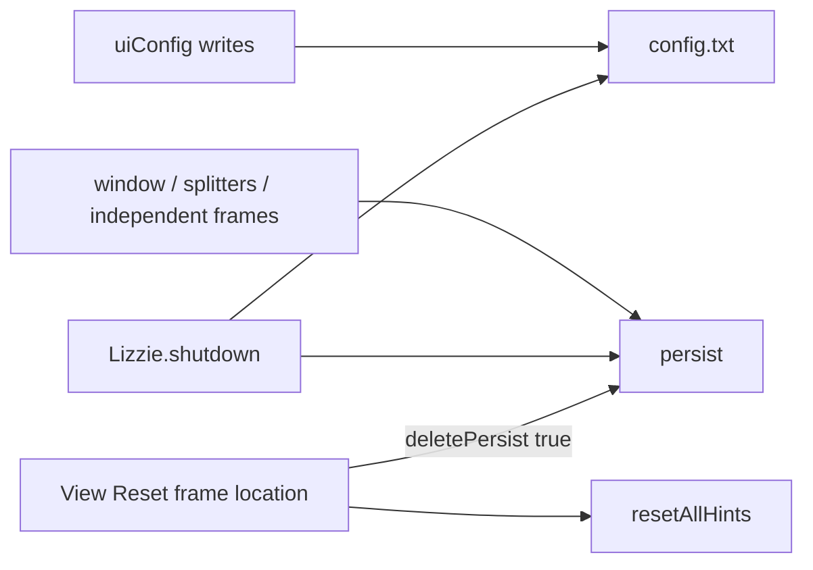

# 02 — Settings, Layout, and Persistence Census

Independent Domain 02 census for [Ticket 02](../issues/02-audit-settings-layout-persistence.md). Destination writes land in `docs/JAVA_CAPABILITY_INVENTORY.md` Domain 02, owned Matrix fields for `PREF-01`, `LAYOUT-01`–`LAYOUT-04`, `WINDOW-01`, `APPEAR-01`, `GUIDE-01`, and `I18N-01`, and Plan phase membership for R5 / R7 / Deferred.

## Sources

| Tree | Path | Commit |
| --- | --- | --- |
| Java Migration Baseline v1 | `/home/dev/dev/weiqi/worktrees/lizzieyzy-next/java-baseline-v1` | `7b4027531c2b26062d0bfc27a040cc550cfbea4d` (verified `git rev-parse HEAD`) |
| Next inventory baseline | this worktree | `18c6d189b8b01069975c4c40ead63a010249cb8c` (Accepted-field comparison only) |
| Current destination docs | this worktree | `e91f56aff0889cd9abd6f63974d1b6acb8b2158e` at census time |

Read-only Java source census. No production edits, tests, builds, or runtime launches. Prior coverage-audit research 02 and Ticket 09–21 dispositions are product-decision sources, not a stop condition for this count.

## Method

1. Walk registered Settings, View, Help-clear, FirstUse, ConfigDialog2, persist files, and first-run / hostname paths from `Menu.java`, `Config.java`, `Lizzie.java`, `LizzieFrame.java`, `FirstUseSettings.java`, `ConfigDialog2.java`, `Input.java`.
2. Count a Capability only when it is one observable user goal. Count an Entry Point only when a control is constructed **and** added, shown, or registered.
3. Hidden JSON keys count only when they back observable behavior. Engine autoload, last-engine, analysis reuse/preload/auto-quit, Lizzie cache, and engine profiles are **04 Entry Points only**.
4. After the census completed, compare the computed count with reference 35. 35 was not used as a stop condition.
5. Runtime-check is allowed only for a named dynamic-visibility, default, persistence, or failure fact not recoverable from frozen source.

Key Java files: `Config.java`, `Lizzie.java`, `gui/Menu.java`, `gui/LizzieFrame.java`, `gui/FirstUseSettings.java`, `gui/ConfigDialog2.java`, `gui/Input.java`, `AppLocale.java`, `ExtraMode.java`, `util/NetworkProxy.java`, `gui/ToolbarPositionConfig.java`, `gui/SetFrameFontSize.java`, `gui/SetBoardSize.java`, `l10n/DisplayStrings.properties`.

## Computed count versus reference

**Computed Domain 02 settings/layout Capabilities: 35.**

Reference 35. Extra rows: none. Missing rows: none.

IDs: `SET-RESET-WINDOW-POS` … `SET-CLEAR-PERSONAL-HISTORY`.

Corrections versus the prior coverage-audit write-up (same 35 IDs; not extra/missing rows):

- `restoreDefaultPanelSizes` body is extracted. It is the narrow panel/board-proportion restore, not window reset.
- ConfigDialog2 Display board-size radios are **19 / 13 / 9 / 7 / 5 / 4 / other**. The `SetBoardSize` dialog (Edit / toolbar / `Ctrl+I`) is **19 / 15 / 13 / 9 / other**.
- English View menu label for window reset is `Reset frame location`.
- `allowCloseCommentControlHint` has load/reset/write and **no consumer**.
- `saveboard` / `save/save` is an internal JSON file, not a Domain 02 Capability.

## Persistence architecture and shared contracts

Java work directory via `WorkDirectoryResolver` / `Config.getWorkDirectory()`. Filenames: `config.txt`, `persist`. `save/save` (`saveboard`) is blunder-threshold storage, not a settings Capability.

### SC-01 Java `config.txt` load / save / merge

- Load: `Config.initializeFromWorkDirectory` (`Config.java:1529-1571`). Missing `config.txt` → write `createDefaultConfig`, `newProfile=true`. Unreadable JSON → `backupUnreadableConfig` then `loadAndMergeConfigdef` rebuild.
- Save: `Config.save` → `writeConfig` temp file plus `ATOMIC_MOVE` or `REPLACE_EXISTING` (`2991-3015`).
- New-profile defaults = `createDefaultConfig` (`2814-2899`) plus `opt*` load fallbacks plus `applyFirstLaunchDefaults` (`3422-3434`). Field initializers are **not** the shipped set.

### SC-02 Java `persist` geometry file

- Load fail → in-memory `createPersistConfig` (`2957-2988`): empty `main-window-position` / `gtp-console-position`, `window-maximized=false`.
- Save: `Config.persist` (`3017-3408`). **No-op if `deletedPersist`** (`3018`).
- `deletePersist(true)` deletes the file, sets `deletedPersist`, shows restart dialog. `deletePersist(false)` deletes, sets `deletedPersist`, reloads empty persist without the dialog (`3469-3485`).

### SC-03 Java shutdown

`Lizzie.shutdown` (`1428-1470`): `persist()` then `save()`. Each failure shows a modal with `Lizzie.save.error` + path.

Immediate `config.save()` in this domain: FirstUse Confirm, Settings language `selectLanguage`, Help clear-personal-data, Appearance `persistUiSettings`, first-run `finalizeAutomaticFirstRunSetup`. Many View/Settings toggles write `uiConfig` only and rely on SC-03.

## Settings/layout-owned Capabilities

| Frozen ID | Observable user goal | Registered Entry Points | Default / persistence | Failure / non-mutation | Source | Runtime-check | Mapping |
| --- | --- | --- | --- | --- | --- | --- | --- |
| `SET-RESET-WINDOW-POS` | Delete persisted window/panel geometry and ask to restart | View `Menu.deletePersistFile` constructed and `viewMenu.add` (`Menu.java:660-670`). EN label `Reset frame location`; ZH `重置界面位置`. | Destructive. Deletes `persist`. Also `resetAllHints`. Does not rewrite theme/language/engine in `config.txt`. | After this action, `persist()` is skipped until restart. Dialog always shown when `showMsg=true`. | `Menu.java:660-670`; `Config.deletePersist` `3469-3485`; `DisplayStrings.properties:848,1235` | Not required | Next redesign: `WINDOW-01`. Automatic recovery only when saved geometry is invalid for current displays. Explicit reset changes window geometry only. |
| `SET-RESTORE-PANEL-SIZES` | Restore splitter / board-proportion sizes without wiping window bounds | View → 面板 `restoreDefaultPanelSizes` constructed and `panel.add` (`Menu.java:1361-1370`) | N/A (restore). Target: `leftoverLeftShare` / `commentHeightShare` / `variationGraphShare` = null; `BoardPositionProportion` = `InFrameLayout.DEFAULT_BOARD_POSITION_PROPORTION`. Writes persist key `board-postion-propotion`. | No immediate `persist()` or `save()`. Shutdown `Config.persist` rewrites live shares (null → remove keys). Window bounds unchanged. | `Menu.java:1361-1370`; `LizzieFrame.java:6773-6786`; `Config.persist` `3087-3100` | Not required | Next redesign: `LAYOUT-03` narrow restore of panel sizes and board proportions only. |
| `SET-RESET-HINTS` | Re-enable a subset of one-time hint flags | Not a menu. Callers: `SET-RESET-WINDOW-POS`; `Lizzie.main` on `firstTimeLoad` / hostname change | Four flags load-default true. Writes `allow-close-comment-control-hint`, `show-replace-file-hint`, `first-load-katago`, `exit-auto-analyze-tip`. Does **not** reset `showNewBoardHint`. | `resetAllHints` does not `save()`. Hostname/first-run path then `finalizeAutomaticFirstRunSetup` → `config.save()`. Window-reset path relies on later SC-01/SC-03. | `Lizzie.resetAllHints` `1518-1527`; callers `Lizzie.java:381-383`, `Menu.java:666-667` | Not required | Next redesign: `GUIDE-01` Reset Guidance (Deferred, Ticket 21) for named Educational Tips only. `firstLoadKataGo` and Abandoned `SET-HINT-COMMENT-CTRL` are not Educational Tips. |
| `SET-FIRST-LAUNCH` | Finish first-run profile setup without the initialize wizard | Startup when `firstTimeLoad` or hostname differs (`Lizzie.java:381-386`) | `first-time-load` load fallback true. Persist `first-time-load`, `host-name`. Host change `deletePersist(false)`. | Save IOException → `startupProfileSaveFailed` repair chip. Hostname lookup 500ms never fakes a machine change. Does **not** open FirstUse. | `Lizzie.java:374-386,894-965`; `Config.applyFirstLaunchDefaults` `3422-3434` | Not required | Abandoned / absorbed: hostname-triggered deletion **Abandoned**. First launch uses defaults of `PREF-01`, `WINDOW-01`, `LAYOUT-04`, `APPEAR-01`. Engine bootstrap remains `SHELL-06` / `REL-C03`. |
| `SET-FIRST-USE` | Settings 初始化设置 dialog | Settings → `Menu.initSettings` → `openFirstUseSettings(false)` (`Menu.java:5314-5323`). Sole caller of `openFirstUseSettings`. | Load-defaults fills the dialog only. Confirm writes listed ui/leelaz keys and `config.save()`. `FirstUseSettings(true)` close-exits-process exists (`750-755`) and has **no caller**. | Confirm parse errors → hint, no write. Save IOException printed, not modal. | `FirstUseSettings.java:33-755`; `Menu.java:5314-5323`; `Lizzie.java:875-878` | Not required | Abandoned / redesign: do not migrate the forced wizard. `PREF-01` categorized Preferences plus contextual entry points. |
| `SET-PERSIST-CONFIG` | Persist ui + leelaz + logging settings to `config.txt` | Any ui/leelaz write; Settings/FirstUse Confirm; Appearance `persistUiSettings`; shutdown `config.save()` | `createDefaultConfig` plus `opt*` plus first-launch. Atomic temp write. | Missing → defaults + `newProfile`. Unreadable → backup + rebuild. Shutdown save fail → modal with path. | `Config.initializeFromWorkDirectory` `1529-1571`; `save` `3532-5339`; `writeConfig` `2991-3015` | Not required | Next redesign: `PREF-01` native durable-preference contract. Do not import Java `config.txt`. |
| `SET-PERSIST-WINDOW` | Persist window bounds, splitter shares, independent frames, GTP console, toolbar height | Implicit on close via `config.persist()`. Reset via `SET-RESET-WINDOW-POS`. Restore via `SET-RESTORE-PANEL-SIZES` (shares only). | Persist default: empty positions, `window-maximized=false`. Field `startMaximized=true` is **not** the persist default. Typo persist key `board-postion-propotion`; uiConfig load `board-postion-proportion`. | Load fail → empty persist. After window reset, writes skipped until restart. Load: `fitWindowBounds` against `availableScreenWorkAreas` (`LizzieFrame.java:1121-1128,1999-2041`); winrate-graph (`1133-1136`); shares (`1139-1150`); GTP `GtpConsolePane.java:78-81`; independent frames in their constructors. | `Config.persist` `3017-3408`; `createPersistConfig` `2957-2988`; `LizzieFrame.java:1121-1150,1999-2041` | Not required | Split: `WINDOW-01` window geometry; `LAYOUT-02` workspace proportions. Neither owns semantic settings from other domains. |
| `SET-LANG` | Choose application locale | Settings language submenu SYSTEM / 简体中文 / 繁體中文 / English / 日本語 / 한국어 / ไทย (`Menu.java:5360-5393`); FirstUse language combo | New profile: OS locale. Load fallback SYSTEM (`use-language=0`). Persist `ui.use-language`. Settings `selectLanguage` writes uiConfig and `config.save()` immediately; FirstUse Confirm also saves. | Save IOException → `printStackTrace`; restart message is still shown. No live `ResourceBundle` replacement: selected bundle is loaded only for `Lizzie.hint.restart` (`Menu.java:6561-6574`). | `AppLocale.java:7-14`; `Menu.java:5360-5393,6561-6574`; `Config.applyFirstLaunchDefaults` `3426-3434` | Not required | Deferred: `I18N-01` Complete Localization. Partial translation is not equivalent language support. |
| `SET-LOOKS` | Java L&F vs system L&F | Settings 界面外观; FirstUse radios | Load `optBoolean(..., !OS.isWindows())`. Persist `ui.use-java-looks`. Restart required. | SC-01. Settings-menu writes `uiConfig` without `save()`. | `Menu.java:5444-5471`; `Config.java:1619`; `FirstUseSettings.java:646-650` | Not required | Swing-only exclusion. Next uses system-integrated chrome. |
| `SET-FRAME-FONT` | UI font size small/middle/big/other | Settings 界面字体大小; other → `SetFrameFontSize` | Load fallback 12. Small=12, middle=16, big=20; other **12–20** (`SetFrameFontSize.java:129`). Persist `ui.frame-font-size`. Apply always shows `menu.setFrameSizeRestart` (`LizzieFrame.setFrameFontSize` 19030–19047); no live UI-font reload. | SC-01. Out-of-range other size refused. | `Menu.java:5395-5442`; `Config.java:1837-1839`; `SetFrameFontSize.java:129`; `LizzieFrame.java:19030-19047` | Not required | Abandoned. Follow system DPI / accessibility scaling. |
| `SET-SOUND` | Toggle move sound and mute-during-sync | Settings `playSound`, `notPlaySoundInSync` (`Menu.java:5475-5496`) | Both load-fallback true. `play-sound` absent from default JSON. Persist `ui.play-sound`, `ui.not-play-sound-insync`. Listeners do not `save()`. | SC-01 | `Menu.java:5475-5496`; `Config.java:102-103,1764-1765`. `Utils.playVoiceFile` when `playSound` at Board place/pass/navigation (`Board.java:2537,2580,2797,2993,4193`). `notPlaySoundInSync` returns before play when `urlSgf` or `syncBoard` (`Utils.java:1117`). Parsers and bulk rewrites temporarily force `playSound=false`. | Not required | Split: `REVIEW-08` default-on persisted sound. Mute-during-sync → `PROV-03` / `READ-02`. `PREF-01` is mechanism only. |
| `SET-CONTRIBUTE-MENU-VIS` | Show or hide the Contribute menubar | Settings `showContribute`; `contributeMenu.setVisible` (`Menu.java:5498-5507,5576-5580`) | Load `show-Contribute` default true. Persist `ui.show-Contribute`. | SC-01 | `Menu.java:5498-5507,5576-5580`; `Config.java:2070` | Not required | Route: `CONTRIB-01` exposes complete service actions only after Accepted; `GAME-09` later adds Open Watch / Close Watch. Do not migrate a general visibility preference. |
| `SET-THEME-BOARD-STYLE` | Japanese vs Chinese-classic board style | View → 外观主题 → 棋盘风格 (`Menu.java:531-558`) | JSON / load default Japanese. Persist `ui.board-style`. Anything else → Japanese. | SC-01 | `Config.java:34-35,1780-1781,2674-2729`; `Menu.java:531-558` | Not required | Next redesign: `APPEAR-01` curated Classic (default) and High Contrast. |
| `SET-THEME-APPLE-CLASSIC-CUSTOM` | Apple-style UI, Morandi colors, custom board image | View Apple / classic color / set+clear custom board (`Menu.java:673-729`). Custom apply/clear call `persistUiSettings()`. | JSON `is-apple-style=false`, `theme=default`. Apple forces `use-morandi-colors`. Persist those plus custom image path. | SC-01. Immediate save on appearance/custom-image. | `Menu.java:673-729,6577-6608`; `Config.java:79,110,1580,1775,2890-2892` | Not required | Abandoned. Curated `APPEAR-01` only. |
| `SET-THEME-DIALOG` | Full theme editor tab | Settings → 主题 → `openConfigDialog2(1)` (`Menu.java:5347-5356`) | Theme `default`. Shadows JSON 85 vs field 75. Persist theme object + ui keys. | SC-01 | `Menu.java:5347-5356`; `Config.readThemeVaule` `2193-2291` | Apply vs live preview matrix (dynamic visibility) | Abandoned. Curated `APPEAR-01` lives in `PREF-01`. |
| `SET-CONFIG-DIALOG-DISPLAY` | Multi-tab comprehensive settings | Settings 综合设置; `Shift+X` `Input.java:583-585` → `openConfigDialog2(0)`; Help About opens tab 2 | N/A as a dialog. Display checkboxes live-toggle View flags; other tabs OK-apply. | SC-01 | `Menu.java:5335-5356`; `Input.java:583-585`; `ConfigDialog2.java:561-651` | Full OK-apply vs live-toggle matrix beyond Display (persistence) | Next redesign: `PREF-01` one categorized Preferences surface plus contextual actions. Each setting’s behavior stays with its owner. |
| `SET-NETWORK-PROXY` | HTTP proxy used by 06/07 traffic | ConfigDialog2 Advanced: Direct / System / Manual (`ConfigDialog2.java:3103-3234`). Host/port **enabled only in Manual**. | Default mode `direct`; host `127.0.0.1` port `7897`. Persist mode/host/port. | SC-01. Manual empty host refused. | `NetworkProxy.java:19-27`; `Config.createDefaultConfig` `2883-2885`; `ConfigDialog2.java:3227-3253` | Not required | Split: update traffic → `REL-03` OS/system proxy. Remote-provider → Provider Network Policy on `PROV-01`–`PROV-07`. Java `direct`/`system`/`manual` UI/keys Abandoned. |
| `SET-BOARD-SIZE` | Default board size | ConfigDialog2 Display radios **19/13/9/7/5/4/other** (`438-488`). `SetBoardSize` dialog **19/15/13/9/other** from Edit / toolbar / `Ctrl+I` (`Menu.java:3945-3946,6110-6114`; `Input.java:501`). `saveOtherBoardSize` for other. | Default 19. Other size 21×21. Persist `board-size`, `other-size-width/height`. Commented `<2` clamp is **not live**. | SC-01 | `ConfigDialog2.java:438-488`; `SetBoardSize.java:123-156`; `Config.java:2887,2030-2031,3789-3794` | Not required | Route: `SGF-10` New Document parameter; `GAME-04` match start. Does not destructively resize a populated tree. |
| `SET-LAYOUT-MODE` | ExtraMode / classic / custom layouts | View 布局模式 Alt+1..9 (`Menu.java:1778-2014`) | JSON ExtraMode Normal. Unknown → Normal. Persist `extra-mode`, `is-classic-mode`, `custom-layout-1/2`. | SC-01 | `ExtraMode.java`; `Menu.java:1778-2014`; `Config.java:1579-1581,3864-3869` | Per-mode panel matrix (dynamic visibility) | Abandoned. Replaced by one adaptive workspace (`LAYOUT-01`/`LAYOUT-02`/`LAYOUT-04`). |
| `SET-LAYOUT-PANELS` | Show/hide panels and independent frames | View 面板 including subboard/winrate/comment/variation/list/captured/status/GTP, independent main/sub, hawk-eye (`panel.add(hawkEye)` `1338-1347`), SuggestionList; ConfigDialog2 Display live toggles | Default JSON: status/comment/variation/subboard/captured/winrate on. Persist show-* keys; independent/GTP geometry in persist. | SC-01 + SC-02 | `Menu.java:1099-1369`; `Config.java:2844-2867,1650` | Not required | Next redesign: `LAYOUT-04` Rail Visibility (left/right collapse only). Do not migrate independent frames or arbitrary placement. Accepted `UI-01` is not expanded. |
| `SET-LAYOUT-TOOLBAR` | Toolbar visibility, wrap, order | View 工具栏: top separated/combined/hidden, auto-wrap (`Menu.java:4352-4455`); `ToolbarPositionConfig` 显示顺序设置 (`4557`) | `showTopToolBar=true`, `autoWrapToolBar=true`. Persist flags; height in persist. | SC-01 + SC-02 | `Menu.java:487,4352-4557`; `Config.java:1103-1104,1904-1905,3070-3076` | Not required | Abandoned. Next toolbar stays fixed. `UI-05` claimed rows remain unchanged. |
| `SET-BOARD-POS` | Nudge main-board splitter left/right | View 主棋盘位置 `[` `]`; `Input` `VK_OPEN_BRACKET` / `VK_CLOSE_BRACKET` (`751-757`) | Field default 4. Nudge ±1, clamp 0–8 (`nudgeBoardPositionProportion`). Persist typo `board-postion-propotion`; uiConfig `board-postion-proportion`. | SC-01 + SC-02 | `Menu.java:490-516`; `Input.java:751-757`; `LizzieFrame.java:6788-6801`; `Config.persist` `3087`; load `1801` and `LizzieFrame.java:1139` | Not required | Next redesign: `LAYOUT-01` / `LAYOUT-02` / `LAYOUT-03`. |
| `SET-COORDS` | Show board coordinates | View 坐标(C); ConfigDialog2 Display | JSON / load default true. Persist `ui.show-coordinates`. `toggleCoordinates` writes uiConfig only (no `save()`). | SC-01 | `Menu.java:518-529`; `Config.java:2669-2672,1798,2863` | Not required | Route: `REVIEW-07` persists the Next boolean (default on) through `PREF-01`. |
| `SET-MOVE-NUMBERS` | Choose how move numbers render | View 手数(M) modes including custom `MovenumberDialog`; ConfigDialog2 radios | JSON `show-move-number=false`, `only-last-move-number=1`. Persist those plus branch/from-one flags. `MovenumberDialog`: empty or over-length text → 0; `<=0` refused with tooltip and red field; no other upper bound (`MovenumberDialog.java:106-134`). | SC-01 | `Menu.java:561-899`; `Config.java:39-44,1573-1578,2843,2891-2893`; `MovenumberDialog.java:106-134` | Not required | Route: `REVIEW-07` persists the Next all-move-number boolean (default off). Java last-N / custom / from-one / branch-numbering **Abandoned**. |
| `SET-SUGGESTION-INFO` | Candidate overlay WR/visits/score, order, delay, max-red | View 选点信息; FirstUse WR/visits/score | JSON `show-best-moves=true`, `limit-max-suggestion=10`. Persist ui + leelaz keys. Search/limit visits are 04. | SC-01 | `Config.java:2826,2861,1736-1738,1862-1866`; `FirstUseSettings.java:471-519`; `Menu.java:1011-1040` | Not required | Route: `ANA-04` supported fields, defaults, and persistence. Ticket 11 abandons Java delay, black/white filtering, PV-visits, branch-length, and other granular review display preferences. Do not expand `UI-03`. |
| `SET-NEXT-MOVE` | Next-move marker none/simple/info plus min playouts | View 下一手 including `minPlayoutsForNextMove` (`Menu.java:574-658`) | JSON `show-next-moves=true`. Load blunder true; min playouts 30. Two booleans + min-playouts, not a Java enum. | SC-01 | `Menu.java:574-658`; `Config.java:1729,1620-1622,2865` | Not required | Next redesign: `ANA-10` persisted `Off` / `Variations` / `Graded`. Do **not** expand `ANA-04`, `UI-01`, or `PREF-01`. |
| `SET-WINRATE-GRAPH` | Graph perspective, WR/score lines, blunder bar, mouse-over WR | View 胜率图设置 (`Menu.java:1373-1394` and related flags) | Blunder bar JSON false plus one-time hide migration. Lines default true. Persist ui flags; persist `winrate-graph` written `3383-3385` and loaded `LizzieFrame.java:1133-1136` (missing or length ≠ 1 → skip; mode from array). | SC-01 + SC-02 | `Menu.java:1373-1394`; `Config.java:2850,2144-2158,1834-1836,3383-3385`; `LizzieFrame.java:1133-1136` | Not required | Next redesign: `ANA-11`. Chart presence stays `UI-01`. Click-to-jump stays `REVIEW-01`. Do **not** expand `ANA-04`, `UI-01`, or `PREF-01`. |
| `SET-SUBBOARD` | Sub-board content: variation / raw / heatmap | View 小棋盘设置; FirstUse mouse-over-subboard radios | JSON `show-subboard=true`. Heat flags load false. Persist those ui keys. Heatmap **data** is 04. | SC-01 | `Menu.java:1618-1771`; `Config.java:1597-1598,2097,2866` | Four-sub vs single heatmap target (dynamic visibility) | Next redesign / Abandoned: `ANA-12` Variation / Raw. Heatmap-on-sub and mouse-over freeze Abandoned. Mini-board presence stays `UI-01`. |
| `SET-MAIN-PANEL` | Large subboard/WR, append WR to comment, names on board, comment control, always-on-top, related hint toggles | View 主界面设置 (`Menu.java:901-1007`); `Input` Ctrl+F / Ctrl+W / Ctrl+Z | JSON large flags false. `append-winrate-to-comment=true`. Persist ui keys. Hint flags also `SET-HINT-*`. | SC-01 | `Menu.java:901-1007`; `Config.java:2535-2576,1794-1797,2894` | Not required | Split: `REVIEW-09` HUD player names; `WINDOW-02` main-window always-on-top. Abandoned: mutually exclusive large-sub / large-WR presets; writing generated winrate/score/playouts into personal `C`. Do **not** expand `UI-01`, `SGF-05`, `LAYOUT-01`, `WINDOW-01`, `REVIEW-07`, or `SGF-13`. |
| `SET-KATA-DISPLAY` | Score+komi, estimate placement/styles, ownership, shortcut | View KataGo settings; FirstUse score+komi radios | Estimate off; on-main/on-sub true. Persist ui keys. Computation is 04. | SC-01 | `Menu.java:1773-1776`; `Config.java:1595-1617,1724-1725`. Commented score-perspective items are **not** Entry Points. | Not required | Split: `ANA-04` keeps capability-gated ownership/policy (and candidate-limit). Remaining Java estimate-style / placement granularity abandoned with Ticket 11. Do not expand `UI-03`. |
| `SET-HINT-NEWBOARD` | “No notice again” for new-board warning | 主界面设置 checkbox (`Menu.java:973-982`); new-board dialog `LizzieFrame.java:20376-20392`. **Not** reset by `resetAllHints`. | Load default true. Persist `ui.show-new-board-hint`. | SC-01 | `Config.java:1173,1987`; `Menu.java:973-982`; `LizzieFrame.java:20376-20392` | Not required | Next redesign, domain 03: non-dismissible dirty-state gate of `SGF-07` / `SGF-10`. Not `GUIDE-01`. |
| `SET-HINT-REPLACE` | Confirm-replace-file hint | 主界面设置 checkbox (`Menu.java:984-993`); File replace dialog `LizzieFrame.java:4116-4141`; re-enabled by `SET-RESET-HINTS` | Default true. Persist `ui.show-replace-file-hint`. Reset **yes**. | SC-01 | `Config.java:1172,1986`; `Menu.java:984-993`; `LizzieFrame.java:4116-4141`; `Lizzie.resetAllHints` `1520,1524` | Not required | Next redesign, domain 03: same non-dismissible dirty-state replacement gate (`SGF-07`). Not education. |
| `SET-HINT-COMMENT-CTRL` | Hint when closing comment controls | Reset via `SET-RESET-HINTS` only. No constructed menu consumer. | Default true. Persist `ui.allow-close-comment-control-hint`. Reset **yes**. | SC-01. Flag is never read outside load/reset/write. | `Config.java:1137,1657`; `Lizzie.resetAllHints` `1519,1525` | Not required | Abandoned. |
| `SET-HINT-AUTOANALYZE` | Tip when leaving auto-analyze | Auto-analyze exit `LizzieFrame.java:12523-12544` (`JOptionPane` dialog when `exitAutoAnalyzeByPause` and `exitAutoAnalyzeTip`); reset via `SET-RESET-HINTS` | Default true. Persist `ui.exit-auto-analyze-tip`. Related `exit-auto-analyze-by-pause` is a separate pref, not in `resetAllHints`. | SC-01 | `Config.java:1282-1283,2044-2045`; `LizzieFrame.java:12523-12544`; `Lizzie.resetAllHints` `1522,1526` | Not required | Abandoned with `CAP-04-ANA-08`. Do not bind `GUIDE-01` to this path. |
| `SET-CLEAR-PERSONAL-HISTORY` | Remove stored personal histories without deleting persist or engines | Help → `clearAllPersonalData` with confirm (`Menu.java:5225-5253`) | N/A. Removes `fox-recent-searches`, `recent-files`, `batch-analysis-history`, `share-history` then `config.save()`. Does **not** remove `recent-file-paths`. | Cancel → no-op. On OK, four keys are removed from in-memory `uiConfig` first, then `config.save()`. Save IOException is printed; the success dialog is still shown. Durable file stays unchanged until a later successful save. | `Menu.java:5225-5253` | Not required | Split by data owner: `SGF-09`; `PROV-02`/`PROV-04` (and Yike recents under `PROV-01`/`PROV-03`); batch-analysis history follows deferred `ANA-07`. No broad preference reset. Not a domain-07 item (`REL-C13`). |

## Explicit non-rows (not extra Domain 02 Capabilities)

| Surface | Why it is not a Domain 02 Capability |
| --- | --- |
| Settings 引擎 / 一键设置 / 远程计算 / 引擎规则 / 引擎参数 | Constructed and added; semantic owners are Domain 04 (`ENG-01` / `ENG-06` / `ENG-09` / Deferred `RCOMP-01`). Listed as 04 Entry Points only. |
| `saveboard` / `save/save` | Internal blunder-threshold JSON. No settings Entry Point. |
| `confirm-exit` | Default-config key never read (Domain 01). |
| Help Diagnostics / About / Check Update | Domain 07. Clear personal data is `SET-CLEAR-PERSONAL-HISTORY`. |
| `needReopenFirstUseSettings` | Written false on first-run and FirstUse confirm; never opens the wizard. |
| Commented ConfigDialog2 score-perspective items; commented `openConfigDialog` on Ctrl+X | Not added / not live. |
| Logging settings | `REL-C10` / `REL-09`. |

## Owner routing (this ticket records links only)

| Concern | Owner | Domain 02 records |
| --- | --- | --- |
| Durable file / Preferences surface | `PREF-01` | `SET-PERSIST-CONFIG`, `SET-CONFIG-DIALOG-DISPLAY`, `SET-FIRST-USE` |
| Window geometry | `WINDOW-01` | `SET-RESET-WINDOW-POS`, `SET-PERSIST-WINDOW` (window half) |
| Workspace proportions / rails | `LAYOUT-01`–`LAYOUT-04` | `SET-RESTORE-PANEL-SIZES`, `SET-PERSIST-WINDOW` (proportion half), `SET-BOARD-POS`, `SET-LAYOUT-PANELS` |
| Appearance | `APPEAR-01` | `SET-THEME-BOARD-STYLE` |
| Localization | `I18N-01` (Deferred) | `SET-LANG` |
| Educational tips | `GUIDE-01` (Deferred) | `SET-RESET-HINTS` |
| Coordinates / move numbers | `REVIEW-07` | `SET-COORDS`, `SET-MOVE-NUMBERS` |
| Review sound | `REVIEW-08` | `SET-SOUND` (play) |
| Always-on-top / HUD names | `WINDOW-02` / `REVIEW-09` | `SET-MAIN-PANEL` split |
| Next-move / chart / sub-board | `ANA-10` / `ANA-11` / `ANA-12` | `SET-NEXT-MOVE`, `SET-WINRATE-GRAPH`, `SET-SUBBOARD` |
| Candidate / Kata overlay | `ANA-04` | `SET-SUGGESTION-INFO`, `SET-KATA-DISPLAY` |
| Board size | `SGF-10` / `GAME-04` | `SET-BOARD-SIZE` |
| Dirty-state hints | `SGF-07` / `SGF-10` | `SET-HINT-NEWBOARD`, `SET-HINT-REPLACE` |
| Proxy | `REL-03` / `PROV-01`–`PROV-07` | `SET-NETWORK-PROXY` |
| Contribute visibility | `CONTRIB-01` / `GAME-09` | `SET-CONTRIBUTE-MENU-VIS` |
| Clear recents | `SGF-09` / provider owners / `ANA-07` | `SET-CLEAR-PERSONAL-HISTORY` |

Foreign contracts were not edited.

## PREF / LAYOUT / WINDOW / APPEAR / GUIDE / I18N authority split

| Item | Matrix-owned | Plan-owned |
| --- | --- | --- |
| `PREF-01` Durable Preferences and Preferences surface | Status Partial. Repository: engine profiles and selected preferences persist. Live: pending native restart smoke. Remaining gap: missing-file defaults, unreadable isolation, atomic write, categorized surface; owner-domain settings must not be absorbed. Acceptance: missing loads defaults; unreadable isolated; explicit setting durable only after atomic write; Java `config.txt` not imported. **Depends on: —** | R5 first Delivery Order item. R5 / R6 / R7 / R10 Migration Phase Gates consume Accepted `PREF-01`. Not a catch-all settings phase. |
| `LAYOUT-01` Draggable workspace proportions | Status Missing. Depends on `UI-01`. | R7 Delivery Order 1. |
| `LAYOUT-02` Persisted workspace proportions | Status Missing. Depends on `LAYOUT-01`, `PREF-01`. | R7 Delivery Order 2. |
| `LAYOUT-03` Restore panel sizes | Status Missing. Depends on `LAYOUT-01`. | R7 Delivery Order 2 with `LAYOUT-02`. |
| `LAYOUT-04` Rail visibility | Status Missing. Depends on `PREF-01`. | R7 Delivery Order 3. |
| `WINDOW-01` Window geometry and reset | Status Missing. Depends on `PREF-01`, `LAYOUT-02`. | R7 Delivery Order 3. Invalid-display recovery is Next contract; Java already `fitWindowBounds`. |
| `APPEAR-01` Curated appearance | Status Partial. Depends on `PREF-01`. | R7 Delivery Order 3. |
| `GUIDE-01` Contextual guidance | Status Deferred. Depends on `PREF-01`. | Unnumbered Deferred queue. Promotion Gate: later disposition names a Guidance Producer whose owner is in a numbered phase. Not an R7 member or exit. |
| `I18N-01` Complete localization | Status Deferred. Depends on `PREF-01`. | Unnumbered Deferred queue. Admit only after functional migration. |

Plan R7 Delivery Order (Plan only; not a second Matrix start-prerequisite set): `LAYOUT-01` → `LAYOUT-02`/`LAYOUT-03` → `LAYOUT-04`/`WINDOW-01`/`WINDOW-02`/`APPEAR-01`.

## Remainder and Accepted-field preservation

Every Domain 02 Capability maps to one supported Parity Item, an explicit split list, an owner-routed mapping, or an explicit exclusion. There is no settings or layout remainder. No Java configuration import or Swing look-and-feel implementation claim.

Original sixteen Accepted items versus Next `18c6d189b8b01069975c4c40ead63a010249cb8c` keep ID, observable scope, status, evidence, remaining gap, and acceptance: `BASE-01`, `BASE-02`, `SGF-01`–`SGF-06`, `RULE-01`, `UI-01`, `UI-03`, `UI-04`, `UI-05`, `ENG-01`, `ANA-05`, `READ-03`. `UI-02` remains Partial. This ticket does not expand `UI-01` / `UI-05` or edit foreign `ANA-*` / `REVIEW-*` / `SGF-*` / `REL-*` / `PROV-*` contracts.

Repository evidence is never written as Installed Live. `GUIDE-01` and `I18N-01` live evidence remains `Not required until admitted`.
