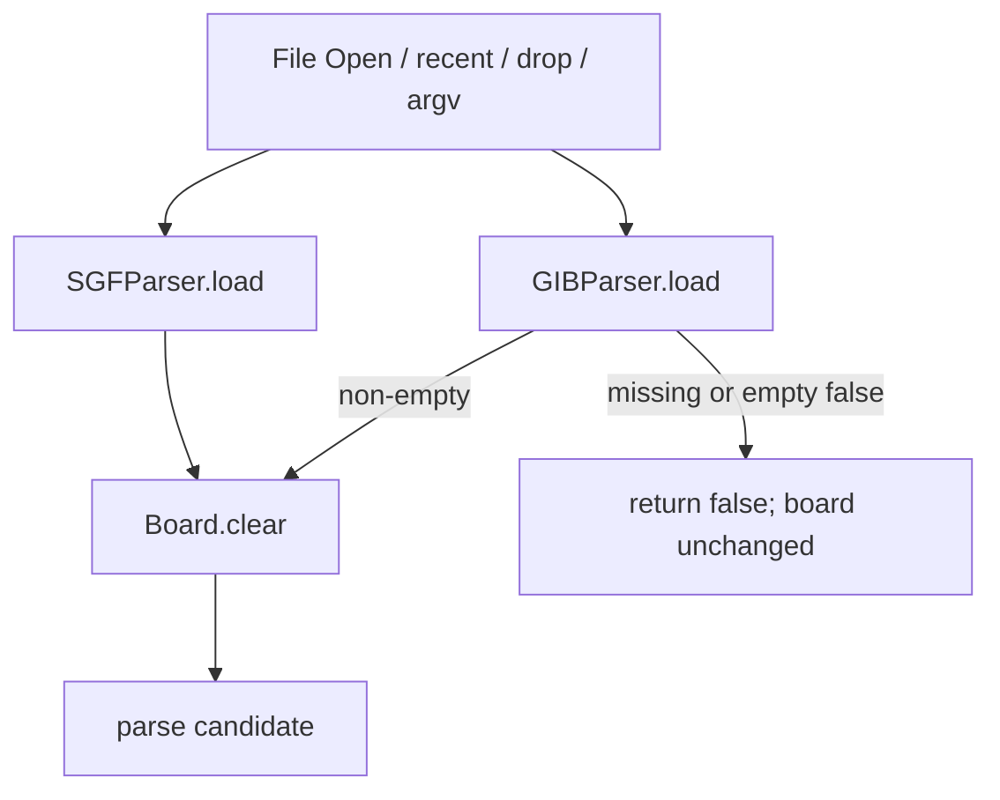

# 03 — SGF, Board, and Review Census

Independent Domain 03 census for [Ticket 03](../issues/03-audit-sgf-board-review.md). Destination writes land in `docs/JAVA_CAPABILITY_INVENTORY.md` Domain 03, owned Matrix fields for `SGF-07`–`SGF-14`, `REVIEW-01`–`REVIEW-03`, `REVIEW-07`, `REVIEW-08`, `EXPORT-01`, `EXPORT-02`, and Plan R5 / R6 / Deferred membership already recorded.

## Sources

| Tree | Path | Commit |
| --- | --- | --- |
| Java Migration Baseline v1 | `/home/dev/dev/weiqi/worktrees/lizzieyzy-next/java-baseline-v1` | `7b4027531c2b26062d0bfc27a040cc550cfbea4d` (verified `git rev-parse HEAD`) |
| Next inventory baseline | this worktree | `18c6d189b8b01069975c4c40ead63a010249cb8c` (Accepted-field comparison only) |
| Current destination docs | this worktree | `e91f56aff0889cd9abd6f63974d1b6acb8b2158e` at census time |

Read-only Java source census. No production edits, tests, builds, or runtime launches. Prior coverage-audit research 03 and Ticket 10 / 17 / 20 / 27 / 28 dispositions are product-decision sources, not a stop condition for this count. Supporting Entry Point proof: [`_03-entrypoints.md`](_03-entrypoints.md).

## Method

1. Walk registered File / Edit / Game / View, right-click, toolbar, top-strip, `Input`, comment pane, and variation-tree click surfaces from `Menu.java`, `LizzieFrame.java`, `Input.java`, `BottomToolbar.java`, `RightClickMenu.java`, `RightClickMenu2.java`.
2. Count a Capability only when it is one observable user goal. Count an Entry Point only when a control is constructed **and** added, shown, or registered.
3. Trace load/save/parse/setup/markup/try-play/score/sound in `SGFParser.java`, `GIBParser.java`, `Board.java`, `Config.java`, `ScoreResult.java`.
4. After the census completed, compare the computed count with reference 35. 35 was not used as a stop condition.
5. Runtime-check is allowed only for a named dynamic-visibility, default, persistence, or failure fact not recoverable from frozen source. Provider fetch and engine-produced analysis are links, not extra Domain 03 Capabilities.

Key Java files: `gui/Menu.java`, `gui/LizzieFrame.java`, `gui/Input.java`, `gui/BottomToolbar.java`, `gui/RightClickMenu.java`, `gui/RightClickMenu2.java`, `gui/ScoreResult.java`, `gui/GameInfoDialog.java`, `gui/AutoPlay.java`, `rules/SGFParser.java`, `rules/GIBParser.java`, `rules/Board.java`, `Config.java`, `teacher/TeacherCommentCodec.java`, `teacher/CommentDisplayRenderer.java`.

## Computed count versus reference

**Computed Domain 03 SGF/board/review Capabilities: 35.**

Reference 35. Extra rows: none. Missing rows: none.

IDs: Accepted `SGF-03-RT` … `SGF-03-ACTIONS` (12) plus adjacent `SGF-03-ADJ-OPEN` … `SGF-03-ADJ-COMMENT-LAYERS` (23). `TRYPLAY / SCORE / LADDER` remains one heading with three split keys.

Corrections versus the prior coverage-audit write-up (same 35 IDs; not extra/missing rows):

- `SGFParser.load` clears the board **before** exists / readable / empty / parse checks. Failed SGF open is mutating in Java. `GIBParser.load` checks missing/empty **before** clear.
- `openFile` assigns `curFile` after `loadFile` even when load returns false.
- Recents persist `uiConfig` `recent-file-paths`, cap **5**. Missing recent still calls `loadFile(recent, true, false)` → SGF clear-then-fail. Help clear-personal-data removes `recent-files`, not `recent-file-paths`.
- File `newEmptyBoard` and toolbar New are in-place `board.clear(false)` and do **not** reset `curFile`. Confirm runs when the current node has a previous or next child. Edit 清空棋盘 is `Board.clear(false)` without that dialog.
- `readKomi` field and load fallback **true**; `read-komi` is absent from `createDefaultConfig`.
- GIB handicap 5/7 places tengen `(9,9)` then decrements and places the remaining stones from `handicapPlacement`.
- `deleteMove` at root calls `clearBoardState(false)`.
- Markup type 2 (circle) button is constructed and **not** added. Types 1/3/4/5/6 plus eraser/clear/paint are added when markup tools are showing.
- `play-sound` load fallback **true**, absent from `createDefaultConfig`. `Utils.playVoiceFile()` on successful local place/pass and forward `history.next`.
- `use-territory-in-score` load fallback **false** (area scoring).
- Image export writes `last-image-folder` on chooser `APPROVE_OPTION` before overwrite confirm and before encode/write.

## Shared Java intake facts (baseline evidence, not Next import)

Next `SGF-07` is parse-and-validate **before** commit. Java SGF open is not that contract.

## Frozen Accepted R1/R2 Capabilities

| Frozen ID | Observable user goal | Registered Entry Points | Default / persistence | Failure / non-mutation | Source | Runtime-check | Mapping |
| --- | --- | --- | --- | --- | --- | --- | --- |
| `SGF-03-RT` | Parse → edit → serialize → reparse preserves tree meaning | File Open / Save / Save As / clipboard copy serialize / sample load | FF[4]-family SGF; board size from `SZ` (parser default 19); `loadSgfLast` default **false** | Unreadable/empty: `SgfObservation` + `false`. Java SGF load already cleared the board (see OPEN) | `SGFParser.java` 51–142; `SGFParserSemanticRoundTripTest.java` 28–80; `SGFParserEmptyEngineSaveTest.java` 14–51 | Not required | Frozen Accepted: `SGF-01`. GIB/raw-save/unknown-property extras are not this item. |
| `SGF-03-DTO` | Complete tree + `NodePath` as location | N/A (wire) | Root `[]`; first-child mainline to leaf | Invalid path → `InvalidNodePath`; no document → `NoCurrentGame` | `BoardHistoryList` / `BoardHistoryNode`; sibling structure in `SGFParserSemanticRoundTripTest` 43–62 | Not required | Frozen Accepted: `SGF-02` |
| `SGF-03-NAV` | Parent / child / sibling / first / last / page jumps | Arrows / Page / Home / End; Edit jump items; toolbar nav; wheel; right-click previous | Session cursor. `load-sgf-last` default false | Illegal path rejected | `Input.java:268-282,326-410,560-581`; `LizzieFrame.java:18882-19019`; `Menu.java:3842-3880`; `BottomToolbar.java:1266-1384` | Not required | Frozen Accepted: `SGF-03`. Click-on-tree / try-play jumps are adjacent. |
| `SGF-03-EDIT` | Play a legal point or review pass as a child; remove selected non-root variation | Game 停一手(P) `board.pass()`; board left-click; Shift+Delete / Edit 删除分支. `P` during Human SL → **05** | Color = selected node’s player-to-play. Dirty until Save | Occupied/suicide/simple-ko reject without mutation. Root cannot be removed as a variation | `Menu.java:3141-3149`; `Input.java:431-437,678-689`; GIB `SKI` → pass | Not required | Frozen Accepted: `SGF-04`; claimed `UI-05` `P` and Shift+Delete. Delete-one-move / setup / drag / set-as-main are successors. |
| `SGF-03-CMT` | Edit/clear personal comment; generated info does not overwrite personal field | Comment pane `setCommentEditable` | Empty comment. Persist `C` | Next no-op if unchanged; empty trim removes `C` | `LizzieFrame.java:9890-9916`; `TeacherCommentCodec.java:7-75`; `CommentDisplayRenderer.java:11-49` | Not required | Frozen Accepted: `SGF-05`. Teacher/match-info/engine-game layers are `SGF-03-ADJ-COMMENT-LAYERS`. |
| `SGF-03-SAVE` | Serialize current tree to current path or chosen path | File Save / Save As; Ctrl+S / S; toolbar save | Timestamp-ish filename from GameInfo or `yyyyMMddHHmmss`; last-folder in `filesystem`. `.gib` cannot overwrite as GIB | `saveFileFailed` toast. Cancel = dialog not APPROVE | `LizzieFrame.java:4042-4330`; `Menu.java:225-245` | Not required | Frozen Accepted: `SGF-06`. Raw/branch/image outputs are adjacent. |
| `SGF-03-RULE` | Occupied, capture, suicide, pass, simple ko; rejected edit leaves tree unchanged | Same as `SGF-03-EDIT` | Simple ko; suicide forbidden in Next `go-core` | Atomic reject | `GIBParser.place`/`pass` 94–105; `src/test/java/featurecat/lizzie/rules/*` | Not required | Frozen Accepted: `RULE-01` for frozen R1 fixtures. Engine-rule UI is 04/02. |
| `SGF-03-CHROME` | Workbench: board, analysis/comment rail, win-rate, candidates, mini-board | Main window after open | Next fixed 228px/260px rails (`UI-01`) | N/A | `LizzieFrame` layout (`showComment` / `showVariationGraph` / `showSubBoard`) | Not required | Frozen Accepted: `UI-01`. Resizable splitters → `LAYOUT-01`. |
| `SGF-03-BOARD-INTENT` | Pointer/keyboard play intent updates selected node without blocking render | Board click; board-focused arrows+Enter/Space; outside-board arrows navigate | N/A | Occupied: status text, position unchanged | `Input.java:19-80` | Not required | Frozen Accepted / Partial residual: `UI-02`. Remaining gap is engine-event delivery during a mutation (**04**). |
| `SGF-03-HOVER` | Hover previews a candidate without committing; scope change drops stale hover | Pointer over candidate; leave/click/scope change cancels | Java default **200 ms**. Next accepted contract **120 ms** | Scope mismatch refuses publish | `SuggestionHoverIntent.java:1-65`; `AnalysisCandidateValidator.java:10-65`; `LizzieFrame.java:8810-8849` | Not required | Frozen Accepted: `UI-03` at Next 120 ms. Java 200 ms + delay dialog is `SGF-03-ADJ-HOVER-DELAY`. |
| `SGF-03-NOENGINE` | Open, inspect, edit, save, exit without engine profile/process | All File/SGF/board/review controls | Next `engineLabel` default `未加载引擎` | Engine-only actions unavailable/explanatory | `SGFParserEmptyEngineSaveTest.java:14-37` | Not required | Frozen Accepted: `UI-04` |
| `SGF-03-ACTIONS` | One visible control + intended shortcut for the claimed R2 set | `Input.keyPressed`; File/View/Game/Edit/toolbar claimed rows | Coordinate/move-number toggles persist via `REVIEW-07` in Next | `shouldIgnoreApplicationShortcut` skips when typing in fields | `Input.java:312-823`; Ticket 07 claimed inventory | Not required | Frozen Accepted: `UI-05` for claimed rows only. Disabled `尚未接入` rows are adjacent. |

## Adjacent successor surfaces

| Frozen ID | Observable user goal | Registered Entry Points | Default / persistence | Failure / non-mutation | Source | Runtime-check | Mapping |
| --- | --- | --- | --- | --- | --- | --- | --- |
| `SGF-03-ADJ-OPEN` | Choose a kifu file and install it as the current game | File 打开 `fileMenu.add` 205; `O`; toolbar `openfile`; top-strip `btnOpen`; `loadFile` after chooser | last-folder from persisted `filesystem` | **No** dirty confirm on Open. Refuses during engine/human match. `SGFParser.load` clears first; missing/empty/parse-false leaves a cleared board. `openFile` still sets `curFile` when `file.length > 0`. Sound flag restored on failure; later open-failed message | `Menu.java:196-205`; `Input.java:532-541`; `LizzieFrame.java:4332-4365,4974-5030`; `SGFParser.java:51-112` | Not required | Next redesign (10): `SGF-07`. Native activation / drop invoke this seam through `APP-01`/`APP-02`. |
| `SGF-03-ADJ-GIB` | Load `.gib` (Tygem) into the current board | Same Open chooser (`*.gib`); `loadFile` extension branch | Names “Player 1/2”; komi 7.5 if not parsed. `readKomi` gates GIB komi. Save as SGF only | Missing/unreadable/empty → false **before** clear. Non-empty clears then parse. Handicap >9 clamped to 9; 5/7 place tengen extra. Save cannot overwrite `.gib` | `GIBParser.java:1-124`; `LizzieFrame.loadFile` 4994–4996; `GIBParserTest.java:1-80` | Not required | Equivalent (10): `SGF-08` through `SGF-07`. Import-only. |
| `SGF-03-ADJ-RECENT` | Re-open a recently used kifu | File → 最近打开 `fileMenu.add` 208; `updateRecentFileMenu` 6721–6744 | Cap **5**. Persist `ui.recent-file-paths`. Newest last; menu lists newest first | `loadFile(recent, true, false)` does not rewrite recents/last-folder. Missing path still runs `SGFParser.load` (clears). Help wipe removes `recent-files`, **not** this key | `Config.java:2161-2191`; `Menu.java:207-210,5225-5253,6721-6744`; `LizzieFrame.loadFile` 5005–5008 | Not required | Equivalent (10): `SGF-09` via `SGF-07` and `PREF-01`; owns clearing this history. |
| `SGF-03-ADJ-CLIP` | Copy current tree as SGF text; paste SGF text as current game | File copy/paste `fileMenu.add` 374/387; Ctrl+C / Ctrl+V | N/A | Copy exception logged. Empty / not-`isSGF` ignored. Confirm-if-stones; cancel leaves game | `LizzieFrame.java:9736-9801`; `Menu.java:371-396`; `Input.java:544-550,643-650` | Not required | Split (10): copy stays claimed `UI-05`. Paste belongs to `SGF-07`. |
| `SGF-03-ADJ-SAVE-MORE` | Save raw SGF, raw+comments, current branch flattened, board/sub-board/winrate images; clipboard board images | File → 更多保存; Ctrl+Shift+S / Ctrl+Alt+S / Alt+S / Shift+S / Shift+Alt+S; File copy-board / copy-subboard Shift+C / Alt+C | Image chooser starts at `last-image-folder` (fallback `last-folder`), no prefilled name. Writes `last-image-folder` on `APPROVE_OPTION` **before** overwrite/write | Existing-file confirm cancel returns after the directory already changed. Unsupported format dialog. Some IO failures swallowed after that write | `Menu.java:247-360`; `Input.java:506-529`; `LizzieFrame.java:4042-4112,4256-4330,10652-10918` | Not required | Abandon / Deferred (10, 27): abandon Swing raw/raw-comment and Sub-Board Image Export. Defer `EXPORT-01` branch SGF, `EXPORT-02` review-board image, `EXPORT-03` winrate chart (04). Clipboard board image is not a separate ID. |
| `SGF-03-ADJ-TEMP` | Named slot save/load with thumbnail; optional resume; autosave on exit | File → 存档与读档 `showTempGamePanel`; toolPanel `saveLoad` when `showSaveLoadMenu`. File › Resume is **commented** and is not an Entry Point | `auto-save-exit` default **true**; `resume-previous-game` default **false**. Slot files under `save/` | Missing bmp/sgf: stack trace / skip. Startup resume is **01** `SHELL-05` | `Menu.java:327-339,412-425`; `LizzieFrame.java:4523-4534,13608-13670`; `TempGameData.java`; `Config.java:1703-1704,2881` | Not required | Absorbed / Abandoned (10): `APP-04` owns automatic current-game recovery. Abandon manual thumbnail slots and a second autosave-on-exit model. |
| `SGF-03-ADJ-NEW` | Replace current game with an empty document | File 新建棋盘 / toolbar / top-strip `newEmptyBoard`; Edit 清空棋盘 Ctrl+Home `Board.clear(false)`. Java `N` is **05** genmove | Next empty `(;GM[1]FF[4]SZ[19]KM[7.5]PB[黑]PW[白])`. Java does **not** reset `curFile` | `newEmptyBoard` confirm-cancel (when node has prev or next) returns without `clear`. Match play refuses File new | `Menu.java:186-194,3809-3817`; `Input.java:565-569`; `LizzieFrame.java:20374-20420`; `BottomToolbar.java:1361-1366` | Not required | Next redesign (10): `SGF-10` one New Document meaning via `SGF-07`. |
| `SGF-03-ADJ-KOMI` | Toggle applying SGF/GIB komi into the current game | File checkbox `fileMenu.add` 410 | Field and `optBoolean("read-komi", true)`. Absent from `createDefaultConfig`. Persist `ui.read-komi`. Even when off, setup/handicap SGF still applies parsed root KM | N/A | `Menu.java:398-410,459-464`; `Config.java:96,1741`; `SGFParser.java:150-174`; `GIBParser.java:107-109` | Not required | Next redesign / Abandoned (10): parsed root `KM` is authoritative (`SGF-07`/`SGF-08`). Absent KM uses `SGF-10` default. Abandon the ignore-file-komi preference. |
| `SGF-03-ADJ-SETUP` | Interactive starting-position setup | Game → 起始局面设置 (toggle, black/white/erase, clear, PL, convert); board clicks in setup; top-strip `btnChangeTurn` | Tools black/white/erase. Persist setup stones in tree. AB/AW/AE/PL **parse** already in `SGF-01` | Non-root edits rejected with `setupEditRequiresRootOnly` (no mutation). Convert confirm-cancel returns false | `Menu.java:3153-3254`; `Input.java:46-62`; `LizzieFrame.java:8164-8240` | Not required | Successor (10): `SGF-11`. Do not expand `SGF-01`/`SGF-04`. |
| `SGF-03-ADJ-INSERT` | Force black/white/alternating add; insert-into-list; drag a stone; double-click search; click-to-review | Edit menu 3705–3781; right-click add/find/move/switch/review; top-strip color buttons; `allowDrag` / `allowDoubleClick` / `enableClickReview` | Those booleans in uiConfig | Drag onto occupied: abort | `Menu.java:3705-3781`; `RightClickMenu.java:25-27,133-138,267-287`; `RightClickMenu2.java:110-176`; `LizzieFrame.java:10300-10340` | Not required | Split (10): Next-native click navigation → `REVIEW-01`. Defer forced insertion / list insert / stone drag as `SGF-15`. Defer board-point search as `REVIEW-04`. |
| `SGF-03-ADJ-DELETE-MOVE` | Delete current move; undo/redo that edit | Edit 删除一手; Delete/Backspace; toolbar `deleteMove`; right-click `deleteone`; undo/redo-delete items stay added | N/A. In-tree via `boardstatbeforeedit` | Root delete **clears** the board. Child-present confirm-cancel is a no-op | `Menu.java:3884-3926`; `Input.java:294-299,678-689`; `Board.java:4695-4799`; `RightClickMenu2.java:23-24,174-176` | Not required | Successor (10): `SGF-12`. Branch removal in `SGF-04`/`UI-05` unchanged. |
| `SGF-03-ADJ-MAIN` | Promote current variation to main; walk back to main trunk | Edit 设为主分支(L) / 返回主分支(B); `L` / `B`; toolbar / top-strip | N/A. Tree child order | Already-main is no-op | `Menu.java:3820-3838`; `Input.java:423-428,663-676`; `LizzieFrame.java:18984-19019` | Not required | Successor (10): `SGF-12`. Navigation *along* mainline remains `SGF-03`. |
| `SGF-03-ADJ-XFORM` | Transform whole tree geometry/colors | Edit exchange/spin/mirror; Ctrl+Shift+Alt+Right, Ctrl+Alt+arrows | N/A. Mutates tree (clear + replay movelist); restores `curFile` | Non-square board refuses rotate; match play refuses | `Menu.java:3953-3997`; `Input.java:330-402`; `Board.java:6099-6148` | Not required | Deferred (10): `SGF-16` |
| `SGF-03-ADJ-META` | Edit PB/PW/KM; set SZ | Edit 编辑棋局信息(I) / 设置棋盘大小(Ctrl+I); toolPanel `setBoardSize` when `showGobanMenu` | Current GameInfo. Handicap field read-only. Persist root properties on save | Whole-game analysis blocks edit | `LizzieFrame.editGameInfo` 4012–4023; `GameInfoDialog.java:20-159`; `Menu.java:3930-3949` | Not required | Split (10): `SGF-13` names+komi. Board size is `SGF-10`. Metadata round-trip stays `SGF-01`. |
| `SGF-03-ADJ-MARKUP` | Place/remove list-property marks on points | Top-strip markup tools when `isShowingMarkupTools`; `tryToMarkup` / `tryToRemoveMarkup`. Type 2 circle button is constructed **not** added | Markup off. Persist node list props; `SGF-01` already preserves unknown/list props | Click off-board: false | `LizzieFrame.java:14419-14478`; `Menu.java:8028-8198`; `SGFParser` `listProps` 41–43 | Not required | Successor (10): `SGF-14` includes labels, circles, squares, crosses, triangles, numbered marks as Next scope. Parse preservation stays `SGF-01`. Java circle tool is not an Entry Point. |
| `SGF-03-ADJ-AUTOPLAY` | Timed main-board / sub-board / variation replay | View 自动播放(Ctrl+A) `viewMenu.add` 587 → `AutoPlay` dialog; toolbar `autoPlay` | Toolbar main/sub values. JSON `replay-branch-interval-seconds` **0.9** for new profile | Next main-board autoplay stops at a leaf | `Menu.java:578-587`; `Input.java:710-713`; `AutoPlay.java:44-206`; `LizzieFrame.java:10171-10223` | Not required | Split (10, 28): claimed `UI-05` fixed-interval toggle unchanged; Deferred `REVIEW-05` interval; `ANA-13` variation replay; abandon engine continuation. `Ctrl+A` remains `UI-05`. |
| `SGF-03-ADJ-NEXT-HINT` | Show next-move marks: none / simple / with blunder info | View 下一手; `J` | JSON `show-next-moves=true`. `show-next-move-blunder` load-fallback true. Persist those ui keys | N/A | `Menu.java:574-658,2556-2568`; `Config.java:83,1620,1729,2646-2662,2865` | Not required | Route 04 (17): `ANA-10`. Domain 03 creates no duplicate item. |
| `SGF-03-ADJ-TREE-CLICK` | Click variation graph, winrate graph, or blunder/suggestion table to change node | `VariationTree` clickPoint; blunder table mouseClicked | N/A | N/A | `VariationTree.java`; `LizzieFrame.java:12008-12300,1431-1448` | Not required | Next redesign (10): `REVIEW-01`. Domain-04 graphs call the same contract. |
| `SGF-03-ADJ-TRYPLAY / SCORE / LADDER` | Try-play overlay; score mode (area/territory + Confirm Result); auto-continue ladder | Try-play: `V` `tryPlay(false)`; toolbar `tryPlay(true)`. Score: Ctrl+Q; Game 形势判断; toolbar `finalScore`; board left-click in score. Ladder: Game 继续征子 | Score defaults to area (`use-territory-in-score` false). Ladder `MINIMUM_LADDER_LENGTH_FOR_AUTO_CONTINUATION = 5` | Try-play serializes `saveToString`, zeros move number, `deleteMoveNoHintAfter`; exit `loadFromString`. Score preview transient; Confirm Result writes `GameInfo.setResult` → root `RE`. Ladder copies history, refuses below threshold, no partial mutation on false | `Input.java:64-67,554-557,704`; `Menu.java:3009-3011,3273-3287`; `LizzieFrame.java:3345-3375,19302-19340`; `Board.java:6540-6673,6789-6825`; `ScoreResult.java:178-387`; `SGFParser.java:1192-1211,1288-1311`; `Config.java:1237,2098` | Not required | Split (10): `REVIEW-02` / `REVIEW-03` / Deferred `REVIEW-06`. One census heading. |
| `SGF-03-ADJ-URL` | Paste/open a URL and load SGF into the current game | File 打开在线链接(Q); `Q`; `OnlineDialog` | Refresh / live flags owned by 06 | Fetch/parse failure owned by 06; current-game install is 03 | `Input.java:701-707`; `OnlineDialog.java`; `Menu.java:212-222` | Not required | Route 06 (10, 13): `PROV-01` / `PROV-03` / deferred `PROV-05`. Success enters through `SGF-07`. |
| `SGF-03-ADJ-PROVIDER` | Provider/readboard import as current-game replacement | Owned by 06; Java loaders end in `loadFile` / `loadSgfString*` | N/A as a 03 setting | Dirty confirm / owner rejection preserves current game in Next `SGF-07`. Java loaders inherit OPEN/SGF clear-first | `LizzieFrame.java:4650-4856` | Not required | Route 06 (10, 13): 06 fetch, `SGF-07` install. Do not duplicate 06 Capabilities. |
| `SGF-03-ADJ-HOVER-DELAY` | Java 200 ms hover vs claimed 120 ms; delay dialog / manual-F reveal | View 选点信息 → `SetDelayShowCandidates`; `Suggestions.add` 1090 | Java `DEFAULT_DELAY_MS = 200`. Persist `delay-show-candidates`, `delay-candidates-seconds` | N/A | `SuggestionHoverIntent.java`; `Menu.java:1081-1090` | Not required | Abandoned (10): keep `UI-03` at fixed Next 120 ms. |
| `SGF-03-ADJ-COMMENT-LAYERS` | Teacher markers, match-info divider, engine-game generated text in the comment pane | Comment pane display path; teacher codec; engine-game generated comments | `append-winrate-to-comment` default true (02/04 overlap) | N/A for the personal field | `TeacherCommentCodec.java`; `CommentDisplayRenderer.java` | Not required | Route 04/05 (10, 11, 12, 20): generators stay 04/05. `SGF-05` owns only separation from personal `C`. Ticket 20 Abandoned writing generated stats into personal `C`. |

## Explicit non-rows (not extra Domain 03 Capabilities)

| Surface | Why it is not a Domain 03 Capability |
| --- | --- |
| File › Resume | Commented `fileMenu.add(resume)`. Startup `autoResume` is `SHELL-05`. |
| File › Exit / Force Exit | Domain 01 `SHELL-08` / `SHELL-09`. |
| Share menubar | `this.add(shareKifu)` commented. Toolbar share is Domain 06. |
| `btnMarkupCircle` | Constructed, never `rightArea.add`. Circle is not a Java Entry Point. |
| `this.add(black/white/blackwhite/playPass)` on the menubar | Commented. They become Entry Points only via `topPanel.add` in `doubleMenu`. |
| Java `N` | Starts genmove (Domain 05), not File New. |
| View coords / move numbers | Domain 02 `SET-COORDS` / `SET-MOVE-NUMBERS`, mapped to `REVIEW-07`. |
| Settings `playSound` | Domain 02 `SET-SOUND`, mapped to `REVIEW-08` / Domain 06 mute-during-sync. |
| `SET-HINT-NEWBOARD` / `SET-HINT-REPLACE` | Domain 02 census; Next non-dismissible dirty gate of `SGF-07` / `SGF-10`. |
| Help clear personal data | Domain 02 `SET-CLEAR-PERSONAL-HISTORY`; recents half is `SGF-09`. Java does not remove `recent-file-paths`. |
| Analyze allow/avoid/track / add-suggestion-as-branch | Domain 04. |
| Game 新对局 / HumanSL / PK | Domain 05. Review pass remains 03. |

## Owner routing (this ticket records links only)

| Concern | Owner | Domain 03 records |
| --- | --- | --- |
| Parse / replace / paste | `SGF-07` | OPEN, CLIP paste, URL/PROVIDER install |
| GIB | `SGF-08` through `SGF-07` | GIB |
| Recents / clear-history | `SGF-09` | RECENT; Help wipe is 02 split |
| New Document | `SGF-10` | NEW; board-size parameter from 02 `SET-BOARD-SIZE` |
| Setup / tree / metadata / markup | `SGF-11`–`SGF-14` | SETUP, DELETE-MOVE, MAIN, META, MARKUP |
| Direct stone manip / transforms | Deferred `SGF-15` / `SGF-16` | INSERT remainder, XFORM |
| Click navigation / try-play / score / display / sound | `REVIEW-01`–`REVIEW-03`, `REVIEW-07`, `REVIEW-08` | TREE-CLICK, TRYPLAY, SCORE, 02 coords/move-numbers/sound |
| Search / autoplay interval / ladder | Deferred `REVIEW-04`–`REVIEW-06` | INSERT search, AUTOPLAY remainder, LADDER |
| Branch / review-board export | Deferred `EXPORT-01` / `EXPORT-02` | SAVE-MORE. `EXPORT-03` is 04 (Ticket 27); link only |
| Next-move overlay | `ANA-10` | NEXT-HINT |
| Variation replay / engine continuation | `ANA-13` / exclusion | AUTOPLAY split (Ticket 28) |
| Session recovery | `APP-04` | TEMP payload; File Resume is not an EP |
| Native activation / drop | `APP-01` / `APP-02` | Call `SGF-07` |
| Provider fetch | Domain 06 | URL / PROVIDER |
| HUD names | `REVIEW-09` | Domain 02 `SET-MAIN-PANEL` split (Ticket 20). Not a Domain 03 census heading |

## SGF-07…REVIEW-08 / EXPORT authority split

| Item | Matrix-owned | Plan-owned |
| --- | --- | --- |
| `SGF-07` Safe Current-game Replacement | Status Partial. Parse-before-commit; Save / Discard / Cancel; preserve tree / `NodePath` / source / dirty / review / recents; success installs once, selects deterministic initial path, updates source/recent only for a real file open. Depends on `SGF-01`, `SGF-02`, `SGF-06`. | R5 after `PREF-01`. Delivery Order before APP-01 semantic gate. |
| `SGF-08`–`SGF-14` | Status / gap / acceptance / Depends on as already recorded. | R6. Gate: `SGF-07` and `PREF-01` accepted. |
| `REVIEW-01`–`REVIEW-03`, `REVIEW-07`, `REVIEW-08` | Same. `REVIEW-09` stays Ticket 20 / R6; this ticket does not rewrite it. | R6 Delivery Order after authoring items. |
| `SGF-15`, `SGF-16`, `REVIEW-04`–`REVIEW-06`, `EXPORT-01`, `EXPORT-02` | Deferred status, bounded acceptance, Item Start Prerequisites. | Unnumbered Deferred Promotion Gates. Not numbered-phase exits. |
| `EXPORT-03` | Domain 04 (Ticket 27). | Deferred. Link from SAVE-MORE only. |

## Remainder and Accepted-field preservation

Every Domain 03 Capability maps to one supported Parity Item, an explicit split list, an owner-route, or an explicit exclusion. There is no SGF / board / review remainder.

Original Accepted items versus Next `18c6d189b8b01069975c4c40ead63a010249cb8c` keep ID, observable scope, status, evidence, remaining gap, and acceptance: `SGF-01`–`SGF-06`, `RULE-01`, `UI-01`, `UI-03`, `UI-04`, `UI-05`. `UI-02` remains Partial. This ticket does not expand those items or edit foreign `APP-*` / `ANA-*` / `PROV-*` / `EXPORT-03` / `REVIEW-09` contracts.

Repository evidence is never written as Installed Live.
