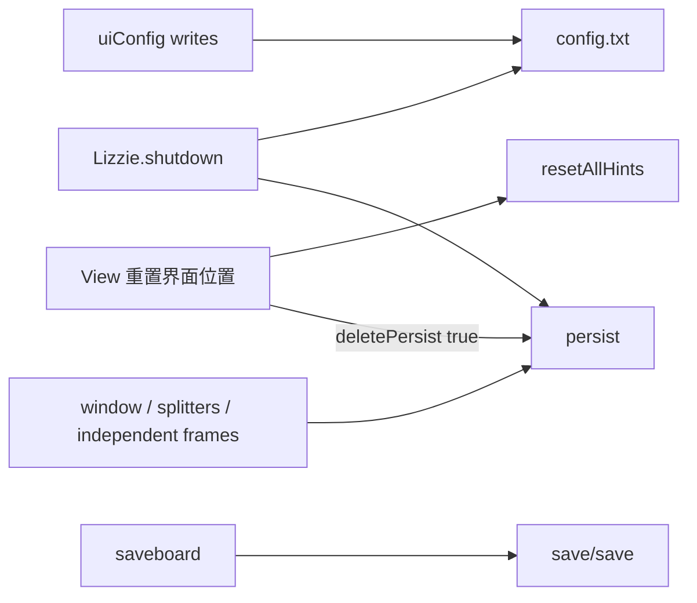

# Ticket 02 — Settings, Layout, and Persistence Capability Census

## 1. Frozen sources

| Tree | Path | Commit |
| --- | --- | --- |
| Java (unique authority) | `/home/dev/dev/weiqi/worktrees/lizzieyzy-next/java-baseline-v1` | `7b4027531c2b26062d0bfc27a040cc550cfbea4d` |
| Next (unique authority) | `/home/dev/dev/weiqi/worktrees/lizzieyzy-next-tauri/migration-coverage-audit` | `18c6d189b8b01069975c4c40ead63a010249cb8c` (`docs/migration-coverage-audit`) |

Docs read from the Next worktree: `CONTEXT.md`, `docs/JAVA_BASELINE.md`, `docs/PARITY_MATRIX.md`, `docs/MIGRATION_PLAN.md`, `docs/ARCHITECTURE_NEXT.md`, `.scratch/migration-coverage-audit/issues/02-inventory-settings-layout-persistence.md`, `.scratch/migration-coverage-audit/research/02-settings-layout.draft.md`.

This report cites only those two worktrees. It does not cite Java `42c92e3`, `/home/dev/dev/weiqi/lizzieyzy-next` (non-worktree), or `/mnt/d/dev/weiqi/tmp/lizzie-java-baseline-r2a`.

Source-only investigation. No builds, tests, formatters, file edits, or runtime launches. Unobserved runtime behavior is marked **需定向运行核验**.

Domain 02 owns application preferences, layout/window geometry, theme/language/sound/L&F, first-use/reset/hints, and persisted UI state. Engine profile fields, four-state autoload, last-engine, analysisReuseCurrentEngine, analysisAutoQuit, enableLizzieCache, and analysisEnginePreLoad are **04 Entry Points only** (§7). Analysis-cache semantics belong with 04. No equivalent / redesign / defer / abandon dispositions.

All 35 `SET-*` keys from the draft are retained. None were merged.

## 2. Method

1. Start from the draft’s 35 keys; do not rescan engine/SGF/game/provider/release domains.
2. Verify Entry Points from Menu construction plus parent add, plus Settings / Help items, plus FirstUse / ConfigDialog2 / persist load-save.
3. Treat Capability as one observable user goal. Hidden JSON keys count only when they back observable behavior.
4. Map Next owners from `AppPreferences`, `PreferencesPanel`, `App.tsx` session state, `AppChrome`, and `load_app_preferences` / `save_app_preferences`.
5. Match existing Parity Items `PREF-01`, `LAYOUT-01`, `LAYOUT-02`, `LAYOUT-03`, `UI-01`, `UI-05` without inventing dispositions.

Key Java files: `Config.java`, `Lizzie.java`, `gui/Menu.java`, `gui/FirstUseSettings.java`, `gui/ConfigDialog2.java`, `AppLocale.java`, `ExtraMode.java`, `util/NetworkProxy.java`, `gui/ToolbarPositionConfig.java`, `l10n/DisplayStrings.properties`, `l10n/DisplayStrings_zh_CN.properties`.

Key Next files: `apps/desktop/src/domain/preferences.ts`, `apps/desktop/src/api/preferences.ts`, `apps/desktop/src/components/PreferencesPanel.tsx`, `apps/desktop/src/App.tsx`, `apps/desktop/src/components/AppChrome.tsx`, `apps/desktop/src-tauri/src/lib.rs`, `docs/PARITY_MATRIX.md`.

Contract fields on every Capability: Name, Entry Points, Frozen behavior, Defaults, Persistence, Failure/Recovery, Frozen evidence, Next mapping, Existing Parity Item, Ambiguity / 需定向运行核验. N/A is written when a field does not apply. Repeated failure semantics cite a numbered shared contract below.

## 3. Persistence architecture and shared contracts

Java work directory via `WorkDirectoryResolver` / `Config.getWorkDirectory()`. Filenames: `config.txt`, `persist`, `save/save`.

### SC-01 Java `config.txt` load / save / merge

- Load: `Config.initializeFromWorkDirectory` (`Config.java` 1529–1571). Missing `config.txt` → write `createDefaultConfig`, `newProfile=true`. Unreadable JSON → `backupUnreadableConfig` to `config.txt.unreadable-backup` or `.N` (`2321–2339`) then `loadAndMergeConfigdef` rebuild. Missing keys merged from defaults; extra keys kept (`mergeDefaultKeys` 2299–2318).
- Save: `Config.save` (`3532–5339`) → `writeConfig` temp file plus `ATOMIC_MOVE` or `REPLACE_EXISTING` (`2991–3015`).
- New-profile defaults a user actually gets = `createDefaultConfig` (`2814–2899`) plus `opt*` load fallbacks plus `applyFirstLaunchDefaults` (`3422–3434`). Field initializers are **not** the shipped set.
- First launch (`newProfile`): `use-language` from OS locale; `enable-startup-benchmark=false`. Migrations: `restoreSubBoardDefaultOnce` (`2129–2142`) restores `show-subboard=true`; `hideBlunderBarDefaultOnce` (`2144–2158`) forces `show-blunder-bar=false` once.

### SC-02 Java `persist` geometry file

- Load fail → in-memory `createPersistConfig` (`2957–2988`): empty `main-window-position` / `gtp-console-position`, `window-maximized=false`.
- Save: `Config.persist` (`3017–3408`). **No-op if `deletedPersist`** (`3018`).
- `deletePersist(true)` deletes the file, sets `deletedPersist`, shows restart dialog. `deletePersist(false)` deletes, sets `deletedPersist`, then reloads empty persist into memory without the dialog (`3469–3485`).

### SC-03 Java shutdown

`Lizzie.shutdown` (`1428–1470`): `persist()` then `save()`. Each failure shows a modal with `Lizzie.save.error` + `Lizzie.save.path` + the file path (`getPersistFilePath` / `getConfigFilePath`). Optionally writes `last-engine` if `autoload-last` (04 xref).

### SC-04 Next `lizzieyzy-next-app-preferences.json`

- File: `APP_PREFERENCES_FILE` via `app_preferences_path` (`lib.rs` 37, 1271–1283) under Tauri app-data. Browser: `localStorage` key `lizzieyzy-next-app-preferences` (`api/preferences.ts` 10, 27–40).
- Load native: missing → `default_app_preferences`; parse error → `failed to parse` (UI `Load failed:`); other I/O → failed to read (`lib.rs` 590–598). Browser parse error → defaults.
- Save native: pretty JSON overwrite; I/O → `failed to write` (UI `Save failed:` while in-memory prefs already updated) (`601–611`, `App.tsx` 388–427).
- `normalize_app_preferences` / `normalizeAppPreferences`: `candidateLimit` clamp 1–20; `reviewMode` coerce to `quick` unless `deep`; `boardTheme` coerce to `classic` unless `high-contrast`; `defaultMaxVisits` clamp 1–1_000_000 (`lib.rs` 1071–1081; `domain/preferences.ts` 28–39).
- Java `config.txt` / `persist` are **not imported** (PREF-01). Engine-profile JSON and `analysis-cache.sqlite3` are 04.

### Default-source mismatches (real; new-profile follows JSON + `opt*`)

| Key / field | Field init | `createDefaultConfig` / persist default | Load fallback |
| --- | --- | --- | --- |
| `replay-branch-interval-seconds` | `0.5` (`Config.java` 59) | JSON `0.9` (2895) | `optDouble(..., 0.5)` (1799). New profile uses **0.9** because the key exists |
| `limit-playouts` (04-adjacent) | `2000` (1109) | **absent** from default JSON | `optLong(..., 100000)` (1909). New profile uses **100000** |
| `only-last-move-number` | `10` (40) | JSON `1` (2891) | uses JSON. New profile **1** |
| `startMaximized` vs persist | field `true` (87) | persist `window-maximized=false` (2979) | persist default wins for geometry |
| `use-java-looks` | field `false` (1124) | absent from default JSON | `optBoolean(..., !OS.isWindows())` (1619) |
| `play-sound` | field `true` (102) | **absent** from default JSON | `optBoolean(..., true)` (1764). Observable new-profile default is **true** |
| `enable-startup-benchmark` | field `true` (1195) | first-launch writes `false` (3433) | `optBoolean(..., true)` (2000) |

## 4. Capabilities (35 keys)

### SET-RESET-WINDOW-POS — Reset frame location (`重置界面位置`)

| Field | Content |
| --- | --- |
| Name | Delete persisted window/panel geometry and ask the user to restart |
| Entry Points | View menu `Menu.deletePersistFile` (源码注释 `重置界面位置`). Constructed and `viewMenu.add` (`Menu.java` 660–670) |
| Frozen behavior | Calls `config.deletePersist(true)` **and** `Lizzie.resetAllHints()`. Deletes the persist file, sets `deletedPersist` so later `persist()` is skipped until restart. Does **not** rewrite theme/language/engine in `config.txt`. Dialog: EN `Config.deletePersistFile` = `Reset frame location succeed,please restart Lizzie!` |
| Defaults | N/A (destructive action) |
| Persistence | Deletes `persist`. Hint keys rewritten by SET-RESET-HINTS. `config.txt` unchanged |
| Failure/Recovery | SC-02. After this action, shutdown persist write is skipped (`persist` early-return). Dialog always shown when `showMsg=true` |
| Frozen evidence | `gui/Menu.java` 660–670 `deletePersistFile`; `Config.deletePersist` 3469–3485; `Lizzie.resetAllHints` 1518–1527; `l10n/DisplayStrings.properties` `Config.deletePersistFile` 1235 |
| Next mapping | Missing. AppChrome 显示 has no reset-frame-location item |
| Existing Parity Item | **Not LAYOUT-03**. LAYOUT-01/02 Missing (geometry). No dedicated reset-window item |
| Ambiguity / 需定向运行核验 | English **menu** label for `Menu.deletePersistFile` was not located in the DisplayStrings slices read; dialog string is confirmed. ZH dialog `重置界面位置成功,请重新打开Lizzie!` is in `DisplayStrings_zh_CN.properties` (draft). Whether the menu i18n key equals `重置界面位置` 需定向运行核验 |

### SET-RESTORE-PANEL-SIZES — Restore default panel sizes (narrow layout)

| Field | Content |
| --- | --- |
| Name | Restore splitter / board-proportion sizes without wiping window bounds or unrelated settings |
| Entry Points | View → 面板 `Menu.restoreDefaultPanelSizes` → `Lizzie.frame.restoreDefaultPanelSizes()` (`Menu.java` 1361–1369) |
| Frozen behavior | Distinct from SET-RESET-WINDOW-POS. This is the Java action LAYOUT-03 describes as narrow panel sizes / board proportion |
| Defaults | N/A (restore action). Target sizes live in `restoreDefaultPanelSizes` body |
| Persistence | 需定向运行核验 whether `persist()` is immediate or only on shutdown |
| Failure/Recovery | N/A from Menu wrapper. Body not fully extracted (`LizzieFrame` ~20k lines) |
| Frozen evidence | `gui/Menu.java` 1361–1369. `LizzieFrame.restoreDefaultPanelSizes` body **not fully extracted** |
| Next mapping | Missing. AppChrome 显示 → 面板 items disabled `title=尚未接入`. Fixed 228/260 rails (UI-01) |
| Existing Parity Item | LAYOUT-03 Missing (narrow restore-layout-default). LAYOUT-01/02 Missing |
| Ambiguity / 需定向运行核验 | Which splitters, whether board proportion (`board-postion-propotion`), whether persist is immediate. Confirm body before treating LAYOUT-03 as this action |

### SET-RESET-HINTS — `resetAllHints` (not a standalone menu)

| Field | Content |
| --- | --- |
| Name | Re-enable a subset of one-time hint flags |
| Entry Points | Not a menu. Callers: SET-RESET-WINDOW-POS (`Menu.java` 667); `Lizzie.main` when `firstTimeLoad` or hostname change (`Lizzie.java` 381–383) |
| Frozen behavior | Sets `allowCloseCommentControlHint`, `showReplaceFileHint`, `firstLoadKataGo` (04-adjacent), `exitAutoAnalyzeTip` all true and writes those ui keys. **Does not** reset `showNewBoardHint` |
| Defaults | All four flags load-default true (`1657`, `1986–1987`, `1994`, `2045`) |
| Persistence | uiConfig keys `allow-close-comment-control-hint`, `show-replace-file-hint`, `first-load-katago`, `exit-auto-analyze-tip`. Written in memory; file save follows SC-01 (shutdown or an explicit `save`) |
| Failure/Recovery | No dedicated save in `resetAllHints`. Relies on later SC-01/SC-03 |
| Frozen evidence | `Lizzie.resetAllHints` 1518–1527; callers `Lizzie.java` 381–383, `Menu.java` 666–667 |
| Next mapping | Missing |
| Existing Parity Item | None |
| Ambiguity / 需定向运行核验 | `showPonderLimitedTips`, `userKnownX`, and `autoAnalyze.notShowAgain` exist and are **not** in `resetAllHints`. Whether `resetAllHints` is followed by an immediate `save()` on the hostname path 需定向运行核验 |

### SET-FIRST-LAUNCH — Automatic first-run / host-change (no FirstUse dialog)

| Field | Content |
| --- | --- |
| Name | Finish first-run profile setup without opening the initialize-settings wizard |
| Entry Points | Startup only, when `config.firstTimeLoad` or resolved hostname differs from stored (`Lizzie.java` 381–386) |
| Frozen behavior | Machine change: `deletePersist(false)` then `resetAllHints()`. Then `completeAutomaticFirstRunSetup` → optional bundled KataGo apply (04) → `finalizeAutomaticFirstRunSetup` writes `first-time-load=false`, `host-name`, `config.save()`. **Does not** auto-open `FirstUseSettings` |
| Defaults | `first-time-load` load fallback true (1648). New profile / firstTimeLoad |
| Persistence | `first-time-load`, `host-name` in uiConfig. Persist wipe on host change (SC-02 `deletePersist(false)`) |
| Failure/Recovery | Save IOException → `startupProfileSaveFailed` and repair chip (`894–914`, `953–964`). Hostname lookup timeout 500ms never treats unknown host as machine change (01) |
| Frozen evidence | `Lizzie.java` 374–386, 894–965; `Config.applyFirstLaunchDefaults` 3422–3434 |
| Next mapping | `App.tsx` 136–150 `loadAppPreferences` on mount only. No host-change wipe |
| Existing Parity Item | PREF-01 Partial; ENG-01. 01 owns routing (SHELL-06); 02 owns the setting/persist wipe |
| Ambiguity / 需定向运行核验 | Bundled KataGo auto-apply details → 04 |

### SET-FIRST-USE — Initialize-settings wizard

| Field | Content |
| --- | --- |
| Name | Settings 初始化设置 dialog that writes a bundle of display / language / L&F prefs |
| Entry Points | Settings → `Menu.initSettings` → `Lizzie.openFirstUseSettings(false)` (`Menu.java` 5314–5323) |
| Frozen behavior | `FirstUseSettings(boolean firstTime)`. `firstTime=true` close-exits-process exists (`750–755`) but current `main` never opens that path. Reopen (`firstTime=false`) prefills. Confirm requires radios+language (`554–604`). Load defaults fills the dialog only (`521–545`), does not write until Confirm. Confirm writes candidate WR/visits/score flags, limit suggestion/variation, max analyze time/visits (04-adjacent), enableLizzieCache (04 xref), mouse-over refresh, score+komi, winrate always black, language, Java vs system L&F, then `config.save()`. L&F change on reopen shows restart hint (`708–709`). `firstTime=true` would call `resetLookAndFeel` (`711`) |
| Defaults | Load-defaults button: WR/visits/score on, Lizzie cache on, no-refresh mouse-over, score without komi, alternately WR, Windows→system L&F else Java, suggestion 10, variation 0, time 600s, playouts unlimited (`527–544`) |
| Persistence | uiConfig + leelazConfig keys listed in Confirm (`605–704`). Immediate `save()` |
| Failure/Recovery | Confirm parse errors → `FirstUseSettings.confirmHint` / `confirmHint2`, no write. Save `IOException` is **printed, not modal** (`700–705`) |
| Frozen evidence | `gui/FirstUseSettings.java` 33–755; `gui/Menu.java` 5314–5323 |
| Next mapping | Missing as a wizard. Next 设置 → 首选项… / 综合设置(Shift+X) / 参数 / 棋盘 all open `PreferencesPanel` (`AppChrome.tsx` 212–220, 310–311) |
| Existing Parity Item | PREF-01 Partial |
| Ambiguity / 需定向运行核验 | Whether any remaining startup path still constructs `FirstUseSettings(true)` besides the dead constructor branch. Confirm-required checkbox matrix vs live View toggles |

### SET-PERSIST-CONFIG — Application preference file (`config.txt`)

| Field | Content |
| --- | --- |
| Name | Persist ui + leelaz + logging settings to `config.txt` |
| Entry Points | Any `uiConfig` / `leelazConfig` write plus Settings Confirm / FirstUse Confirm / many View toggles; shutdown `config.save()` |
| Frozen behavior | SC-01. Work-dir file `config.txt`. Atomic temp write |
| Defaults | `createDefaultConfig` plus `opt*` plus first-launch (§3) |
| Persistence | SC-01 |
| Failure/Recovery | SC-01 + SC-03. Missing → write defaults + newProfile. Unreadable → backup + rebuild. Shutdown save fail → modal with path |
| Frozen evidence | `Config.initializeFromWorkDirectory` 1529–1571; `save` 3532–5339; `writeConfig` 2991–3015; `backupUnreadableConfig` 2321–2339 |
| Next mapping | Subset `AppPreferences` via SC-04. No Java file import |
| Existing Parity Item | PREF-01 Partial |
| Ambiguity / 需定向运行核验 | Which View toggles call `save()` immediately vs wait for shutdown only |

### SET-PERSIST-WINDOW — Window / panel geometry (`persist`)

| Field | Content |
| --- | --- |
| Name | Persist main window bounds, splitter shares, independent frames, GTP console, toolbar height |
| Entry Points | Implicit on close via `Lizzie.shutdown` → `config.persist()`. Reset via SET-RESET-WINDOW-POS |
| Frozen behavior | Writes `ui-persist`: `main-window-position` [x,y,w,h] (unmax or last non-max), `window-maximized`, `main-window-other` (toolbarHeight first), list/blunder column widths, `gtp-console-position` / `gtp-console-opened`, `board-postion-propotion` (typo), `leftover-left-share`, `comment-height-share`, `variation-graph-share`, independent main/sub boards, suggestions-list-position-7/9, ctrl-position, public-kifu-search, badmoves-list-position, toolbar-parameter, `winrate-graph` (mode), fast-commands-width/height |
| Defaults | `createPersistConfig` empty positions, `window-maximized=false`. Field `startMaximized=true` is **not** the persist default |
| Persistence | SC-02 file `persist` |
| Failure/Recovery | SC-02 + SC-03. Load fail → memory empty persist. After SET-RESET-WINDOW-POS, writes skipped until restart |
| Frozen evidence | `Config.persist` 3017–3408; `createPersistConfig` 2957–2988; `deletedPersist` 3018 |
| Next mapping | Missing. Fixed `228px` / `260px` rails (UI-01). No splitter preference |
| Existing Parity Item | LAYOUT-01 Missing; LAYOUT-02 Missing |
| Ambiguity / 需定向运行核验 | Hawk-eye / analysis-frame keys beyond `suggestions-list-position-*` not fully listed here. Load-time restore of every persist key 需定向运行核验 |

### SET-LANG — UI language

| Field | Content |
| --- | --- |
| Name | Choose application locale |
| Entry Points | Settings → language submenu: system / 简体中文 / 繁體中文 / English / 日本語 / 한국어 / ไทย → `selectLanguage(AppLocale.*)` (`Menu.java` 5360–5393). FirstUse language combo (`FirstUseSettings.java` 643–645, 757–762) |
| Frozen behavior | `AppLocale` 0–6: SYSTEM, SIMPLIFIED_CHINESE, ENGLISH, KOREAN, JAPANESE, TRADITIONAL_CHINESE, THAI (`AppLocale.java` 7–14). Stored as `use-language` int |
| Defaults | New profile: OS locale via `applyFirstLaunchDefaults` (3430). Load fallback `optInt(..., 0)` = SYSTEM (1718) |
| Persistence | `ui.use-language`. FirstUse Confirm saves immediately. Settings menu writes uiConfig; restart vs live reload is 需定向运行核验 |
| Failure/Recovery | SC-01 |
| Frozen evidence | `AppLocale.java` 7–14; `Menu.java` 5360–5393; `Config.applyFirstLaunchDefaults` 3426–3434; `Config` load 1718 |
| Next mapping | Missing. `PreferencesPanel` heading hardcoded `设置` (`PreferencesPanel.tsx` 16–18) |
| Existing Parity Item | PREF-01 Partial |
| Ambiguity / 需定向运行核验 | `selectLanguage` restart vs immediate `ResourceBundle` reload. Menu checkbox mapping 0=default, 1=ZH, 2=EN, 3=KR, 4=JP, 5=TW, 6=TH (`Menu.java` 5527–5333) |

### SET-LOOKS — Java vs system look-and-feel

| Field | Content |
| --- | --- |
| Name | Choose Java L&F vs system L&F |
| Entry Points | Settings → 界面外观 `frameLooksSystem` / `frameLooksJava` (`Menu.java` 5444–5471). FirstUse radios (`FirstUseSettings.java` 568–571, 646–650) |
| Frozen behavior | Writes `useJavaLooks` + `ui.use-java-looks`. Settings path shows `Lizzie.hint.restart`. FirstUse reopen shows `Lizzie.hint.restartForPartChanges` if L&F changed |
| Defaults | Load `optBoolean(..., !OS.isWindows())` (1619). Field init `false` is not the load fallback |
| Persistence | `ui.use-java-looks`. Settings menu does not call `save()` in the listener (relies on shutdown / later save) |
| Failure/Recovery | SC-01. Restart required for L&F to apply |
| Frozen evidence | `Menu.java` 5444–5471; `Config.java` 1619; `FirstUseSettings.java` 646–650, 708–709 |
| Next mapping | Missing |
| Existing Parity Item | PREF-01 Partial |
| Ambiguity / 需定向运行核验 | Whether Settings-menu L&F writes are flushed before a crash without shutdown save |

### SET-FRAME-FONT — Frame font size

| Field | Content |
| --- | --- |
| Name | Choose UI font size small/middle/big/other |
| Entry Points | Settings → 界面字体大小: small → `setFrameFontSize(0)`, middle `(1)`, big `(2)`, other → `SetFrameFontSize` dialog (`Menu.java` 5395–5442) |
| Frozen behavior | Small=12, middle=16, big=20; other 12–20 (draft; `setFrameFontSize` body 需定向运行核验). Load `frame-font-size` (`1837`) |
| Defaults | Load fallback 12 (1837) |
| Persistence | `ui.frame-font-size` |
| Failure/Recovery | SC-01 |
| Frozen evidence | `Menu.java` 5395–5442; `Config.java` 1837–1839 |
| Next mapping | Missing |
| Existing Parity Item | PREF-01 Partial |
| Ambiguity / 需定向运行核验 | `setFrameFontSize` persist write + whether restart is required. `SetFrameFontSize` allowed range |

### SET-SOUND — Play sound / mute during sync

| Field | Content |
| --- | --- |
| Name | Toggle move sound and mute-during-sync |
| Entry Points | Settings `Menu.playSound`, `Menu.notPlaySoundInSync` (`Menu.java` 5475–5496) |
| Frozen behavior | Toggles `playSound` / `notPlaySoundInSync` and writes ui keys. Checkbox state refreshed on menu open (`5516–5519`) |
| Defaults | Field `playSound=true`, `notPlaySoundInSync=true` (102–103). Load fallbacks true (1764–1765). **`play-sound` is absent from `createDefaultConfig`**; observable new-profile default is still true via `optBoolean` |
| Persistence | `ui.play-sound`, `ui.not-play-sound-insync` |
| Failure/Recovery | SC-01. Listeners do not call `save()` |
| Frozen evidence | `Menu.java` 5475–5496; `Config.java` 102–103, 1764–1765; `createDefaultConfig` 2838–2897 (no play-sound key) |
| Next mapping | Missing |
| Existing Parity Item | PREF-01 Partial |
| Ambiguity / 需定向运行核验 | When sound actually plays (board click vs engine move vs sync) → runtime |

### SET-CONTRIBUTE-MENU-VIS — Show Contribute menu

| Field | Content |
| --- | --- |
| Name | Show or hide the Contribute menubar |
| Entry Points | Settings `Menu.showContribute` (`Menu.java` 5498–507). Contribute menu itself added then `setVisible(showContribute)` (`5576–5580`) |
| Frozen behavior | Toggles `showContribute`, writes `ui.show-Contribute` (capital C), `contributeMenu.setVisible` |
| Defaults | Load `optBoolean("show-Contribute", true)` (2070) |
| Persistence | `ui.show-Contribute` |
| Failure/Recovery | SC-01 |
| Frozen evidence | `Menu.java` 5498–507, 5576–5580; `Config.java` 2070 |
| Next mapping | Missing as a visibility pref. AppChrome `跑谱贡献` is always shown; items disabled `尚未接入` (`AppChrome.tsx` 223–226). Contribute **gameplay** is 05/07 |
| Existing Parity Item | None in PREF/LAYOUT. Gameplay → 05 |
| Ambiguity / 需定向运行核验 | N/A for the visibility toggle itself |

### SET-THEME-BOARD-STYLE — JP vs CN classic board style

| Field | Content |
| --- | --- |
| Name | Japanese vs Chinese-classic board rendering style |
| Entry Points | View → 外观主题 → 棋盘风格 `Menu.boardStyleJapanese` / `Menu.boardStyleChineseClassic` → `config.setBoardStyle` (`Menu.java` 531–558) |
| Frozen behavior | `BOARD_STYLE_JAPANESE` / `BOARD_STYLE_CHINESE_CLASSIC`. `normalizeBoardStyle` maps anything else to Japanese (`2674–678`). `setBoardStyle` writes ui and refreshes renderers (`2685–729`) |
| Defaults | JSON `board-style` Japanese (2864). Load `normalizeBoardStyle(optString(..., BOARD_STYLE_JAPANESE))` (1780) |
| Persistence | `ui.board-style` |
| Failure/Recovery | SC-01 |
| Frozen evidence | `Config.java` 34–35, 1780–1781, 2674–729; `Menu.java` 531–558 |
| Next mapping | `boardTheme` `classic` \| `high-contrast`, default `classic` (`domain/preferences.ts` 2, 16–25). Preferences `棋盘对比` 浅色/高对比 (`PreferencesPanel.tsx` 57–62). Not the same JP/CN stone/board assets |
| Existing Parity Item | PREF-01 Partial |
| Ambiguity / 需定向运行核验 | Visual mapping of Next `classic` to Java Japanese vs Chinese-classic is ticket 09, not 02 |

### SET-THEME-APPLE-CLASSIC-CUSTOM — Apple UI / Morandi / custom board

| Field | Content |
| --- | --- |
| Name | Apple-style UI, classic/Morandi colors, custom board image/restore |
| Entry Points | View `Menu.appleStyleUi`, `Menu.classicColorTheme`, plus custom board image/restore items in the same appearance cluster (`Menu.java` 673+; custom-image body 需定向运行核验) |
| Frozen behavior | Apple forces `use-morandi-colors`. Persist `is-apple-style`, `use-morandi-colors`, theme default `default` |
| Defaults | JSON `is-apple-style=false` (2892), `theme=default` (2890). Load `isAppleStyle` false (1580), `useMorandiColors` false (1775) |
| Persistence | `ui.is-apple-style`, `ui.use-morandi-colors`, `ui.theme` |
| Failure/Recovery | SC-01 |
| Frozen evidence | `Menu.java` 673–677; `Config.java` 79, 110, 1580, 1775, 2890–2892 |
| Next mapping | `classic` / `high-contrast` only. No Apple / Morandi / custom board image |
| Existing Parity Item | PREF-01 Partial |
| Ambiguity / 需定向运行核验 | Exact Apple→Morandi force matrix and custom-board restore path |

### SET-THEME-DIALOG — Theme configuration tab

| Field | Content |
| --- | --- |
| Name | Full theme editor: folders, paths or pure colors, shadows, fonts, stone indicator, comment-node color, blunder-node table |
| Entry Points | Settings → 主题 → `openConfigDialog2(1)` (`Menu.java` 5347–5356) |
| Frozen behavior | Theme tab of ConfigDialog2. Preview gated on tab index 1 (draft). Stone indicator circle/triangle/solid/none via `stoneIndicatorType` / theme |
| Defaults | Theme `default`. Shadows enabled, shadow-size 85 in default JSON (2840–2842) vs field `shadowSize=75` (172) — another field-vs-JSON mismatch |
| Persistence | Theme object + ui keys via Theme.getTheme / save |
| Failure/Recovery | SC-01 |
| Frozen evidence | `Menu.java` 5347–5356; `Config.readThemeVaule` 2193–2291; `createDefaultConfig` 2840–2890 |
| Next mapping | `boardTheme` only. AppChrome 设置 → 主题 disabled (`AppChrome.tsx` 220) |
| Existing Parity Item | PREF-01 Partial |
| Ambiguity / 需定向运行核验 | Apply vs live preview matrix. Theme-folder discovery |

### SET-CONFIG-DIALOG-DISPLAY — Comprehensive settings (`综合设置`)

| Field | Content |
| --- | --- |
| Name | Multi-tab settings dialog; Display tab duplicates many View flags |
| Entry Points | Settings 综合设置(Shift+X) → `openConfigDialog2(0)` (`Menu.java` 5335–5345). Help → About → `openConfigDialog2(2)` (5215–5216) |
| Frozen behavior | Modern nav: Display, Kifu, Engine, Play, Advanced, Theme, About. Display checkboxes live-call `toggleShowWinrate` / `toggleShowVariationGraph` / `setShowComment` / `toggleShowSubBoard` / `toggleShowStatus` / `toggleCoordinates` (`ConfigDialog2.java` 565–651). Kifu/Play/Advanced mix 03/05/07/04 |
| Defaults | N/A as a dialog; controls bind current config |
| Persistence | Mix of live uiConfig writes (Display toggles) and OK-apply (other tabs) |
| Failure/Recovery | SC-01 |
| Frozen evidence | `Menu.java` 5335–5356; `gui/ConfigDialog2.java` 561–651 |
| Next mapping | `PreferencesPanel` sheet; disabled while engine running (`App.tsx` 1402–1406). AppChrome 综合设置(Shift+X) opens the same prefs sheet (`212–219`) |
| Existing Parity Item | PREF-01 Partial |
| Ambiguity / 需定向运行核验 | Full OK-apply vs live-toggle matrix beyond the Display checkboxes read. Shift+X `Input.keyPressed` mapping 需定向运行核验 |

### SET-NETWORK-PROXY — Network proxy setting

| Field | Content |
| --- | --- |
| Name | Configure HTTP proxy used by 06/07 traffic |
| Entry Points | ConfigDialog2 Advanced (draft). Keys owned by `NetworkProxy` |
| Frozen behavior | Modes `direct` / `system` / `manual`. 02 owns the setting; 06/07 consume it |
| Defaults | `network-proxy-mode` = `NetworkProxy.DEFAULT_MODE` = `direct` (`NetworkProxy.java` 24–27). Host `127.0.0.1`, port `7897` (`createDefaultConfig` 2883–2885) |
| Persistence | `ui.network-proxy-mode`, `ui.network-proxy-host`, `ui.network-proxy-port` |
| Failure/Recovery | SC-01 |
| Frozen evidence | `util/NetworkProxy.java` 19–27; `Config.createDefaultConfig` 2883–2885 |
| Next mapping | Missing |
| Existing Parity Item | PREF-01 Partial. Traffic → 06/07 |
| Ambiguity / 需定向运行核验 | Exact Advanced widgets and whether manual host/port are used when mode is `direct` |

### SET-BOARD-SIZE — Default board size setting

| Field | Content |
| --- | --- |
| Name | Choose default board size (9/13/15/19/other) |
| Entry Points | ConfigDialog2 Display; `SetBoardSize` dialog (`DisplayStrings` `SetBoardSize.*` 2298–2304). `Config.saveOtherBoardSize` for other (`3789–3794`) |
| Frozen behavior | Default JSON `board-size=19`. Other size width/height persist separately |
| Defaults | 19 (`2887`). Other size 21×21 (2030–2031, 1200–1201) |
| Persistence | `ui.board-size`, `ui.other-size-width`, `ui.other-size-height` |
| Failure/Recovery | SC-01. Commented validator would clamp `<2` to 19 (`1405–1410`) — **not live** |
| Frozen evidence | `Config.java` 2887, 2030–2031, 3789–3794; `l10n/DisplayStrings.properties` 2298–2304 |
| Next mapping | Missing as a global pref. SGF `SZ` owns size (03). AppChrome `设置棋盘大小(Ctrl+I)` disabled (`AppChrome.tsx` 154) |
| Existing Parity Item | None in PREF. Size of a loaded game → 03 |
| Ambiguity / 需定向运行核验 | Whether Display tab opens `SetBoardSize` or an inline combo. Whether new-empty-board uses this pref |

### SET-LAYOUT-MODE — ExtraMode / classic / custom layouts

| Field | Content |
| --- | --- |
| Name | Switch main-window layout mode |
| Entry Points | View 布局模式: default Alt+1 `defaultMode`, classic Alt+2 `classicMode`, min Alt+3 `minMode`, thinking Alt+4 `toggleExtraMode(3)`, four-sub Alt+5 `(1)`, double-engine Alt+6 `(2)` (`Menu.java` 1778–1853). Independent/float cluster Alt+7 (`1855–1915`). Custom 1 Alt+8 / custom 2 Alt+9 (`1919–2014`) |
| Frozen behavior | `ExtraMode`: Normal, Four_Sub, Double_Engine, Thinking, Min, Float_Board (`ExtraMode.java` 3–9). Values 0/1/2/3/7/8 (`getExtraModeValue` 3796–3812). Four_Sub / Double_Engine **auto-hide comment** (`shouldHideCommentPanel` 3883–3885; `loadPanelModeSettings` 3864–3869). Classic is **not** an ExtraMode: `isClassicMode` forces `showStatus=false` on load (`1581`) |
| Defaults | JSON `extra-mode` Normal (2857). Load `readExtraMode(uiConfig.opt("extra-mode"))` (3865) |
| Persistence | `ui.extra-mode` int, `ui.is-classic-mode`, `ui.custom-layout-1/2` |
| Failure/Recovery | SC-01. Unknown extra-mode → Normal (`3830–3831`, 3857–3858) |
| Frozen evidence | `ExtraMode.java`; `Config.loadPanelModeSettings` 3864–3869; `Menu.java` 1778–2014; `Config.java` 1579–1581 |
| Next mapping | Missing. AppChrome 显示 → 布局模式 disabled (`AppChrome.tsx` 138) |
| Existing Parity Item | LAYOUT-01/02/03 Missing. UI-01 fixed rails |
| Ambiguity / 需定向运行核验 | Per-mode panel matrix. Alt+N `Input.keyPressed` vs menu-only. Classic vs ExtraMode.Min interaction |

### SET-LAYOUT-PANELS — Panel visibility including independent frames

| Field | Content |
| --- | --- |
| Name | Show/hide subboard, winrate, comment, variation, list, captured, status, GTP, independent boards, hawk-eye, candidates list |
| Entry Points | View 面板: subboard, winrate W, comment Alt+T, variation G, list Alt+G, captured, status, GTP E, plus independent / hawk-eye / SuggestionList (`Menu.java` 1099–1359, 1232–1267). ConfigDialog2 Display live toggles (SET-CONFIG-DIALOG-DISPLAY) |
| Frozen behavior | Toggles write ui keys via `toggleShow*` (`toggleShowSubBoard` 2732–2737, `toggleCoordinates` 2669–2672, etc.). Independent frames also persist geometry (SET-PERSIST-WINDOW) |
| Defaults | Default JSON: status/comment/variation/subboard/captured/winrate on; `large-subboard` / `large-winrate-graph` false (2844–2867). List pane load fallback true (1650) |
| Persistence | uiConfig show-* keys; persist file for independent/GTP geometry |
| Failure/Recovery | SC-01 + SC-02 |
| Frozen evidence | `Menu.java` 1099–1369; `Config.java` 2844–2867, 1650, 2732–2737 |
| Next mapping | Always-on workbench (UI-01). Session-only `showCoordinates` true / `showMoveNumbers` false (`App.tsx` 98–99). AppChrome 面板 submenu disabled except coords/move/candidates (`124–138`) |
| Existing Parity Item | UI-01 Accepted (fixed rails). LAYOUT-01 Missing |
| Ambiguity / 需定向运行核验 | Visualized panel-settings body. Hawk-eye / independent-controller construction vs add |

### SET-LAYOUT-TOOLBAR — Toolbar visibility, wrap, order

| Field | Content |
| --- | --- |
| Name | Top toolbar separated/combined/hidden/auto-wrap/custom; bottom on/off; button order |
| Entry Points | View 工具栏 submenu (`Menu.java` 487). `ToolbarPositionConfig` `显示顺序设置` |
| Frozen behavior | `show-top-tool-bar`, `auto-wrap-tool-bar`. Height in persist `main-window-other[0]` (`3070`, `3076`) |
| Defaults | `showTopToolBar=true`, `autoWrapToolBar=true` (1103–1104; load 1904–1905) |
| Persistence | uiConfig toolbar flags; persist toolbar height + `toolbar-parameter` |
| Failure/Recovery | SC-01 + SC-02 |
| Frozen evidence | `Menu.java` 487; `Config.java` 1103–1104, 1904–1905, 3070–3076; `gui/ToolbarPositionConfig.java` |
| Next mapping | `AppChrome` toolbar exists; many Java actions visible-disabled `尚未接入` (UI-05). No wrap/order prefs |
| Existing Parity Item | UI-05 Accepted for claimed R2 rows; unwired Java toolbar actions unclaimed |
| Ambiguity / 需定向运行核验 | Exact top-toolbar separated/combined/hidden widget set |

### SET-BOARD-POS — Nudge main-board proportion

| Field | Content |
| --- | --- |
| Name | Move the main-board splitter left/right |
| Entry Points | View 主棋盘位置 `[` / `]` → `nudgeBoardPositionProportion(±1)` (`Menu.java` 490–516) |
| Frozen behavior | Adjusts `BoardPositionProportion`. Persist key **typo** `board-postion-propotion` (`3087`) |
| Defaults | Field `boardPositionProportion=4` (197). Load `optInt("board-postion-proportion", 4)` (1801) — **different spelling** from persist typo |
| Persistence | persist `board-postion-propotion`; uiConfig `board-postion-proportion` (1801). Two spellings |
| Failure/Recovery | SC-01 + SC-02 |
| Frozen evidence | `Menu.java` 490–516; `Config.persist` 3087; load 1801 |
| Next mapping | Missing. LAYOUT-01/02/03 |
| Existing Parity Item | LAYOUT-01 Missing; LAYOUT-02 Missing; LAYOUT-03 Missing |
| Ambiguity / 需定向运行核验 | Nudge step. Whether load reads persist typo, uiConfig spelling, or both. `[` `]` `Input.keyPressed` |

### SET-COORDS — Coordinates visibility

| Field | Content |
| --- | --- |
| Name | Show board coordinates |
| Entry Points | View 坐标(C) (`Menu.java` 518–529) → `toggleCoordinates`. ConfigDialog2 Display (`ConfigDialog2.java` 641–651). Next 显示 坐标(C) (`AppChrome.tsx` 129) |
| Frozen behavior | Toggles `showCoordinates`, writes `ui.show-coordinates` (`2669–2672`) |
| Defaults | JSON true (2863). Load `optBoolean(..., true)` (1798) |
| Persistence | Java: `ui.show-coordinates`. Next: **session only**, not in `AppPreferences` |
| Failure/Recovery | SC-01. Next: lost on reload |
| Frozen evidence | `Menu.java` 518–529; `Config.java` 2669–2672, 1798, 2863; `App.tsx` 98; `AppChrome.tsx` 129 |
| Next mapping | Session `useState(true)`. Same default, not persisted |
| Existing Parity Item | PREF-01 Partial |
| Ambiguity / 需定向运行核验 | Next `C` shortcut vs menu-only (需定向运行核验 in `App.tsx` `onKey`) |

### SET-MOVE-NUMBERS — Move-number display modes

| Field | Content |
| --- | --- |
| Name | Choose how move numbers render on the board |
| Entry Points | View 手数(M): none/last1/5/10/all/custom, from-1, branch numbering, all-in-branch, var-pane numbers (`Menu.java` 561–870 cluster). ConfigDialog2 Display radios (`657–678`). Next 显示 手数(M) boolean (`AppChrome.tsx` 130) |
| Frozen behavior | `show-move-number`, `only-last-move-number`, `allow-move-number`, `new-move-number-in-branch`, `movenumber-from-one`, `show-moveall-inbranch`. Custom opens `MovenumberDialog` (`794–803`) |
| Defaults | JSON `show-move-number=false`, `only-last-move-number=1`, `new-move-number-in-branch=true` (2843, 2891, 2893). Field `onlyLastMoveNumber=10` is **not** the shipped JSON |
| Persistence | Java uiConfig keys above. Next: session `showMoveNumbers` default false, not persisted |
| Failure/Recovery | SC-01 |
| Frozen evidence | `Menu.java` 561–865; `Config.java` 39–44, 1573–1578, 2843, 2891–2893 |
| Next mapping | Boolean on/off only. No last-N / custom / branch numbering |
| Existing Parity Item | PREF-01 Partial |
| Ambiguity / 需定向运行核验 | `MovenumberDialog` range. Next `M` shortcut |

### SET-SUGGESTION-INFO — Candidate overlay display settings

| Field | Content |
| --- | --- |
| Name | What to show on suggestions: WR / visits / score, order, delay, max-red, always-black WR, no-refresh |
| Entry Points | View 选点信息 (`Menu.java` 570–572 plus suggestion submenu). FirstUse WR/visits/score checkboxes (`471–519`, `605–614`). Next 显示 候选 / Preferences 候选 + 显示候选数 |
| Frozen behavior | Display settings are 02; search/limit visits are 04. `show-best-moves`, `limit-max-suggestion` (leelaz), suggestion-info order ints |
| Defaults | JSON `show-best-moves=true` (2861), `limit-max-suggestion=10` (2826). Next `showCandidates=true`, `candidateLimit=8` clamp 1–20 |
| Persistence | Java ui + leelaz keys. Next `showCandidates` / `candidateLimit` in AppPreferences (SC-04) |
| Failure/Recovery | SC-01 / SC-04 |
| Frozen evidence | `Config.java` 2826, 2861, 1736–1738, 1862–1866; `FirstUseSettings.java` 471–519; `domain/preferences.ts` 16–20; `PreferencesPanel.tsx` 22, 27–37 |
| Next mapping | Persisted candidate toggle + limit. No delay / max-red / always-black WR / custom order dialog |
| Existing Parity Item | PREF-01 Partial. Search → 04 |
| Ambiguity / 需定向运行核验 | Mapping Java `limit-max-suggestion` 10 vs Next `candidateLimit` 8 is ticket 09 |

### SET-NEXT-MOVE — Next-move hint

| Field | Content |
| --- | --- |
| Name | Show next-move marker: none / simple / info, plus min playouts |
| Entry Points | View 下一手 (`Menu.java` 574–658 including `minPlayoutsForNextMove`) |
| Frozen behavior | `show-next-moves`, `show-next-move-blunder`, `min-playouts-for-next-move` |
| Defaults | JSON `show-next-moves=true` (2865). Load `showNextMoveBlunder` true (1620), `minPlayoutsForNextMove` 30 (1622) |
| Persistence | `ui.show-next-moves`, `ui.show-next-move-blunder`, `ui.min-playouts-for-next-move` |
| Failure/Recovery | SC-01 |
| Frozen evidence | `Menu.java` 574–658; `Config.java` 1729, 1620–1622, 2865 |
| Next mapping | Missing as a pref |
| Existing Parity Item | PREF-01 Partial |
| Ambiguity / 需定向运行核验 | Exact none/simple/info enum vs two booleans |

### SET-WINRATE-GRAPH — Winrate graph presentation

| Field | Content |
| --- | --- |
| Name | Graph perspective, WR/score lines, blunder bar, mouse-over WR |
| Entry Points | View 胜率图设置: black/both perspective (`Menu.java` 1373–1394 sets `WinrateGraph.mode` and repaints). Related line/blunder flags in the same submenu (read around 1373–1602) |
| Frozen behavior | Default JSON `show-blunder-bar=false` plus `hideBlunderBarDefaultOnce` migration. Graph **mode is written** to persist `winrate-graph` array (`Config.persist` 3383–3385) |
| Defaults | Blunder bar false (2850). `show-score-lead-line` true, `show-win-rate-line` true, `show-mouse-over-winrate-graph` true (1834–1836) |
| Persistence | uiConfig blunder/line flags; persist `winrate-graph` for mode |
| Failure/Recovery | SC-01 + SC-02 |
| Frozen evidence | `Menu.java` 1373–1394; `Config.java` 2850, 2144–2158, 1834–1836, 3383–3385 |
| Next mapping | `WinrateChart` always on, hardcoded black perspective label `胜率走势 (黑)` (`App.tsx` 1274). No perspective pref. AppChrome 胜率图设置 disabled (`136`) |
| Existing Parity Item | UI-01 Accepted (chart present). PREF-01 Partial |
| Ambiguity / 需定向运行核验 | Whether persist `winrate-graph` is **loaded** on startup (write is verified; load not extracted) |

### SET-SUBBOARD — Mini-board mode

| Field | Content |
| --- | --- |
| Name | Sub-board content: variation / raw / heatmap |
| Entry Points | View 小棋盘设置: variation, raw, heatmap during/after calc, no heatmap (`Menu.java` 1618–1771). FirstUse mouse-over-subboard refresh radios |
| Frozen behavior | `show-heat`, `show-heat-aftercalc`, `subboard-raw`, `no-refresh-on-sub`. Heatmap **data** is 04; mode is 02 |
| Defaults | JSON `show-subboard=true` (2866). Heat flags load false (1597–1598). `no-refresh-on-sub` true (2097) |
| Persistence | uiConfig keys above |
| Failure/Recovery | SC-01 |
| Frozen evidence | `Menu.java` 1618–1771; `Config.java` 1597–1598, 2097, 2866 |
| Next mapping | Mini-board exists (UI-01) without mode prefs. AppChrome 小棋盘设置 disabled (`137`) |
| Existing Parity Item | UI-01 Accepted (mini-board). PREF-01 Partial |
| Ambiguity / 需定向运行核验 | Four-sub vs single subboard heatmap target (`subBoardRenderer4` vs `subBoardRenderer`) |

### SET-MAIN-PANEL — Main-interface extras

| Field | Content |
| --- | --- |
| Name | Large subboard / large WR, append WR to comment, names on board, comment control, always-on-top, new-board/replace-file hints |
| Entry Points | View 主界面设置 cluster (draft). Large sub `toggleLargeSubBoard` / large WR `toggleLargeWinrate` (`Config.java` 2535–2576). Hint flags also SET-HINT-* |
| Frozen behavior | `large-subboard`, `large-winrate-graph`, `append-winrate-to-comment`, `show-name-in-board`, `mains-always-ontop`, comment-control hint |
| Defaults | JSON large flags false (2847, 2867). `append-winrate-to-comment=true` (2894, load 1797) |
| Persistence | uiConfig keys |
| Failure/Recovery | SC-01 |
| Frozen evidence | `Config.java` 2535–2576, 1794–1797, 2894 |
| Next mapping | Missing extras. No large-sub / always-on-top / append-WR prefs |
| Existing Parity Item | PREF-01 Partial |
| Ambiguity / 需定向运行核验 | Ctrl+F / Ctrl+W / Ctrl+Z `Input` mapping. Full 主界面设置 menu inventory |

### SET-KATA-DISPLAY — KataGo overlay display prefs

| Field | Content |
| --- | --- |
| Name | Score+komi vs board, estimate on/off/hidden/main/sub/both, render styles, ownership, shortcut |
| Entry Points | View KataGo settings (`Menu.java` 1773–1776 `kataSettings`). FirstUse score+komi radios (`680–684`) |
| Frozen behavior | 04 owns computation; 02 owns overlay prefs: `show-katago-score-lead-with-komi`, `show-katago-estimate`, on-main/on-sub, estimate style flags, `shortcut-kata-estimate` |
| Defaults | Estimate off (1601); on-sub/on-main true (1724–1725); small-estimate true (1611). Next `showOwnership` / `showPolicy` default true |
| Persistence | Java uiConfig. Next `showOwnership` / `showPolicy` in AppPreferences. Next `overlayMode` session-only (`App.tsx` 102) |
| Failure/Recovery | SC-01 / SC-04 |
| Frozen evidence | `Menu.java` 1773–1776; `Config.java` 1595–1617, 1724–1725; `domain/preferences.ts` 16–18; `PreferencesPanel.tsx` 23–24 |
| Next mapping | Two booleans + session overlayMode. Mapping Java estimate enum → two booleans is ticket 09, not 02 |
| Existing Parity Item | PREF-01 Partial. ANA-04 Partial (data path) |
| Ambiguity / 需定向运行核验 | Full Kata settings submenu (commented score-perspective items at `Menu.java` 2103–2135 are **not** Entry Points) |

### SET-HINT-NEWBOARD — New-board hint (not reset by `resetAllHints`)

| Field | Content |
| --- | --- |
| Name | “No notice again” for new-board warning |
| Entry Points | 主界面设置 plus dialog `noNoticeAgain` (draft) |
| Frozen behavior | `showNewBoardHint`. **Not** written by `resetAllHints` |
| Defaults | Load `optBoolean(..., true)` (1987). Field true (1173) |
| Persistence | `ui.show-new-board-hint` |
| Failure/Recovery | SC-01 |
| Frozen evidence | `Config.java` 1173, 1987; `Lizzie.resetAllHints` 1518–1527 (key absent) |
| Next mapping | Missing |
| Existing Parity Item | None |
| Ambiguity / 需定向运行核验 | Exact dialog class / menu item that sets the flag |

### SET-HINT-REPLACE — Replace-file hint

| Field | Content |
| --- | --- |
| Name | Confirm-replace-file hint; re-enabled by `resetAllHints` |
| Entry Points | File replace dialog `noNoticeAgain`; reset via SET-RESET-HINTS / SET-RESET-WINDOW-POS |
| Frozen behavior | `showReplaceFileHint`. Reset **yes** |
| Defaults | true (1172, 1986) |
| Persistence | `ui.show-replace-file-hint` |
| Failure/Recovery | SC-01 |
| Frozen evidence | `Config.java` 1172, 1986; `Lizzie.resetAllHints` 1520, 1524 |
| Next mapping | Missing |
| Existing Parity Item | None |
| Ambiguity / 需定向运行核验 | Exact replace-dialog class |

### SET-HINT-COMMENT-CTRL — Comment-control close hint

| Field | Content |
| --- | --- |
| Name | Hint when closing comment controls; re-enabled by `resetAllHints` |
| Entry Points | Comment-control UI; reset via SET-RESET-HINTS |
| Frozen behavior | `allowCloseCommentControlHint`. Reset **yes** |
| Defaults | true (1137, 1657) |
| Persistence | `ui.allow-close-comment-control-hint` |
| Failure/Recovery | SC-01 |
| Frozen evidence | `Config.java` 1137, 1657; `Lizzie.resetAllHints` 1519, 1525 |
| Next mapping | Missing |
| Existing Parity Item | None |
| Ambiguity / 需定向运行核验 | Exact control that consumes the flag |

### SET-HINT-AUTOANALYZE — Exit auto-analyze tip

| Field | Content |
| --- | --- |
| Name | Tip when leaving auto-analyze; re-enabled by `resetAllHints` |
| Entry Points | Auto-analyze exit path (04 runtime); reset via SET-RESET-HINTS |
| Frozen behavior | `exitAutoAnalyzeTip`. Reset **yes**. Related `exit-auto-analyze-by-pause` is a separate pref (2044), not in `resetAllHints` |
| Defaults | true (1283, 2045) |
| Persistence | `ui.exit-auto-analyze-tip` |
| Failure/Recovery | SC-01 |
| Frozen evidence | `Config.java` 1282–1283, 2044–2045; `Lizzie.resetAllHints` 1522, 1526 |
| Next mapping | Missing |
| Existing Parity Item | None. Auto-analyze itself → 04 |
| Ambiguity / 需定向运行核验 | Dialog vs status-bar presentation |

### SET-CLEAR-PERSONAL-HISTORY — Clear personal data

| Field | Content |
| --- | --- |
| Name | Remove stored personal histories without deleting persist or engines |
| Entry Points | Help → `Menu.clearAllPersonalData` (`Menu.java` 5225–2553). Confirm then remove keys then `config.save()` then done dialog |
| Frozen behavior | Removes `fox-recent-searches`, `recent-files`, `batch-analysis-history`, `share-history`. Does **not** delete persist or engine profiles |
| Defaults | N/A |
| Persistence | uiConfig keys removed then SC-01 save |
| Failure/Recovery | Save `IOException` printed (`5245–5247`). Cancel on confirm → no-op (`5238`) |
| Frozen evidence | `gui/Menu.java` 5225–2553 |
| Next mapping | Missing. AppChrome 帮助 has 关于 / 检查更新 / 简介 only (`207–210`) |
| Existing Parity Item | None. Cross-ref 06 (fox) / 03 (recent files) |
| Ambiguity / 需定向运行核验 | Whether `recent-file-paths` (separate from `recent-files`) is also cleared |

## 5. Key index (all 35, unchanged)

SET-RESET-WINDOW-POS, SET-RESTORE-PANEL-SIZES, SET-RESET-HINTS, SET-FIRST-LAUNCH, SET-FIRST-USE, SET-PERSIST-CONFIG, SET-PERSIST-WINDOW, SET-LANG, SET-LOOKS, SET-FRAME-FONT, SET-SOUND, SET-CONTRIBUTE-MENU-VIS, SET-THEME-BOARD-STYLE, SET-THEME-APPLE-CLASSIC-CUSTOM, SET-THEME-DIALOG, SET-CONFIG-DIALOG-DISPLAY, SET-NETWORK-PROXY, SET-BOARD-SIZE, SET-LAYOUT-MODE, SET-LAYOUT-PANELS, SET-LAYOUT-TOOLBAR, SET-BOARD-POS, SET-COORDS, SET-MOVE-NUMBERS, SET-SUGGESTION-INFO, SET-NEXT-MOVE, SET-WINRATE-GRAPH, SET-SUBBOARD, SET-MAIN-PANEL, SET-KATA-DISPLAY, SET-HINT-NEWBOARD, SET-HINT-REPLACE, SET-HINT-COMMENT-CTRL, SET-HINT-AUTOANALYZE, SET-CLEAR-PERSONAL-HISTORY.

No keys added. No keys merged.

## 6. 04 Entry Points only (do not duplicate as 02 Capabilities)

- Engine profiles: Settings 引擎(Alt+X) `openMoreEngineDialog`; ConfigDialog2 Engine tab; KataGo Auto Setup. Next: 设置 → 引擎 / 引擎一键设置 open engine sheet (`AppChrome.tsx` 214, 218).
- Four-state autoload: ChooseMoreEngine radios Selected / Last exited / Manually / No engine (`DisplayStrings` `ChooseMoreEngine.lblrdo*` 1106–1110).
- `last-engine`: written on shutdown if `autoload-last` (`Lizzie.shutdown` 1439–1441).
- `analysisReuseCurrentEngine`, `analysisAutoQuit`, `analysisEnginePreLoad`: ConfigDialog2 Engine/Advanced; load keys `1825–1826`, `1993`.
- `enableLizzieCache`: FirstUse radios plus ConfigDialog2; leelaz `enable-lizzie-cache` (1855).
- `limit-playouts` / max analyze time: FirstUse plus ConfigDialog2; Next `defaultMaxVisits` 800 is 04. Default-source mismatch recorded in §3 (field 2000 vs load 100000).
- Remote compute, engine rules, engine parameters Alt+D: 04/05. Next items disabled (`AppChrome.tsx` 215–217).
- Next PreferencesPanel `autoLoadCache`, `autoSaveAnalysis`, `defaultMaxVisits`, `reviewMode` are 04-adjacent; listed here so 02 does not claim them.

## 7. Next map at `18c6d189`

PreferencesPanel (`设置`): 候选, 领地, 策略, 自动载入缓存 (04), 自动保存分析 (04), 显示候选数 1–20 default 8, 默认计算量 (04), 复盘深度 quick\|deep (04), 棋盘对比 classic\|high-contrast. App.tsx load on mount; versioned save loop; engine-running disables panel. Session-only: `showCoordinates`, `showMoveNumbers`, `overlayMode`, `autoPlaying`.

AppChrome 设置: 首选项… and 综合设置(Shift+X) open prefs; 主题 disabled. 参数 / 棋盘 buttons also open prefs.

Missing vs Java 02: language, sound, L&F, frame font, FirstUse wizard, hint flags and `resetAllHints`, `重置界面位置`, `restoreDefaultPanelSizes`, ExtraMode, splitters and persist file, window bounds, independent frames, GTP console, theme folders/custom board/Apple/Morandi, toolbar wrap/order, board-position nudge, winrate-graph perspective, next-move hint, contribute-menu visibility, proxy, default board-size setting, clear-personal-history, ConfigDialog2 Display/Theme/Advanced depth.

Parity: PREF-01 Partial (this census is the missing Java inventory); LAYOUT-01 Missing; LAYOUT-02 Missing; LAYOUT-03 Missing (narrow restore is **not** `重置界面位置`).

## 8. Default / failure cheat-sheet

Java new profile 02-relevant: coordinates on, move numbers off (`only-last-move-number` JSON 1), status/comment/variation/subboard/captured/winrate on, blunder bar off, extra-mode Normal, board-style Japanese, theme default, Apple off, append WR to comment on, replay-branch-interval **0.9s** (JSON), board-size 19, language from OS, startup benchmark off, first-time-load cleared by automatic first-run, persist empty positions, play-sound true (load fallback; key absent from default JSON), use-java-looks `!OS.isWindows()`, proxy mode `direct` host 127.0.0.1:7897, contribute menu visible.

Java failure: missing config writes defaults; unreadable config backup plus rebuild; persist fail memory defaults; shutdown persist/save fail modal with path; after `重置界面位置` persist writes skipped until restart; FirstUse save IOException is printed not modal.

Next failure: missing file defaults; native parse error Load failed (does not rebuild file); browser parse error defaults; save error Save failed while in-memory prefs already updated; invalid reviewMode/boardTheme coerced to quick/classic.

## 9. Corrections vs invalid first-round reports

1. `FirstUseSettings` is **not** auto-shown on first launch. Automatic first-run writes `first-time-load=false` without the dialog. The dialog is Settings `初始化设置` with `firstTime=false`.
2. `resetAllHints` is frozen, invoked from `重置界面位置` and first-load/hostname change. It does **not** reset `showNewBoardHint`.
3. View `重置界面位置` is frozen (`deletePersist(true)` plus `resetAllHints`, restart dialog). It is **not** LAYOUT-03. LAYOUT-03 maps to `restoreDefaultPanelSizes` if that body is confirmed narrow.
4. Engine autoload, last-engine, Lizzie cache, analysis auto-quit/reuse/preload, engine profiles are **04**. This census lists only settings-page Entry Points.
5. Java `config.txt` is not imported into Next unless separately approved (PREF-01).
6. Do not cite `42c92e3` or a dirty `/mnt/d` Java checkout. Authority is `7b4027531c2b26062d0bfc27a040cc550cfbea4d` and Next `18c6d189b8b01069975c4c40ead63a010249cb8c`.
7. `limit-playouts` load fallback **100000** vs field **2000**, and `replay-branch-interval-seconds` JSON **0.9** vs field **0.5**, are real default-source mismatches; new-profile behavior follows `createDefaultConfig` plus `opt*` fallbacks. Also: `only-last-move-number` field 10 vs JSON 1; `startMaximized` field true vs persist `window-maximized` false; `use-java-looks` field false vs load `!OS.isWindows()`; `play-sound` absent from default JSON but load fallback true.
8. Draft listed winrate-graph mode persist as ambiguous. **Write is verified**: `Config.persist` stores `WinrateGraph.mode` under persist key `winrate-graph` (3383–3385). Load restore remains 需定向运行核验.
9. `SET-RESET-WINDOW-POS`, `SET-RESTORE-PANEL-SIZES`, and `SET-RESET-HINTS` stay three distinct Capabilities. Do not collapse them.
