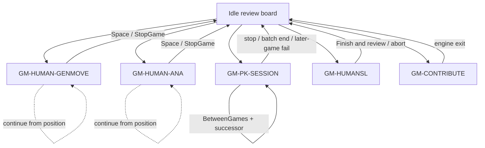

# Domain 05 — Actual Match-Session Capability Inventory

## 1. Frozen sources

| Tree | Path | Commit |
| --- | --- | --- |
| Java (unique authority) | `/home/dev/dev/weiqi/worktrees/lizzieyzy-next/java-baseline-v1` | `7b4027531c2b26062d0bfc27a040cc550cfbea4d` |
| Next (unique authority) | `/home/dev/dev/weiqi/worktrees/lizzieyzy-next-tauri/migration-coverage-audit` | `18c6d189b8b01069975c4c40ead63a010249cb8c` (`docs/migration-coverage-audit`) |

Docs read from the Next worktree: `CONTEXT.md`, `docs/JAVA_BASELINE.md`, `docs/PARITY_MATRIX.md`, `docs/MIGRATION_PLAN.md`, `docs/ARCHITECTURE_NEXT.md`, `.scratch/migration-coverage-audit/issues/05-inventory-game-modes.md`.

This report cites only those two worktrees. It does not cite Java `42c92e3`, `/home/dev/dev/weiqi/lizzieyzy-next` (non-worktree), or `/mnt/d/dev/weiqi/tmp/lizzie-java-baseline-r2a`.

Source-only investigation. No builds, tests, formatters, or runtime verification. Unobserved runtime behavior is marked **需定向运行核验**.

## 2. Census method

Covered entry-generation surfaces:

- i18n: `src/main/resources/l10n/DisplayStrings.properties` (`Menu.*`, `NewGameDialog.*`, `NewAnaGameDialog.*`, `NewEngineGameDialog.*`, `HumanSl*`, `EngineGameInfo.*`, `Contribute*`)
- Menu / double-menu / keyboard: `gui/Menu.java`, `gui/Input.java`, `gui/LizzieFrame.java` command overlay
- Human vs engine dialogs: `gui/NewGameDialog.java`, `gui/NewAnaGameDialog.java`
- PK/engine-game: `gui/NewEngineGameDialog.java`, `gui/BottomToolbar.java` (`enginePkPanel`), `gui/EngineGameDesktop.java`, `gui/EngineGameBatchSpecCapture.java`, `enginegame/*`
- HumanSL / AI Coach: `gui/NewHumanSlGameDialog.java`, `gui/HumanSlGameController.java`, `gui/HumanSlTrainingBar.java`, `training/*`
- Contribute: `analysis/ContributeEngine.java`, `gui/ContributeView.java`
- Persistence: `Config.java` `uiConfig` / `leelazConfig` keys written by the dialogs
- Next: `docs/PARITY_MATRIX.md` GAME-01..03, `docs/MIGRATION_PLAN.md` R6, `docs/ARCHITECTURE_NEXT.md` Engine-Game State, `apps/desktop/src/components/AppChrome.tsx`, `crates/engine-manager/src/lib.rs`

Capability rule: one observable user goal. Multiple controls that start the same session family are one Capability with every Entry Point listed. Swing class, widget, thread, and file format are not Capabilities. PK stop/pause/revise and generated SGF information stay inside `GM-PK-SESSION` (no `GM-PK-CONTROL` / `GM-PK-BOARD-COMMENT`). Analysis (04) and review pass/edit/save (03) are dependencies, not this domain's product.

## 3. Session-family architecture

Mutual exclusion (source): HumanSL start refuses PK / human-vs-engine / contribute; PK dialog refuses an already-playing PK; contribute start is blocked when starting HumanSL/analyze/continue; whole-game analysis conflict list includes PK, both human match flags, HumanSL, contribute (`LizzieFrame.isWholeGameAnalysisConflict`, 14743-14752). Exact dialog-vs-dialog preemption order beyond these guards is **需定向运行核验**.

Shared board/SGF owner is `Lizzie.board` + `GameInfo`. PK additionally owns `Lizzie.engineGame` (`EngineGameModule`). HumanSL owns `Lizzie.frame.humanSlGame`. Contribute owns `Lizzie.frame.isContributing` plus `ContributeEngine`.

## 4. Capabilities

### GM-HUMAN-GENMOVE — Start and play a human-vs-engine genmove match

| Field | Content |
| --- | --- |
| Name | Human vs one engine using GTP genmove |
| Entry Points | Menu 棋局 → 新对局 → `Menu.newGenmoveGame` (New game Genmove mode, N) → `LizzieFrame.startNewGame()` (`Menu.java` 2912-2922). Keyboard N (no Alt) → `startNewGame()` (`Input.java` 412-417). Double-menu `doubleMenuNewGame` (same cluster as Pause/Stop/Resign; `Menu.java` 120-123). Continue-from-position: 棋局 → 人机续弈 → `Menu.continueGenmoveGameAsWhite` / `AsBlack` → `continueAiPlaying(true, …)` (`Menu.java` 2952-2976). Keyboard Enter (no Alt) → `continueAiPlaying(true, true, true, true)` (`Input.java` 655-660). |
| Frozen baseline | User picks engine, color, continue-or-new, komi, handicap, time mode (normal / Kata byoyomi-or-fisher / raw advanced / engine-owned), ponder, play-mode overlay, show-black/white candidates, autosave. OK persists config, switches engine if needed, rejects WebSocket+advanced clock (`NewGameDialog.apply` 889-1001). After dialog, `isPlayingAgainstLeelaz=true`; engine is sent time (unless engine-owned) and genmove for the AI color (`continueAiPlayingReserved` 11895-11915). Human clock optional (`limitMyTime` → `countDownForHuman`). Timeout writes result 白胜/黑超时 or 黑胜/白超时 and calls `stopAiPlayingAndPolicy` (`LizzieFrame` 14395-14410). Navigation undo/redo is blocked while the flag is set (`LizzieFrame.undo/redo` 18882-18935). |
| Defaults | Komi fallback 7.5 in apply parse (`NewGameDialog` 912-916). `GameInfo.DEFAULT_KOMI=7.5`. Time mode from `genmoveGameNoTime` / `advanceTimeSettings` / `kataTimeSettings` else normal (`NewGameDialog` 721-728). Ponder from `config.playponder` (Config field default true, line 64). Play-mode from `config.UsePlayMode`. Show candidates from `newGameShowBlack/White`. Autosave from `autoSavePlayedGame`. |
| Persistence | uiConfig: `check-play-black`, `check-continue-play`, `new-game-komi`, `new-game-handicap`, `limit-my-time`, `my-save-time`, `my-byoyomo-seconds`, `my-byoyomo-times`, `advance-time-txt`, `kata-time-*`, `kata-visits-playouts-settings`, `kata-visits-txt`, `kata-playouts-txt`, `use-play-mode`, `auto-save-played-game`, show-candidate persist via `persistNewGameShowCandidates`. leelazConfig: `max-game-thinking-time-seconds`, `play-ponder`. |
| Failure / recovery | No engine selected → modal `NewAnaGameDialog.noEngineHint`. Engine switch failure aborts apply. WebSocket advanced clock → `showUnsupportedWebSocketAdvancedClock`. Foreground engine lease conflict → `AnalysisSettings.reuseStatus.existing_lease`. Contribute active → contribute tip, no start (`continueAiPlayingReserved` 11873-11876). Empty engine manager → return. Stop: Space / `Menu.breakGame` / `togglePonderMannul` → `stopAiPlayingAndPolicy` (clears flag, restores candidates, optional MyGames timestamp autosave). |
| Frozen evidence | `gui/NewGameDialog.java` 93-111, 889-1001; `gui/LizzieFrame.java` continueAiPlaying 11856-11980, stopAiPlayingAndPolicy 12452-12553, countDownForHuman 14342-14416; `gui/Input.java` 412-417, 655-660; `gui/Menu.java` 2905-2976, 3034-3042; `analysis/GameInfo.java` 11-13. `startNewGame()` body not fully read in this pass; post-dialog handicap GTP (`place_free_handicap` / `fixed_handicap`) for genmove (present for analysis-mode at `NewAnaGameDialog` 908-918) is **需定向运行核验**. |
| Next mapping | Missing. AppChrome 棋局 → 人机对局(Genmove模式) and 续弈 items are disabled title=尚未接入 (`AppChrome.tsx` 140-147). Visible 新对局 calls `onNew` (empty-board / review, `AppChrome.tsx` 141, 282), not a genmove session. `play_current_game` is R1 tree edit (03), not a match. |
| Existing Parity Item | None dedicated. GAME-01 text is PK session state only. |
| Ambiguity / 需定向运行核验 | Exact `startNewGame()` sequence after OK (handicap placement, setGameStatus, first genmove). Whether double-menu NewGame opens genmove vs a chooser. Enter vs menu continue: Enter uses continueNow=true (AI plays the side to move); menu items use continueNow=false with an explicit AI color. |

### GM-HUMAN-ANA — Start and play a human-vs-engine analysis-mode match

| Field | Content |
| --- | --- |
| Name | Human vs one engine; engine plays by analysis + auto-play of the best move, not genmove |
| Entry Points | Keyboard Alt+N → `startAnalyzeGameDialog()` (`Input.java` 412-415). Menu 棋局 → 新对局 → `Menu.newAnalyzeModeGame` (`Menu.java` 2924-2925, `createAnalyzeModeGameItem()`). Continue: 人机续弈 analyze-mode items (`Menu.java` 2978-3007); if leelaz.noAnalyze, those items fall back to genmove. Alt+Enter → `continueAiPlaying(false, true, true, true)` (`Input.java` 655-657). Engines with noAnalyze redirect analyze-start to genmove (`startAnalyzeGameDialogReserved` 11818-11820). |
| Frozen baseline | Dialog title is analysis-mode game. Fields: engine, color, continue, human time, AI time/playouts/first-playouts, resign start-move / consecutive / winrate%, ponder, play-mode, show B/W, autosave, optional pure-net. Apply requires at least one of time / playouts / first-playouts / pure-net (`NewAnaGameDialog.apply` 817-823). Sets `isAnaPlayingAgainstLeelaz=true`, `toolbar.chkAutoPlay=true`, AI color via auto-play checkboxes, `board.isGameBoard=true`, `leelaz.setGameStatus(true)`, optional handicap GTP, then ponder (`apply` 734-934). Engine resign uses `anaGameResignCount` vs configured consecutive/percent. |
| Defaults | Komi parse fallback 7.5 (742-746). Resign fields persist `anaGameResignStartMove/Move/Percent`. Continue/color/komi/handicap share `check-play-black`, `check-continue-play`, `new-game-komi`, `new-game-handicap` with genmove. |
| Persistence | Same human-game uiConfig keys plus `anagame-resign-start-move`, `anagame-resign-move`, `anagame-resign-percent`, `genmove-game-notime` (written here too, 851). |
| Failure / recovery | No engine; wrong AI-move settings; contribute block; HumanSL teardown deferral; lease conflict. Cancel restores ponder if it was on (`showAnalyzeGameDialogAfterModeTransition` 11847-11850). Stop path is the same `stopAiPlayingAndPolicy` branch for `isAnaPlayingAgainstLeelaz` (12499-12520): clears auto-play, restores candidates, optional autosave. |
| Frozen evidence | `gui/NewAnaGameDialog.java` 85-102, 734-934; `gui/LizzieFrame.java` 11802-11854, 11929-11980, 12499-12520; `gui/Input.java` 412-415, 655-657; `gui/Menu.java` 2924-3007. |
| Next mapping | Missing. AppChrome 人机对局(分析模式) is unwired (`AppChrome.tsx` 143). Whole-game / one-shot analysis (ANA-01/02) is 04, not this match family. Toolbar 暂停 is analysis cancel (`AppChrome.tsx` 283), not match pause. |
| Existing Parity Item | None. GAME-01/03 do not name analysis-mode human games. |
| Ambiguity / 需定向运行核验 | Whether pause (vs stop) exists for analysis-mode human games (`leelaz.isGamePaused` is set false on start; no dedicated pause Entry Point found besides Space-as-stop). Live resign threshold behavior vs PK resign policy. |

### GM-PK-SESSION — Engine-vs-engine (PK) session, including stop/pause/resume/revise and generated game information

Single Capability. Do not split stop/pause/revise or generated SGF facts into GM-PK-CONTROL / GM-PK-BOARD-COMMENT.

| Field | Content |
| --- | --- |
| Name | Two engines play one game or a batch; user can stop, pause/resume, revise remaining batch size; completion facts are stored on GameInfo and saved with the SGF |
| Entry Points | Start: Menu 棋局 → 新对局 → `Menu.newEngineGame` (Alt+E per i18n) → `startEngineGameDialog()` (`Menu.java` 2927-2937). Keyboard Alt+E → `startEngineGameDialog()` (`Input.java` 317-321). Dialog `NewEngineGameDialog` OK → `Lizzie.engineGame.accept(spec)` (`NewEngineGameDialog.java` 1132-1159). Bottom toolbar PK panel: `chkenginePk`, engine combos, `btnStartPk`, `btnEnginePkConfig` (`BottomToolbar.java` 239-253). Stop: `Menu.breakEngineGame` → `EngineGameDesktop.stop()` (`Menu.java` 3045-3054); `EngineGameModule.stop()` (93-137). Pause/resume: `Menu.pauseEngineGame` → `EngineGameDesktop.togglePause()` (`Menu.java` 3057-3066); chrome button `btnEnginePkStop` text 暂停/继续 (`SwingEngineGameChrome` 115-120). Revise batch limit: `Menu.changeEngineGameNumbers` input → `EngineGameDesktop.reviseLiveBatchLimit` (`Menu.java` 3069-3094). Intervention: `Menu.intervention` → Manual dialog (`Menu.java` 3097-3107); during PK, board clicks go to `onClickedForManul` (`Input.java` 86-96). Generated info / save: `EngineGameModule.captureSaveSnapshot()` (254-284); completion `freezeEngineGameRecord` (678-697); i18n `EngineGameInfo.*` for batch score text; autosave / winrate image via `EngineGameOutputChoices`. |
| Frozen baseline | Spec: two distinct engines, play mode ANALYSIS or GENMOVE, per-side time mode (ENGINE_OWNED / FIXED / RAW_ADVANCED), time seconds, visits, opening visits, resign (minMove, consecutive, winrate%), komi, handicap, opening (empty / continue position / SGF catalog sequential or random), exchange colors, batch + live-revisable limit, max-move cap (toolbar default 450), autosave, save winrate image, batch folder name (`EngineGameParsedStart` 8-40, 238-253; `EngineGameBatchSpecCapture` 19-57). Lifecycle snapshot: Idle / BatchActive(Starting / Playing(RUNNING or PAUSED) / BetweenGames) (`EngineGameSnapshot`, `GameActivity`, `RunState`). Chrome kinds: STARTING, PLAYING, PAUSED, RESUMED, BETWEEN_GAMES, START_FAILED, USER_STOPPED, BATCH_ENDED, LATER_GAME_FAILED. Normal outcomes: Resign(side), DoublePass, MaxMoves — user stop is not a GameOutcome (`GameOutcome.java` 5-16). GENMOVE pause while unsettled is refused and shows `BottomToolbar.genmoveStopHint` (`EngineGameDesktop` 38-46; `EngineGameModule.resume` 168-172). Analysis-mode start rejected if both sides lack time/visits/first-move visits (`validateSpec` 526-540). Same engine rejected. Occupied lifecycle rejected. Later successor start failure → Idle + LATER_GAME_FAILED (346-387). Generated facts live on `GameInfo.engineGameRecordContext` / `engineGameRecord` / `engineGameSaveSnapshot` (`GameInfo.java` 96-148), not in the personal-comment field. |
| Defaults | Komi 7.5, handicap 0, batchLimit 1, maxMoves 450, autosave true, resign `EngineGameResignPolicy.defaults()` = minMove 0, consecutive 2, winrate 10.0 (`EngineGameParsedStart.Builder` 238-253; `EngineGameResignPolicy` 3-6). Toolbar AutosavePk=true, exChangeToolbar=true, maxGameMoves=450 (`BottomToolbar` 144-173). |
| Persistence | uiConfig: `new-engine-game-komi`, `new-engine-game-handicap`, `first/second-engine-resign-move-counts|winrate|min-move`, `advance-black-time-txt`, `advance-white-time-txt`, engine SGF-start via `persistEngineSgfStart`, PK identity via `EnginePkIdentity.persistSelection`. Time modes via `DesktopTimeControl.commitEngineGameSelection`. |
| Failure / recovery | Dialog: empty SGF-start catalog; multi-SGF without batch; bad komi; illegal handicap text (`Menu.inputIntegerHint`); WebSocket advanced clock. Accept: same engine message; invalid analysis limits; occupied; startFailed observer shows `EngineManager.engineGameStartFailed` unless user cancel. User stop during Starting notifies `StartFailure.CancelledByUser`. GTP console blocked (`GtpConsolePane.isEngineGame`). |
| Frozen evidence | `enginegame/EngineGameModule.java` 22-212, 254-387, 400-450, 526-540, 667-697; `enginegame/EngineGameControl.java`; `enginegame/EngineGameSnapshot.java`; `gui/EngineGameDesktop.java` 16-75; `gui/NewEngineGameDialog.java` 1016-1169; `gui/EngineGameBatchSpecCapture.java` 16-57; `gui/SwingEngineGameChrome.java` 15-121; `analysis/GameInfo.java` 96-148; `gui/Menu.java` 2927-3107; `gui/Input.java` 86-96, 317-321. |
| Next mapping | Missing. GAME-01/02/03 all Missing. `MIGRATION_PLAN.md` R6 and `ARCHITECTURE_NEXT.md` Engine-Game State specify a future engine-manager internal module (start/stop/pause/resume/revise_batch_limit/snapshot) that does not exist in `crates/engine-manager/src/lib.rs` (profiles, asset checks, analysis process/cancel only). AppChrome 引擎对局 disabled (`AppChrome.tsx` 148). |
| Existing Parity Item | GAME-01 (session), GAME-02 (revisable batch limit), GAME-03 (board/comment integration). See section 7: these three over-aggregate PK internals and omit other families. |
| Ambiguity / 需定向运行核验 | Menu strings say stop Alt+R and pause Alt+T, but `Input.keyPressed` maps R → `replayBranch` and Alt+T → `toggleShowComment` with no PK handlers. Whether those accelerators are Swing setAccelerator elsewhere is **需定向运行核验**. Exact SGF property used for EngineGameRecord vs personal comments is 03/SGF-05/#369; this domain only owns that the facts exist on GameInfo. Autosave directory/name for PK vs human MyGames is **需定向运行核验**. |

### GM-HUMANSL — AI Coach / HumanSL match

| Field | Content |
| --- | --- |
| Name | Human vs HumanSL policy opponent (rank / modern pro / online 9d), with optional live analysis or post-game review |
| Entry Points | Menu 棋局 → 新对局 → `Menu.newHumanSlGame` → `startHumanSlGameDialog()` (`Menu.java` 2940-2949). Toolbar AI Coach button → `handleAiCoachToolbarAction()` (`LizzieFrame` 11701-11710): if a game is live, show the training bar; else open setup. `startHumanSlGameDialogAtCurrentPosition()` for from-current. In-game bar: Pass, Retry AI, Finish and review (`HumanSlTrainingBar` 131-157). Keyboard P → `humanSlGame.humanPass()` when a live controller exists (`Input.java` 431-436). Board clicks routed to the controller before other modes (`Input.java` 32-45). |
| Frozen baseline | Setup: training mode POST_GAME_REVIEW or LIVE_ANALYSIS (LIVE_CORRECTION deprecated alias), opponent preset RANK/MODERN_PRO/ONLINE_9D, rank 1-9 dan or 1-20 kyu, color RANDOM/BLACK/WHITE, move time >=2s (default 10), handicap 0-9, komi, from-current-position (`HumanSlTrainingConfig`). Session states IDLE → PREPARING → PLAYING → REVIEWING → REPORT_READY → FINISHED (`HumanSlTrainingSession`). Start pauses foreground analysis, optionally `board.clear`, sets komi/handicap/player names You / HumanSL AI (label), schedules AI if human is not to play. AI move: HumanSL runner bestHumanMove with retries, 800-4000 ms think delay, pass on empty/illegal. Stale-position AI reply aborts (`HumanSlGameController` 631-640). Finish keeps the game on the main board for ordinary review. Resign is a deprecated alias of finish (`humanResign` 516-520). Save kifu is `LizzieFrame.saveFile(false)` (03). |
| Defaults | Mode POST_GAME_REVIEW, opponent RANK, rank 3 dan, color RANDOM, moveTime 10s, handicap 0, komi 7.5, fromCurrent false (`HumanSlTrainingConfig.Builder` 62-71). RANK visits 64 / symmetries 1; MODERN_PRO visits 128 / symmetries 2 (`OpponentPreset` 22-27). Engine ready timeout 180s (`NewHumanSlGameDialog` 69). |
| Persistence | N/A as a dedicated match-store in the files read; HumanSL profile strings are KataGo HumanSL names (rank_3d, proyear_2023, …). Whether setup fields write uiConfig is **需定向运行核验** (not in the Config keys listed for human/PK dialogs). |
| Failure / recovery | URL-SGF live sync blocks start. Failed start rolls back StartBoardSnapshot (board, file title, readboard, foreground engine flags, winrate graph) (`HumanSlGameController` 83-169, 357-433). AI no-response sets aiFailed, toast, Retry AI. Exit is retryable (exitRecoveryPending); bar shows Retry cleanup. Opening PK/analyze/continue while HumanSL is live defers behind `deferUntilHumanSlExit` / abort. |
| Frozen evidence | `gui/NewHumanSlGameDialog.java` 65-150; `gui/HumanSlGameController.java` 32-80, 292-433, 490-767; `gui/HumanSlTrainingBar.java` 19-157; `training/HumanSlTrainingConfig.java`; `training/HumanSlTrainingSession.java`; `training/TrainingMode.java`; `gui/LizzieFrame.java` 11689-11741; `gui/Input.java` 32-45, 431-436; `gui/Menu.java` 2940-2949. |
| Next mapping | Missing. No HumanSL/AI Coach control in AppChrome. Contribute menu is unrelated. |
| Existing Parity Item | None. |
| Ambiguity / 需定向运行核验 | Menu Pass (`Lizzie.board.pass()`, `Menu.java` 3141-3148) vs keyboard Pass (`humanPass`) during HumanSL — two Entry Points may not be the same behavior. Whether a dedicated Resign control remains on double-menu. Live-analysis vs 04 foreground analysis sharing GPU. |

### GM-MATCH-PASS — Pass in an actual match

| Field | Content |
| --- | --- |
| Name | Pass the current match turn |
| Entry Points | Keyboard P (`Input.java` 431-436): HumanSL → humanPass(), else `Lizzie.board.pass()`. Menu `Menu.playPassMove` → always `Lizzie.board.pass()` (`Menu.java` 3141-3148). Double-menu / board pass button `playPass` (`Menu.java` 91). PK engines pass as a game outcome (`GameOutcome.DoublePass`). |
| Frozen baseline | HumanSL pass only on human turn, places a pass locally, then schedules AI. Review/human-engine pass is board.pass (03 dependency when not in a match). PK double-pass ends the game without counting in batch score (`EnginePkConfig.textAreaHint`). |
| Defaults | N/A |
| Persistence | N/A |
| Failure / recovery | HumanSL ignores pass if finished or not human turn. |
| Frozen evidence | `Input.java` 431-436; `Menu.java` 3141-3148; `HumanSlGameController.humanPass` 505-514; `GameOutcome.DoublePass`. |
| Next mapping | Review pass exists (AppChrome 停一手 / 虚手 → onPass / play_current_game pass vertex). That is 03, not match-session pass. Unwired for match families. |
| Existing Parity Item | SGF-04 (legal pass edit) covers review pass only. |
| Ambiguity / 需定向运行核验 | Menu Pass during HumanSL. Whether human genmove/ana pass is GTP play pass vs local only. |

### GM-MATCH-STOP — Stop a human-vs-engine match (and HumanSL via shared Space path)

| Field | Content |
| --- | --- |
| Name | End the current human-vs-engine (or HumanSL) match and return to review |
| Entry Points | Space / `Menu.breakGame` / `togglePonderMannul` (`Menu.java` 3034-3042; `Input.java` 419-421; `LizzieFrame` 12357-12366). Double-menu `doubleMenuStopGame`. HumanSL also: training-bar Finish (`finishAndReturnToBoard`). PK stop is not this Capability (it belongs to GM-PK-SESSION). |
| Frozen baseline | `stopAiPlayingAndPolicy`: if HumanSL live, defer abort (returns true, does not toggle ponder). Else if genmove match: stop human timer, clear countdown, setAsMain, restore WRN, setGameStatus(false), optional autosave MyGames timestamp (names).sgf, clear isPlayingAgainstLeelaz. Analysis-mode match: clear auto-play flags, restore show B/W, setGameStatus(false), optional autosave. Then toggleDoubleMenuGameStatus. If no match was active, Space falls through to ponder toggle. |
| Defaults | `autoSavePlayedGame` gates autosave. |
| Persistence | Autosave files under process cwd MyGames. |
| Failure / recovery | HumanSL abort is async/retryable. |
| Frozen evidence | `LizzieFrame.stopAiPlayingAndPolicy` 12452-12553; `autoSavePlayedGame` 12417-12449; `togglePonderMannul` 12357-12366. |
| Next mapping | Missing. AppChrome 暂停 cancels analysis, not this stop. |
| Existing Parity Item | GAME-01 stop is specified only for engine-game. |
| Ambiguity / 需定向运行核验 | Double-menu Resign vs Stop vs Pause labels (`Menu.resignBtn` / `pauseGameBtn` / `endGameBtn`). Whether resign writes an SGF RE[] before stop. |

### GM-CONTRIBUTE — KataGo distributed-training contribute session

| Field | Content |
| --- | --- |
| Name | Run KataGo contribute and watch/play distributed games |
| Entry Points | Menu 跑谱贡献 / ContributeView (i18n ContributeView.title=KataGo Distributed Training). Constructor of ContributeEngine starts the process, sets `Lizzie.frame.isContributing=true`, clears the board, relabels engine menu (`ContributeEngine.java` 73-126). Next AppChrome 可视化KataGo分布式训练 is disabled (`AppChrome.tsx` 223-226). |
| Frozen baseline | Builds katago contribute with username/password, maxSimultaneousGames, ownership, optional maxRatingMatches=0, logGamesAsJson=true, optional SSH. paused flag exists (70-71, 131). Watches a list of contribute games. Drag on the main board is ignored while contributing (`Input.java` 175). Starting HumanSL/analyze/continue while contributing is refused. |
| Defaults | Server https://katagotraining.org/ unless overridden. |
| Persistence | config.contribute* command/path/user/batch (02/06 cross-cut). |
| Failure / recovery | SSH login failure leaves javaSSHClosed. Benchmark-sync suppression can skip start. Error path can append -cacerts cacert.pem. |
| Frozen evidence | `analysis/ContributeEngine.java` 32-126; `gui/ContributeView.java`; `LizzieFrame.isContributing` uses in Input / start guards. |
| Next mapping | Missing (disabled menu only). |
| Existing Parity Item | None in GAME-*. PROV/READ items are Fox/Yike/readboard, not contribute. |
| Ambiguity / 需定向运行核验 | Pause/resume/watch-next UX in ContributeView. Whether this is better owned with 06 external publishing; this census records it as a reachable match-like session because it occupies the board, engine menu, and blocks other match families. No product disposition. |

### GM-MATCH-RULES-START — Handicap, komi, and time/move limits at match start

Not a separate session. Documented as the shared start-parameter surface so GAME items do not hide it inside engine-game state.

| Field | Content |
| --- | --- |
| Name | Choose komi, handicap, clocks, and (PK) max-moves when starting a match |
| Entry Points | All four start dialogs; GameInfo dialog I (`Input.java` 497-504) edits names/komi/handicap on the current GameInfo (03/review overlap). Live komi spinner `Menu.txtKomi` (02 overlap). PK max-move in EnginePkConfig. Human time combos in NewGame/NewAna dialogs. |
| Frozen baseline | Human/PK/HumanSL all default komi 7.5. Human handicap combo; PK empty handicap = even game 0, handicap>=2 places stones. Analysis-mode KataGo free handicap vs fixed (useFreeHandicap). HumanSL 19x19 setupFixedHandicap when handicap>=2. Time: human fixed seconds / Kata byoyomi / fisher / engine-owned / raw time_settings. PK per-side modes. |
| Defaults | See each family. DesktopTimeControl is the shared parser. |
| Persistence | See family uiConfig keys. |
| Failure / recovery | Illegal komi/handicap strings. WebSocket engines reject advanced clocks. |
| Frozen evidence | Dialogs cited above; GameInfoDialog; DesktopTimeControl; EngineGameHandicapApply (`NewEngineGameDialog` 961-1014). |
| Next mapping | AppChrome 贴目 is read-only (`AppChrome.tsx` 285-288). 规则 disabled. No match clocks. |
| Existing Parity Item | None. PREF-01 does not inventory these. |
| Ambiguity / 需定向运行核验 | Whether changing txtKomi mid-match sends GTP komi for each family. |

## 5. Implementation / non-session candidates (not classified abandon/skip)

| Candidate | Why it is not a Domain 05 Capability |
| --- | --- |
| EngineGameModule, SwingEngineGameChrome, RetainedEngineModeTarget, EngineGameBatchState | Implementation / chrome. Behavior is folded into GM-PK-SESSION / human start. |
| ExtraMode Thinking / Double_Engine / Float_Board | Layout (02). |
| Whole-game / flash / auto / batch analysis | 04. Conflict list proves they are not match sessions. |
| Try-play (V), continue ladder, setup-stone tools, score mode (Ctrl+Q) | 03 review/edit. |
| TeacherDialog / Menu AI commentary | 04 commentary, not a match. |
| Tsumego / capture tsumego | 03 puzzle. |
| Play best move (comma) | Review force-play; not a session family. |
| newEmptyBoard / Ctrl+Home clear | 03 empty review board. Next 新对局 currently maps here, which is a routing mismatch with Java 棋局/新对局. |
| Menu.alternatelyMoves add-black/white | 03 setup. |

## 6. Cross-domain dependencies and unclaimed entries

| Dependency | Owner | Why 05 needs it |
| --- | --- | --- |
| Foreground engine identity, switch, lease, genmove / analyze process | 04 ENG/ANA | Every family except empty contribute-watch requires a live engine. Human start uses EngineModeReservation / tracking handoff. PK uses EngineManager.startEngineGame/pauseEngineGame/resumeEngineGame/stopEngineGame. HumanSL pauses/restores foreground analysis. |
| SGF tree, save, reopen, personal comments | 03 SGF-04/05/06 | Match moves update Lizzie.board. Autosave and saveKifu call SGFParser.save / saveFile. Generated PK facts must stay off the personal-comment field (JAVA_BASELINE.md #369, SGF-05). |
| Settings / layout persistence | 02 PREF | Dialog defaults live in uiConfig. |
| Global entry routing | 01 | N, Alt+N, Alt+E, Enter, Alt+Enter, Space, P, menu 棋局, contribute menu, double-menu game cluster. 01 should list these Entry Points and point here, not duplicate session semantics. |
| Providers / live URL-SGF | 06 | HumanSL refuses urlSgf. Contribute is also an external network session; 06 may claim publishing, 05 claims board occupancy. |
| Install/update | 07 | Bundled KataGo used by contribute/HumanSL download; not session semantics. |

Unclaimed by current GAME-01..03 (must not be silently dropped):

- Entire GM-HUMAN-GENMOVE, GM-HUMAN-ANA, GM-HUMANSL, GM-CONTRIBUTE
- Human continue-from-position (Enter / 人机续弈)
- Human stop-via-Space (overloaded with ponder)
- HumanSL pass/retry/cleanup
- PK intervention (Manual)
- PK SGF-catalog openings and color exchange
- Contribute watch/pause

## 7. Why GAME-01..03 over-aggregate or omit families

From docs/PARITY_MATRIX.md R6 (all Missing):

| Item | Stated capability | What the frozen product actually has | Boundary gap |
| --- | --- | --- | --- |
| GAME-01 | Engine-game session state — start/stop/pause/resume, one current session inside engine-manager | Four (plus contribute) distinct session machines: isPlayingAgainstLeelaz genmove, isAnaPlayingAgainstLeelaz auto-play, EngineGameModule Idle/BatchActive, HumanSlTrainingSession IDLE…FINISHED, isContributing | Omits human genmove, human analysis-mode, HumanSL, contribute. Over-aggregates PK analysis vs genmove vs batch vs single-game into one session without naming those modes. Acceptance one current session is true for PK (OccupiedLifecycle) but HumanSL/PK/human flags are separate and mutually exclusive in UI guards, not one module. |
| GAME-02 | Revisable batch limit — change scheduling mid-session | Only PK reviseBatchLimit / Menu.changeEngineGameNumbers / toolbar txtenginePkBatch. Human games have no batch. HumanSL has no batch. Contribute has maxSimultaneousGames at start, not a live GAME-02 control | Omits non-PK families. Over-fits a PK-only control as if it were generic game-mode. |
| GAME-03 | Game-mode board and comment integration — engine moves update tree; pause/resume/stop coherent; generated info separate from personal comments | PK moves + GameInfo.engineGameRecord* + pause/resume/stop are one PK session. Human/HumanSL also write player names and results onto GameInfo and the tree. Comment split is already SGF-05 / #369 (03) | Over-aggregates PK lifecycle (already GAME-01) with generated-info (belongs inside GM-PK-SESSION) and with 03 comment separation. Omits human/HumanSL generated names/results. Splitting a GM-PK-BOARD-COMMENT item would duplicate this. |

MIGRATION_PLAN.md R6 exit (short session, pause/resume, limit revision, stop, save, reopen) is PK-shaped and will not accept human or HumanSL families unless successor items are added. That is an inventory fact, not a disposition.

Recommended successor shape (inventory only, no disposition): keep GAME-01..03 as PK-only claims aligned to GM-PK-SESSION (01 lifecycle, 02 revise limit, 03 tree binding + generated-info vs SGF-05), and add separate items for GM-HUMAN-GENMOVE, GM-HUMAN-ANA, GM-HUMANSL, and optionally contribute.

## 8. Next mapping snapshot (18c6d189)

| Surface | Evidence |
| --- | --- |
| Parity | GAME-01..03 Missing; R6 not started |
| Architecture | Planned engine-manager session module; crate today is analysis process only |
| UI | 棋局 submenu: genmove/ana/PK/continue disabled 尚未接入; 新对局 = empty board; 跑谱贡献 disabled; 停一手 = review pass; 暂停 = cancel analysis |
| Commands | play_current_game / save / pass are 03 review. No Tauri match-session commands found in the engine-manager crate header |

## 9. Corrections vs an invalid first-round report

- Java evidence is only `/home/dev/dev/weiqi/worktrees/lizzieyzy-next/java-baseline-v1` @ `7b4027531c2b26062d0bfc27a040cc550cfbea4d`. No `42c92e3`. No `/mnt/d/dev/weiqi/tmp/lizzie-java-baseline-r2a`. No `/home/dev/dev/weiqi/lizzieyzy-next` main checkout.
- Next evidence is only the `migration-coverage-audit` worktree @ `18c6d189b8b01069975c4c40ead63a010249cb8c`.
- PK stop/pause/revise and generated information are one Capability GM-PK-SESSION, not separate CONTROL/BOARD-COMMENT items.
- Analysis-mode human play is a match family (05), not 04 whole-game analysis.
- Next 新对局 is not Java 新对局(Genmove/Analyze/PK/HumanSL).
- Contribute is recorded as a reachable session, not silently treated as 06-only, and not marked abandoned.
