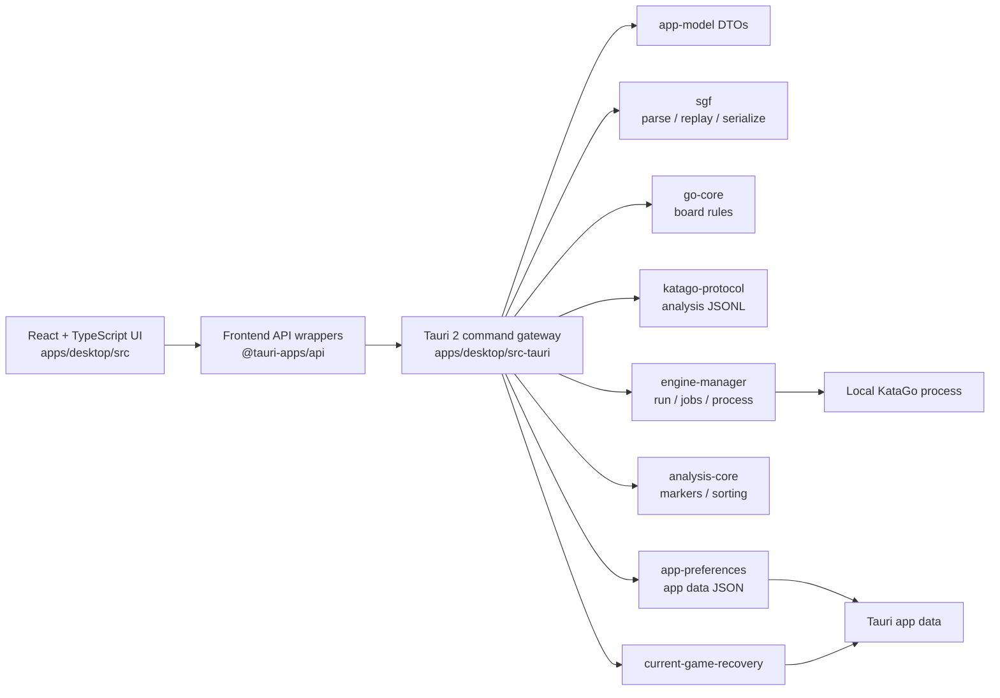

# LizzieYzy Next Architecture

LizzieYzy Next is the Tauri 2 + Rust + TypeScript desktop architecture being built beside the Java/Swing maintenance line. The goal is to move user-visible behavior into smaller testable domains without claiming full legacy parity before the evidence exists.

## Current System Shape

The UI consumes DTOs and view models. It does not consume raw KataGo JSON and does not own long-running engine processes. `engine-manager` owns the Foreground Engine Run, Analysis Jobs, and process lifetime. Rust owns file I/O, SGF parsing, process execution, cancellation, and app-data persistence.

Provider and readboard live paths follow the same boundary rule. The React UI should enter these paths through frontend API wrappers and Tauri commands; provider HTTP parsing, readboard sidecar probing, protocol parsing, and DTO normalization belong behind Rust crate boundaries. A wired command path is repository evidence only. It is not evidence that the external Yike/Fox services, accounts, network, or a local readboard sidecar have been validated.

## Modules

### `apps/desktop`

React + TypeScript desktop UI built with Vite. The current UI includes board rendering, SGF text/import workflow, native open/save entry points, winrate and analysis panels, and engine profile controls.

The browser preview can exercise UI fallback paths and local demonstration analysis, but it cannot perform native file dialogs, authoritative current-game edit/Save, app-data profile or recovery persistence, local asset checks, or real KataGo execution.

### `apps/desktop/src-tauri`

Tauri 2 command gateway. It exposes health, SGF parse/replay, native SGF read/write, engine profile persistence, asset checks, and manager-owned Foreground Engine Run commands (`foreground_engine_snapshot`, `foreground_engine_start`, `foreground_engine_stop`, `foreground_engine_restart`, `foreground_engine_switch`, `foreground_engine_start_selected_node`, `foreground_engine_cancel_job`). Whole-game analysis on a Ready Run uses `katago_start_analyze_game` / `katago_cancel_analysis`. Current-game replacement uses `prepare_document_replacement` / `resolve_document_replacement`. Application exit uses `prepare_application_exit`, `resolve_application_exit`, `retry_application_teardown`, `confirm_application_exit_anyway`, and `confirm_native_exit`. Current-game recovery uses `inspect_current_game_recovery`, `restore_current_game_recovery`, `discard_current_game_recovery`, `retry_current_game_recovery`, and `current_game_recovery_protection`. Removed profile-to-process commands `katago_analyze_once` and `katago_analyze_game` are not registered. Native `fake_analyze` is not registered; browser-preview demonstration analysis remains non-authoritative and does not create a Foreground Engine Run.

This layer should stay a gateway. Domain behavior belongs in crates unless it is directly about Tauri lifecycle, app data paths, command shape, or event emission.

Rust owns the authoritative current game. The holder stores `CurrentSgfDocument`, a monotonic semantic position/tree `generation`, `dirty`, `native_path`, the selected `NodePath`, and recovery sequence counters (`document_seq`, `snapshot_seq`). Shared results use `CurrentGameResultDto` (`tree`, `selected_path`, `snapshot`, `generation`, `snapshot_seq`, `dirty`, `native_path`). Comments, navigation and ordinary Save preserve `generation`; accepted move/tree edits and document replacement advance it. `snapshot_seq` orders document content and Save state within that identity, so delayed analysis snapshots cannot overwrite newer comments or saved/dirty state. Domain failures stay in `CurrentGameError` / `CurrentGameErrorKind`. Filesystem Save failures stay Gateway `String` errors and do not extend the domain kind enum.

Current-game mutation and derived reads are `select_current_game_node`, `play_current_game`, `set_current_game_personal_comment`, `remove_current_game_variation`, `serialize_current_game`, `save_current_game`, `save_current_game_as`, and `project_current_game_mainline`. Native document replacement prepares and resolves a candidate rather than installing SGF in one command. `play_current_game` sends a `NodePath` plus point/pass vertex; Rust uses the selected position's player-to-play color and `go-core` legality. An identical existing child is selected without mutation. A new child increments document generation and marks the game dirty. Occupied, suicide, simple-ko, and invalid-path failures are atomic.

Ordinary `save_current_game` writes a caller-supplied path. Ordinary `save_current_game_as` owns the Save As dialog: cancel returns `null` (`Save cancelled.`); a chosen allowed path writes through `save_current_game`'s path; a dialog-denied or Windows-redirected path is a Gateway write failure (`failed to write`) and does not write, adopt, or clear dirty. The `save-as-dialog` crate classifies those outcomes without a new harness. Successful ordinary Save keeps the caller-supplied `NodePath`, does not increment `generation`, and does not admit a document departure or cancel analysis. Directory-as-file write failure remains `current_game_save_write_failure`. Save is a semantic SGF round-trip, not byte-for-byte format preservation.

Confirmed replacement and application exit share a document-departure owner. `prepare_document_replacement` parses and validates the candidate before admission; a dirty holder returns `needs_decision`, a clean holder returns `ready`. `resolve_document_replacement` then takes Save / Discard / Cancel. Cancel aborts without sealing. Confirmed Discard or Save can stop Analysis Jobs; successful commit installs one candidate at its default selected path, clears dirty, and adopts the candidate source path. Cancelled or failed departure Save keeps the current game, keeps the engine, and stops analysis. `prepare_application_exit` / `resolve_application_exit` reuse that dirty gate for File Exit and window close (`application-exit-requested`). After confirmed leave, teardown uses a 10s budget, with `retry_application_teardown` and `confirm_application_exit_anyway` for outstanding resources, then `confirm_native_exit` to end the process. Exit dispositions recorded on the recovery envelope are `clean_completed`, `explicit_discard`, and `exit_incomplete`.

`serialize_current_game` and `project_current_game_mainline` are derived reads. The only remaining first-child adapter is the fresh Rust mainline `GameDto` consumed by analysis and review. React must not treat original `sgfText`, independently replayed positions, or `GameDto.moves` as document authority. The SGF textarea remains load input. Browser preview keeps edit and authoritative Save unavailable and explains that they need the native runtime.

Provider/readboard command contracts in this batch:

- `provider_fetch_yike` is the Tauri entry point for Yike runtime fetch. It must validate the request provider and timeout, call the Yike provider runtime path, and return `ProviderFetchResult` on success or a typed `ProviderError` on auth, network, payload, timeout, or runtime unavailable states.
- `provider_fetch_fox` is the Tauri entry point for Fox runtime fetch. It must validate the request provider and timeout, call the Fox provider runtime path for supported `chessid`, `uid`, and `user_name` commands, and return normalized provider DTOs or typed errors.
- `readboard_sidecar_probe` is the Tauri entry point for checking whether the local readboard sidecar is available. Its boundary is process/path/protocol readiness; it must not imply that a target board has been synced.
- `readboard_sidecar_sync_snapshot` is the Tauri entry point for syncing a snapshot through the sidecar. Its boundary is sidecar protocol line parsing and DTO normalization from supported inputs. Image OCR remains unavailable unless the sidecar/runtime explicitly supports it and should return a structured unsupported/not-implemented error rather than a false success.

The Provider panel is the expected UI surface for provider fetch, readboard probe, and readboard sync controls. Browser-preview behavior may show local fallback or structured unavailable states, but only the Tauri desktop runtime can exercise native provider/readboard commands.

### `crates/app-model`

Shared DTOs for games, moves, positions, candidate moves, analysis frames, engine profiles, assets, health, and problem markers.

### `crates/go-core`

Pure Go board and rules logic. It has no UI, Tauri, storage, or process dependency.

### `crates/sgf`

SGF parsing, replay, and serialization. It preserves the parsed tree for compatibility paths while exposing normalized game and position DTOs to the rest of the app.

### `crates/katago-protocol`

KataGo analysis JSONL query/response modeling and normalization. Raw engine JSON should remain here or in engine-manager helpers; the UI should receive `AnalysisFrameDto`.

### `crates/analysis-core`

Analysis-derived helpers such as candidate sorting and problem marker classification.

### `crates/engine-manager`

Engine profile catalog, Autoload Default, asset checks, and the manager-owned Foreground Engine Run: lifecycle snapshot, Start/Stop/Restart/Switch, selected-node and whole-game Analysis Jobs, process execution, cancellation, and typed failure.

### `crates/app-preferences`

Durable app preference storage for the categorized Preferences surface. Missing files load owner defaults. Unreadable files are isolated beside the original path and recovered to defaults with a user-visible report. Explicit writes use replace-safe persist; serialize/write/replace failures keep the previous durable value. This crate owns the preference mechanism only. It does not absorb analysis, shortcut, layout, scoring, window, or engine-domain semantics.

### `crates/current-game-recovery`

Session recovery for the current game only. The recovery envelope (`RecoveryEnvelopeDto`) stores `document_seq`, `snapshot_seq`, `sgf_text`, `selected_path`, optional `source_path`, `dirty`, and `disposition` (`clean_completed`, `explicit_discard`, or `exit_incomplete`). The crate coalesces pending snapshots with a 1000 ms scheduling delay and atomically replaces the recovery file; the gateway supplies the app-data `current-game-recovery.json` path and runs the writer. Replacement and exit also have explicit flush paths. A failed write reports `Unprotected` and keeps the last successful envelope; `retry_current_game_recovery` reissues a pending write. `inspect_current_game_recovery` classifies startup as `none` (missing or `explicit_discard`), `abnormal` (`exit_incomplete`), `normal` (`clean_completed`), or `unreadable`. Restore installs that current game, including its attached SGF analysis, personal `C`, `NodePath`, source path, and dirty state. It does not resume a Foreground Engine Run, Analysis Job, Match Session, or provider session. Discard persists `explicit_discard`. Preference `restoreLastSession` defaults off and applies only to a `normal` envelope.

### Provider crates

Provider crates own provider-specific URL parsing, request construction, payload parsing, and normalization. Yike live fetch must remain behind the Yike provider boundary. Fox fetch must support the documented `chessid`, `uid`, and `user_name` command shapes through the Fox provider boundary. The UI should not hand-roll provider HTTP behavior.

### `crates/readboard-sidecar`

The readboard sidecar crate owns launch/probe discovery, protocol line parsing, sidecar sync request/response normalization, and structured sidecar errors. Live sidecar availability depends on a local process and target client state outside repository validation.

### `crates/storage`

SQLite schema and storage helpers for unrelated application tables (`games`, `game_nodes`, `engine_profiles`, `assets`). Analysis persistence is SGF attachment through ordinary Save / Save As, not this crate.

## Continuous Selected-node Analysis

The selected-node lane supports `finite` and `continuous` modes. Durable `continuousAnalysisEnabled` defaults to true and is loaded with the continuous budget before automatic admission. The manager follows the latest authoritative generation/NodePath on an independently Ready Run. Continuous time and visits limits are independent: time defaults enabled at 600 seconds; visits defaults disabled with a retained value of 100000; empty-board stop defaults false. Values are positive whole numbers representable by `u32` (1–4294967295). Disabled limits retain their values and explicitly override finite engine-config caps. KataGo owns search-time accounting, excluding queue wait; 100 ms reports remain independent from process-failure deadlines. Intent never starts an engine. `foreground_engine_continuous_action` implements contextual Start/Stop/Resume; preference writes commit before intent/work change. The Preferences checkbox does not authorize Resume.

Snapshots distinguish queued, searching, stopping and time-limited work. Valid continuous Progress and admitted final frames attach to the authoritative SGF node, mark dirty and advance recovery snapshot ordering without changing document generation. Ordinary Save persists its invocation-time snapshot; a later frame marks dirty again. Whole-game search reports do not advance completed-node counts. Valid activity on the shared Run prevents a queued lane from expiring on its old submission timeout.

Targeted cancellation sends an independent control id plus `terminateId`. Stop and document departure seal publication immediately; cleanup ownership remains until the target final response, not its control ACK. The target wait is capped at five seconds within the shared departure budget. Delivery/deadline failure fails both lanes, visibly fails the Run and performs bounded process cleanup; an unconfirmed cleanup retains ownership and blocks new work. A pending replacement/exit aborts without final Save or installation. Initial departure Cancel leaves analysis untouched.

The manager coalesces superseded targets while cancellation finishes. Time/visits-limited completion retains the admitted result and holds the same admission; duplicate events or reselecting the same path cannot renew it. Explicit Resume, a changed durable budget, a different accepted position or a new Run can create a fresh budget, subject to stronger holds. Budget writes atomically seal and replace only continuous work; failed writes preserve the active identity. Finite and whole-game requests retain their budgets. Empty-board eligibility uses authoritative stone occupancy, not the root or move number, and does not mutate the SGF. Job errors survive navigation and budget updates. New Run identities release weak/error holds, not departure safety holds. Confirmed departure suppresses scheduling before collecting live jobs; aborted departure keeps a safety hold until explicit eligible Resume. Successful replacement supplies a fresh target. `ForegroundEngineSnapshotDto.continuous` distinguishes loading/off/waiting/unavailable/queued/searching/stopping/time_limited/visits_limited/empty_board/finite/paused/error/safety_hold/departing phases.

Explicit finite selected-node requests validate position and capability before taking over continuous work, then recheck admission after target cleanup. Successful finite completion releases the override; the manager creates one fresh continuous Job only from the latest intent, Run, position, budget and holds. Turning continuous intent off leaves finite work running. Explicit finite Cancel pauses the same admission; finite failure retains the error hold. Neither completion nor supersession clears a stronger hold. Whole-game work starts only through its explicit action and remains independently cancellable; selected-node navigation preserves its target list and completed counts. The latest valid admitted frame replaces a node's primary analysis regardless of lane or visit count, with the same admitted document feeding Save and recovery.

## Explicit Analysis Tasks

`preview_analysis_scope` resolves current node, Selected Review Line, first-child mainline, or all branches in Rust. Inclusive intervals count actual moves (pass included), with root zero; setup/PL positions retain their move count and pure comment nodes are automatic-scope non-targets. Filtering uses side to play and identity uses NodePath. `start_analysis_task` revalidates the complete preview under the current-game lock before manager admission. The existing `katago_start_analyze_game` is a first-child preset of this same owner.

The manager retains one session-only `AnalysisTaskDto`, distinct from its underlying Job, with frozen scope, Run, semantic generation, strategy, stage conditions, requested paths and stage-local completed paths. Single-stage tasks use one condition set. The all-position strategy completes the frozen worklist once with overview conditions before resetting traversal for deep conditions; overview completions and task-owned summary frames remain separate from deep completions and later SGF primary-analysis replacement. Time, total visits and leading-candidate visits are independent enabled/value conditions combined with OR in either stage. Every retained value must be a positive `u32`, including disabled conditions; all-disabled admission rejects without changing work or preferences, and the all-position deep total-visits value must be at least 500. `analysis_task_snapshot` exposes queued/searching and retained completed/cancelled/failed/invalidated states. Cancel seals publication immediately while target-final cleanup completes. Semantic edits, Stop/Restart and successful Run replacement invalidate; navigation, comments, ordinary Save and failed switches retaining the original Run preserve work.

The task panel previews count/endpoints, selects single-stage or all-position two-stage execution, edits their independent conditions, and shows immutable active conditions, stage-local progress and ending causes. Explicit Start persists `taskSingleStageConditions`, `taskOverviewConditions` and `taskDeepConditions` through the existing serialized atomic preferences transaction before admission. Legacy `taskConditions` becomes the unchanged single-stage preset and seeds a separate deep preset whose total-visits value is floored to 500; unrelated preferences remain intact. Overview defaults to 32 total visits. Missing deep presets derive total visits from the existing single-stage/default value with a floor of 500; a supported stored deep preset at or above 500 is retained. Explicit task limits support 1–4294967295 independently of the finite selected-node preference. Failed writes preserve durable preferences and current work; later successful writes affect future tasks only. Ctrl+B uses a one-visit first-child single-stage preset without changing durable task presets; Ctrl+Shift+B starts the durable all-position two-stage preset. Both use registry focus suppression. Existing finite selected-node and contextual Space controls remain independent. Task state is never serialized into SGF or recovery. ANA-16 remains Missing pending the complete batch and ticket 07 native acceptance.

Task queries explicitly override `maxTime`, `maxVisits` and `maxPlayouts`, using KataGo's unbounded sentinels for disabled caps, with 100 ms reports. KataGo owns search-time accounting after engine queue admission. Leading-candidate visits come from the current legitimate report's `order=0` move. Observed visit limits terminate the actual target; only its valid final releases cleanup and completes the position. Each position has a distinct wire query ID while public Job identity remains stable. `ending_conditions` records the first observed set for the most recently completed target; a final arriving during cleanup cannot invent additional causes. KataGo does not report elapsed search time: a valid natural final below enabled visit limits identifies the configured time limit, while observed visit ties report the visits condition set without inferring timing order. Ignored required settings, malformed budget-final responses, or target-final delivery/deadline failure use bounded Run-failure cleanup. Pause, Cancel, invalidation and departure retain stronger publication fences.

`pause_analysis_task` seals the task's Job under the current-game holder lock and requests target cancellation. `analysis_task_snapshot` exposes `pausing` until target-final cleanup, then `paused`; a control ACK alone cannot release cleanup. The paused task retains the whole-game reservation and its frozen worklist. `continue_analysis_task` rechecks semantic generation, Run and departure admission, creates a fresh Job identity, skips the same task's completed positions and restarts the interrupted position with its full immutable budget. It neither restarts the Run nor changes selected-node intent/error/departure holds. Pause/Cancel and next-position query delivery are serialized, preventing a cancellation from being overtaken by a queued submission. Cancel and confirmed departure terminate a paused task; cancellation delivery/deadline failure follows bounded Run cleanup and aborts an in-flight departure. The frontend provides Pause/Continue alongside Start/Cancel and fences delayed pre-Pause events without stopping independent selected-node work.

## Data Flow

1. The user opens, replaces, or edits SGF in the React UI.
2. The frontend calls Tauri commands through API wrapper functions. Native Open / New / paste / import use `prepare_document_replacement` then `resolve_document_replacement`. Ordinary Save / Save As use `save_current_game` / `save_current_game_as` and do not admit a document departure.
3. Rust parses SGF into DTOs and replays positions through `sgf` and `go-core`. The holder keeps the selected `NodePath` with the document.
4. The user edits saved engine profiles and Autoload Default in Engine Settings. Manual Check Assets is diagnostic, not a Start gate.
5. The Engine Switcher starts, stops, restarts, or switches a manager-owned Foreground Engine Run. `engine-manager` validates assets, spawns KataGo, and publishes Ready only after adapter readiness.
6. Selected-node and whole-game analysis jobs occupy that Ready Run. `katago-protocol` builds JSONL; `engine-manager` writes it to the resident process, emits progress, and cancels by run/job identity.
7. Responses are normalized into `AnalysisFrameDto` and classified by `analysis-core`.
8. Identity-valid finite completion and continuous progress/final analysis attach to the exact SGF node. Ordinary Save / Save As persists the invocation-time document while analysis continues. Confirmed-departure Save during replacement or exit first seals/stops document analysis, then saves before installing a candidate or finishing teardown.
9. Launch calls `inspect_current_game_recovery`. Restore / Discard apply or drop the envelope through the recovery commands. Restoring a game does not resume a Foreground Engine Run or Analysis Job.
10. File Exit and window close call `prepare_application_exit` / `resolve_application_exit`.
11. The UI renders board state, winrate, candidates, PVs, ownership, policy, and problem markers from DTOs.

## Persistence

Current app-data persistence includes:

- `lizzieyzy-next-engine-profile.json` for multiple engine profile settings.
- `lizzieyzy-next-app-preferences.json` for categorized durable app preferences.
- `current-game-recovery.json` for the current-game recovery envelope.

Attached analysis lives in the SGF document. There is no separate durable analysis-cache command path. The recovery envelope snapshots that document, including attached analysis, for session recovery; it is not a Foreground Engine Run or Analysis Job checkpoint.

## Production Invariants

- The Rust workspace declares every crate and the Tauri desktop crate explicitly.
- `apps/desktop/src-tauri/tauri.conf.json` uses Tauri 2 config, `org.lizzieyzy.next`, local `127.0.0.1` development URL, and `../dist` frontend output.
- The frontend package exposes `dev`, `build`, `tauri:dev`, and `tauri:build`.
- TypeScript depends on React and `@tauri-apps/api`; build tooling includes Vite, TypeScript, and `@tauri-apps/cli`.
- Rust crates inherit workspace edition/rust-version metadata.
- Golden SGF fixtures live under `tests/golden`.
- CI and local acceptance run scaffold validation before deeper Node and Rust checks.
- Release acceptance runs `scripts/validate_release_assets.py` to verify Tauri metadata, bundle identifiers, dry-run artifact expectations, and the safe release workflow.

## Boundaries

- UI code should call wrapper functions in `apps/desktop/src/api` instead of scattering raw `invoke` calls.
- Tauri commands should return structured DTOs or explicit string errors.
- SGF, Go rules, KataGo protocol, analysis classification, engine execution, and storage should remain separate domains.
- Provider integrations such as Fox, Yike, and readboard should be modeled as providers or sidecars behind Rust/TypeScript boundaries, not as UI-specific shortcuts.
- Provider/readboard code should have offline contract or domain tests before being wired into release claims. In the current batch, the acceptable repository-level claim is that offline contracts and runtime command wiring/path plumbing are implemented where the owning code lands. That is not the same as a live external provider claim.
- Live Fox/Yike network behavior and live readboard sidecar behavior require separate environment validation with real credentials, network access, target client state, and sidecar process evidence.
- Java/Swing files are behavior references during this migration track and should not be edited for Next scaffold validation.

## Provider And Sidecar Readiness

| Area | Repository-Level Evidence | Requires External Environment |
| --- | --- | --- |
| Yike provider | Offline request/response contract coverage and `provider_fetch_yike` runtime fetch path wired behind the provider boundary. | Real Yike account/session, network reachability, rate-limit behavior, login/session expiry, and game-fetch smoke evidence. |
| Fox provider | Offline request/response contract coverage and `provider_fetch_fox` runtime fetch path wired for `chessid`, `uid`, and `user_name`. | Real Fox environment, network reachability, capture/session prerequisites, failure handling, and game-fetch smoke evidence. |
| readboard probe | Domain command/DTO coverage and `readboard_sidecar_probe` path wired behind the sidecar boundary. | A real readboard sidecar process, expected port/path/process state, probe success/failure, timeout, and version evidence. |
| readboard sync | Protocol line parsing and `readboard_sidecar_sync_snapshot` path wired behind the sidecar boundary. | A real sidecar plus target client/window state, sync behavior, stale-state handling, timeout, and restart evidence. |
| image OCR | Structured unsupported/not-implemented error when image OCR is unavailable. | A sidecar/runtime that explicitly supports OCR, plus image fixture evidence and false-positive/timeout checks. |
| Editable current-game Save | `editable_workspace_roundtrip` plus `current_game_save_write_failure` (directory-as-file) and `save-as-dialog` coverage for cancel/chosen/denied/redirected dialog outcomes. Redirected user-profile paths are write failures and are not adopted. | Ticket 08 cancel and happy-path Save As/reopen passed on `8c749a6` (PID 75084). Ticket 09 Case 6 passed on PID 73980 using `f2c5896` plus the Windows build fix committed as `8289391`; the rejected ACL path remained authoritative, dirty state remained set, and no redirected `denied.sgf` was written. Evidence: `D:\dev\weiqi\tmp\editable-sgf-09-case6.txt`. |

## Current-Game And Parity Evidence

Repository evidence for the editable SGF workspace is the focused Rust filters above, frontend type/build validation, and the command/DTO ownership recorded in this document. Tickets 08 and 09 recorded the Windows/native dialog, path, failure, and reopen evidence and update these rows only where both repository and native criteria hold:

| ID | Status | Repository evidence | Native evidence (tickets 08–09) | Remaining gap |
| --- | --- | --- | --- | --- |
| SGF-03 | Accepted | Ticket 03 navigation tests and BottomBar parent/child/sibling wiring. | Case 2: both siblings, parent/next-child memory, and sibling round-trip kept board, 手数, 下一手, 提子, and comments in sync. | None for this item. |
| SGF-04 | Accepted | Tickets 04 and 06 move/pass/remove tests; edits return a valid `NodePath`. | Case 3: 白 C4 on the first continuation; second continuation removed; selection recovered to the parent; retained branch stayed navigable and survived Case 5 reopen. | None for this item. |
| SGF-05 | Accepted | Ticket 05 personal-comment edit tests; generated information stays off the personal field. | Case 3 wrote `ticket-08 retained comment` on C4; Case 5 reopen showed the same comment on that node. | None for this item. |
| SGF-06 | Accepted | Ticket 07 `editable_workspace_roundtrip` and `current_game_save_write_failure`, plus Ticket 09 `save-as-dialog` redirect/deny/cancel/chosen coverage. | Cases 4 and 5 proved cancel and Save As/reopen. Re-run Case 6 reported the rejected ACL target, retained prior path/dirty state, and wrote no redirected user-profile file. | None for this item. |
| UI-04 | Accepted | No-engine UI and native Open/Save commands exist without a configured engine. | Cases 1–6 covered launch, open, inspect, edit, cancel, save, reopen, and failed Save As with `未加载引擎` while SGF controls remained usable. | None for this item. |

Browser preview is not native evidence. Ticket 08 confirmed the preview copy `Native current-game, edit, and authoritative Save require the Tauri desktop backend. Browser preview is non-authoritative.`

Docs, release notes, and handoffs should describe these as two different gates: offline contract plus runtime path is an implementation milestone; live provider/sidecar smoke is an environment milestone.

## Release Readiness Meaning

Passing scaffold validation and CI means the Next architecture is structurally healthy. Passing release preflight means the Tauri config and release dry-run workflow still match the expected safe metadata contract. Neither result means the Tauri app has shipped, reached full Java/Swing parity, completed live Fox/Yike/readboard migration, or produced signed production installers.
