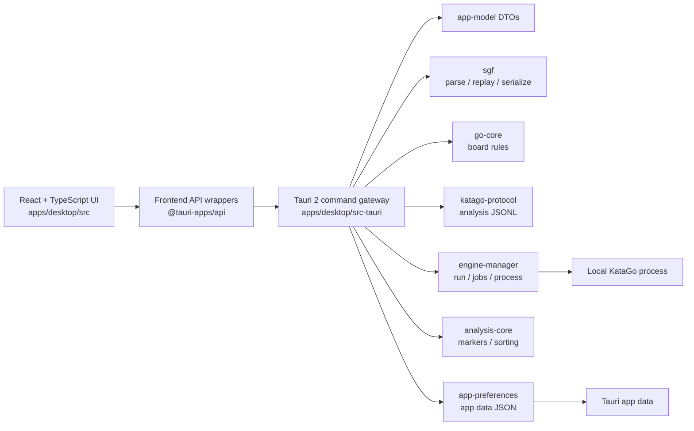

# LizzieYzy Next Architecture

LizzieYzy Next is the Tauri 2 + Rust + TypeScript desktop architecture being built beside the Java/Swing maintenance line. The goal is to move user-visible behavior into smaller testable domains without claiming full legacy parity before the evidence exists.

## Current System Shape

The UI consumes DTOs and view models. It does not consume raw KataGo JSON and does not own long-running engine processes. `engine-manager` owns the Foreground Engine Run, Analysis Jobs, and process lifetime. Rust owns file I/O, SGF parsing, process execution, cancellation, and app-data persistence.

Provider and readboard live paths follow the same boundary rule. The React UI should enter these paths through frontend API wrappers and Tauri commands; provider HTTP parsing, readboard sidecar probing, protocol parsing, and DTO normalization belong behind Rust crate boundaries. A wired command path is repository evidence only. It is not evidence that the external Yike/Fox services, accounts, network, or a local readboard sidecar have been validated.

## Modules

### `apps/desktop`

React + TypeScript desktop UI built with Vite. The current UI includes board rendering, SGF text/import workflow, native open/save entry points, winrate and analysis panels, and engine profile controls.

The browser preview can exercise UI fallback paths and fake analysis, but it cannot perform native file dialogs, authoritative current-game edit/Save, app-data profile persistence, local asset checks, or real KataGo execution.

### `apps/desktop/src-tauri`

Tauri 2 command gateway. It exposes health, SGF parse/replay, native SGF read/write, fake analysis, engine profile persistence, asset checks, and manager-owned Foreground Engine Run commands (`foreground_engine_snapshot`, `foreground_engine_start`, `foreground_engine_stop`, `foreground_engine_restart`, `foreground_engine_switch`, `foreground_engine_start_selected_node`, `foreground_engine_cancel_job`). Whole-game analysis on a Ready Run uses `katago_start_analyze_game` / `katago_cancel_analysis`. Removed profile-to-process commands `katago_analyze_once` and `katago_analyze_game` are not registered. Fake analysis remains non-authoritative and does not create a Foreground Engine Run.

This layer should stay a gateway. Domain behavior belongs in crates unless it is directly about Tauri lifecycle, app data paths, command shape, or event emission.

Rust owns the authoritative current game. The holder stores `CurrentSgfDocument`, a monotonic `generation`, `dirty`, and `native_path`. It does not store the React-owned `NodePath` cursor. Shared results use `CurrentGameResultDto` (`tree`, `selected_path`, `snapshot`, `generation`, `dirty`, `native_path`). Domain failures stay in `CurrentGameError` / `CurrentGameErrorKind`. Filesystem Save failures stay Gateway `String` errors and do not extend the domain kind enum.

Current-game commands are `replace_current_game`, `select_current_game_node`, `play_current_game`, `set_current_game_personal_comment`, `remove_current_game_variation`, `serialize_current_game`, `save_current_game`, `save_current_game_as`, and `project_current_game_mainline`. `play_current_game` sends a `NodePath` plus point/pass vertex; Rust uses the selected position's player-to-play color and `go-core` legality. An identical existing child is selected without mutation. A new child increments document generation and marks the game dirty. Occupied, suicide, simple-ko, and invalid-path failures are atomic.

`save_current_game` writes a caller-supplied path. `save_current_game_as` owns the Save As dialog: cancel returns `null` (`Save cancelled.`); a chosen allowed path writes through `save_current_game`'s path; a dialog-denied or Windows-redirected path is a Gateway write failure (`failed to write`) and does not write, adopt, or clear dirty. The `save-as-dialog` crate classifies those outcomes without a new harness. Successful Save keeps the caller-supplied cursor and does not increment `generation`. Directory-as-file write failure remains `current_game_save_write_failure`. Save is a semantic SGF round-trip, not byte-for-byte format preservation.

`serialize_current_game` and `project_current_game_mainline` are derived reads. The only remaining first-child adapter is the fresh Rust mainline `GameDto` consumed by analysis and review. React must not treat original `sgfText`, independently replayed positions, or `GameDto.moves` as document authority. The SGF textarea remains load input. Browser preview keeps edit and authoritative Save unavailable and explains that they need the native runtime.

Provider/readboard command contracts in this batch:

- `provider_fetch_yike` is the Tauri entry point for Yike runtime fetch. It must validate the request provider and timeout, call the Yike provider runtime path, and return `ProviderFetchResult` on success or a typed `ProviderError` on auth, network, payload, timeout, or runtime unavailable states.
- `provider_fetch_fox` is the Tauri entry point for Fox runtime fetch. It must validate the request provider and timeout, call the Fox provider runtime path for supported `chessid`, `uid`, and `user_name` commands, and return normalized provider DTOs or typed errors.
- `readboard_sidecar_probe` is the Tauri entry point for checking whether the local readboard sidecar is available. Its boundary is process/path/protocol readiness; it must not imply that a target board has been synced.
- `readboard_sidecar_sync_snapshot` is the Tauri entry point for syncing a snapshot through the sidecar. Its boundary is sidecar protocol line parsing and DTO normalization from supported inputs. Image OCR remains unavailable unless the sidecar/runtime explicitly supports it and should return a structured unsupported/not-implemented error rather than a false success.

The Provider panel is the expected UI surface for provider fetch, readboard probe, and readboard sync controls. Browser-preview behavior may show local fallback or structured unavailable states, but only the Tauri desktop runtime can exercise native provider/readboard commands.

### `crates/app-model`

Shared DTOs for games, moves, positions, candidate moves, analysis frames, engine profiles, assets, health, and problem markers.

### `crates/go-core`

Pure Go board and rules logic. It has no UI, Tauri, storage, or process dependency.

### `crates/sgf`

SGF parsing, replay, and serialization. It preserves the parsed tree for compatibility paths while exposing normalized game and position DTOs to the rest of the app.

### `crates/katago-protocol`

KataGo analysis JSONL query/response modeling and normalization. Raw engine JSON should remain here or in engine-manager helpers; the UI should receive `AnalysisFrameDto`.

### `crates/analysis-core`

Analysis-derived helpers such as candidate sorting and problem marker classification.

### `crates/engine-manager`

Engine profile catalog, Autoload Default, asset checks, and the manager-owned Foreground Engine Run: lifecycle snapshot, Start/Stop/Restart/Switch, selected-node and whole-game Analysis Jobs, process execution, cancellation, and typed failure.

### `crates/app-preferences`

Durable app preference storage for the categorized Preferences surface. Missing files load owner defaults. Unreadable files are isolated beside the original path and recovered to defaults with a user-visible report. Explicit writes use replace-safe persist; serialize/write/replace failures keep the previous durable value. This crate owns the preference mechanism only. It does not absorb analysis, shortcut, layout, scoring, window, or engine-domain semantics.

### Provider crates

Provider crates own provider-specific URL parsing, request construction, payload parsing, and normalization. Yike live fetch must remain behind the Yike provider boundary. Fox fetch must support the documented `chessid`, `uid`, and `user_name` command shapes through the Fox provider boundary. The UI should not hand-roll provider HTTP behavior.

### `crates/readboard-sidecar`

The readboard sidecar crate owns launch/probe discovery, protocol line parsing, sidecar sync request/response normalization, and structured sidecar errors. Live sidecar availability depends on a local process and target client state outside repository validation.

### `crates/storage`

SQLite schema and storage helpers for unrelated application tables (`games`, `game_nodes`, `engine_profiles`, `assets`). Analysis persistence is SGF attachment through ordinary Save / Save As, not this crate.

## Data Flow

1. The user opens or edits SGF in the React UI.
2. The frontend calls Tauri commands through API wrapper functions.
3. Rust parses SGF into DTOs and replays positions through `sgf` and `go-core`.
4. The user edits saved engine profiles and Autoload Default in Engine Settings. Manual Check Assets is diagnostic, not a Start gate.
5. The Engine Switcher starts, stops, restarts, or switches a manager-owned Foreground Engine Run. `engine-manager` validates assets, spawns KataGo, and publishes Ready only after adapter readiness.
6. Selected-node and whole-game analysis jobs occupy that Ready Run. `katago-protocol` builds JSONL; `engine-manager` writes it to the resident process, emits progress, and cancels by run/job identity.
7. Responses are normalized into `AnalysisFrameDto` and classified by `analysis-core`.
8. Identity-valid completed analysis attaches to the exact node and persists only through ordinary SGF Save / Save As.
9. The UI renders board state, winrate, candidates, PVs, ownership, policy, and problem markers from DTOs.

## Persistence

Current app-data persistence includes:

- `lizzieyzy-next-engine-profile.json` for multiple engine profile settings.
- `lizzieyzy-next-app-preferences.json` for categorized durable app preferences.

Attached analysis lives in the SGF document. There is no second durable analysis-cache file or command path.

## Production Invariants

- The Rust workspace declares every crate and the Tauri desktop crate explicitly.
- `apps/desktop/src-tauri/tauri.conf.json` uses Tauri 2 config, `org.lizzieyzy.next`, local `127.0.0.1` development URL, and `../dist` frontend output.
- The frontend package exposes `dev`, `build`, `tauri:dev`, and `tauri:build`.
- TypeScript depends on React and `@tauri-apps/api`; build tooling includes Vite, TypeScript, and `@tauri-apps/cli`.
- Rust crates inherit workspace edition/rust-version metadata.
- Golden SGF fixtures live under `tests/golden`.
- CI and local acceptance run scaffold validation before deeper Node and Rust checks.
- Release acceptance runs `scripts/validate_release_assets.py` to verify Tauri metadata, bundle identifiers, dry-run artifact expectations, and the safe release workflow.

## Boundaries

- UI code should call wrapper functions in `apps/desktop/src/api` instead of scattering raw `invoke` calls.
- Tauri commands should return structured DTOs or explicit string errors.
- SGF, Go rules, KataGo protocol, analysis classification, engine execution, and storage should remain separate domains.
- Provider integrations such as Fox, Yike, and readboard should be modeled as providers or sidecars behind Rust/TypeScript boundaries, not as UI-specific shortcuts.
- Provider/readboard code should have offline contract or domain tests before being wired into release claims. In the current batch, the acceptable repository-level claim is that offline contracts and runtime command wiring/path plumbing are implemented where the owning code lands. That is not the same as a live external provider claim.
- Live Fox/Yike network behavior and live readboard sidecar behavior require separate environment validation with real credentials, network access, target client state, and sidecar process evidence.
- Java/Swing files are behavior references during this migration track and should not be edited for Next scaffold validation.

## Provider And Sidecar Readiness

| Area | Repository-Level Evidence | Requires External Environment |
| --- | --- | --- |
| Yike provider | Offline request/response contract coverage and `provider_fetch_yike` runtime fetch path wired behind the provider boundary. | Real Yike account/session, network reachability, rate-limit behavior, login/session expiry, and game-fetch smoke evidence. |
| Fox provider | Offline request/response contract coverage and `provider_fetch_fox` runtime fetch path wired for `chessid`, `uid`, and `user_name`. | Real Fox environment, network reachability, capture/session prerequisites, failure handling, and game-fetch smoke evidence. |
| readboard probe | Domain command/DTO coverage and `readboard_sidecar_probe` path wired behind the sidecar boundary. | A real readboard sidecar process, expected port/path/process state, probe success/failure, timeout, and version evidence. |
| readboard sync | Protocol line parsing and `readboard_sidecar_sync_snapshot` path wired behind the sidecar boundary. | A real sidecar plus target client/window state, sync behavior, stale-state handling, timeout, and restart evidence. |
| image OCR | Structured unsupported/not-implemented error when image OCR is unavailable. | A sidecar/runtime that explicitly supports OCR, plus image fixture evidence and false-positive/timeout checks. |
| Editable current-game Save | `editable_workspace_roundtrip` plus `current_game_save_write_failure` (directory-as-file) and `save-as-dialog` coverage for cancel/chosen/denied/redirected dialog outcomes. Redirected user-profile paths are write failures and are not adopted. | Ticket 08 cancel and happy-path Save As/reopen passed on `8c749a6` (PID 75084). Ticket 09 Case 6 passed on PID 73980 using `f2c5896` plus the Windows build fix committed as `8289391`; the rejected ACL path remained authoritative, dirty state remained set, and no redirected `denied.sgf` was written. Evidence: `D:\dev\weiqi\tmp\editable-sgf-09-case6.txt`. |

## Current-Game And Parity Evidence

Repository evidence for the editable SGF workspace is the focused Rust filters above, frontend type/build validation, and the command/DTO ownership recorded in this document. Tickets 08 and 09 recorded the Windows/native dialog, path, failure, and reopen evidence and update these rows only where both repository and native criteria hold:

| ID | Status | Repository evidence | Native evidence (tickets 08–09) | Remaining gap |
| --- | --- | --- | --- | --- |
| SGF-03 | Accepted | Ticket 03 navigation tests and BottomBar parent/child/sibling wiring. | Case 2: both siblings, parent/next-child memory, and sibling round-trip kept board, 手数, 下一手, 提子, and comments in sync. | None for this item. |
| SGF-04 | Accepted | Tickets 04 and 06 move/pass/remove tests; edits return a valid `NodePath`. | Case 3: 白 C4 on the first continuation; second continuation removed; selection recovered to the parent; retained branch stayed navigable and survived Case 5 reopen. | None for this item. |
| SGF-05 | Accepted | Ticket 05 personal-comment edit tests; generated information stays off the personal field. | Case 3 wrote `ticket-08 retained comment` on C4; Case 5 reopen showed the same comment on that node. | None for this item. |
| SGF-06 | Accepted | Ticket 07 `editable_workspace_roundtrip` and `current_game_save_write_failure`, plus Ticket 09 `save-as-dialog` redirect/deny/cancel/chosen coverage. | Cases 4 and 5 proved cancel and Save As/reopen. Re-run Case 6 reported the rejected ACL target, retained prior path/dirty state, and wrote no redirected user-profile file. | None for this item. |
| UI-04 | Accepted | No-engine UI and native Open/Save commands exist without a configured engine. | Cases 1–6 covered launch, open, inspect, edit, cancel, save, reopen, and failed Save As with `未加载引擎` while SGF controls remained usable. | None for this item. |

Browser preview is not native evidence. Ticket 08 confirmed the preview copy `Native current-game, edit, and authoritative Save require the Tauri desktop backend. Browser preview is non-authoritative.`

Docs, release notes, and handoffs should describe these as two different gates: offline contract plus runtime path is an implementation milestone; live provider/sidecar smoke is an environment milestone.

## Release Readiness Meaning

Passing scaffold validation and CI means the Next architecture is structurally healthy. Passing release preflight means the Tauri config and release dry-run workflow still match the expected safe metadata contract. Neither result means the Tauri app has shipped, reached full Java/Swing parity, completed live Fox/Yike/readboard migration, or produced signed production installers.
