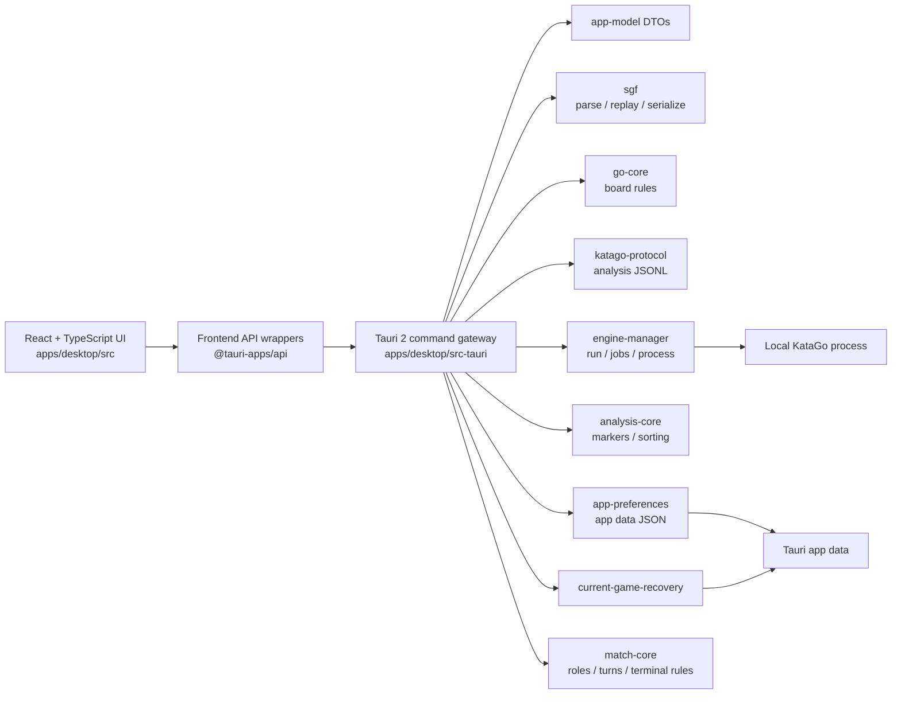

# LizzieYzy Next Architecture

LizzieYzy Next is the Tauri 2 + Rust + TypeScript desktop architecture being built beside the Java/Swing maintenance line. The goal is to move user-visible behavior into smaller testable domains without claiming full legacy parity before the evidence exists.

## Current System Shape

```mermaid
flowchart LR
  UI["React + TypeScript UI\napps/desktop/src"] --> API["Frontend API wrappers\n@tauri-apps/api"]
  API --> Tauri["Tauri 2 command gateway\napps/desktop/src-tauri"]
  Tauri --> Model["app-model DTOs"]
  Tauri --> SGF["sgf\nparse / replay / serialize"]
  Tauri --> Go["go-core\nboard rules"]
  Tauri --> Kata["katago-protocol\nanalysis JSONL"]
  Tauri --> Engine["engine-manager\nrun / jobs / process"]
  Tauri --> Analysis["analysis-core\nmarkers / sorting"]
  Tauri --> Prefs["app-preferences\napp data JSON"]
  Tauri --> Recovery["current-game-recovery"]
  Tauri --> Match["match-core\nroles / turns / terminal rules"]
  Engine --> KataGo["Local KataGo process"]
  Prefs --> AppData["Tauri app data"]
  Recovery --> AppData
```

The UI consumes DTOs and view models. It does not consume raw KataGo JSON and does not own long-running engine processes. `engine-manager` owns the Foreground Engine Run, Analysis Jobs, and process lifetime. Rust owns file I/O, SGF parsing, process execution, cancellation, and app-data persistence.

Provider and readboard live paths follow the same boundary rule. The React UI should enter these paths through frontend API wrappers and Tauri commands; provider HTTP parsing, readboard sidecar probing, protocol parsing, and DTO normalization belong behind Rust crate boundaries. A wired command path is repository evidence only. It is not evidence that the external Yike/Fox services, accounts, network, or a local readboard sidecar have been validated.

## Modules

### `apps/desktop`

React + TypeScript desktop UI built with Vite. The current UI includes board rendering, SGF text/import workflow, native SGF/GIB open and SGF save entry points, winrate and analysis panels, and engine profile controls.

The browser preview can exercise UI fallback paths and local demonstration analysis, but it cannot perform native file dialogs, authoritative current-game edit/Save, app-data profile or recovery persistence, local asset checks, or real KataGo execution.

`apps/desktop/src/workspace` owns left/right ratio drafts, their visible projection, pointer/keyboard resizing, and element measurement. `useWorkspace` exposes the persistence owner and default restoration; `projectWorkspace` and `resizeWorkspace` are pure, and `Workspace` consumes them without IPC. App retains SGF, selected-node and analysis ownership. Visible column minima are 210/360/240 CSS px with separate 8px separators; insufficient space scrolls rather than changing preferences. Unset shares use 228/260px above 1180px workspace width, otherwise 210/240px. Hidden shares remain stored, their pixels go to the center, and finite nonnegative shares must sum below one; a large hidden share can therefore limit the remaining rail's custom proportion. Separator bounds report that feasible range.

Main board, sub-board and winrate chart consume `useElementSize` (ResizeObserver, DPR change and window resize). Zero-size surfaces wait for visibility; unchanged measurements are filtered before scheduling React state. Bitmap dimensions track measured CSS content dimensions times DPR independently of analysis frames. Rectangular board geometry and input callbacks remain owned by their existing consumers.

Nullable `workspaceShares: { left, right }` is stored in the existing app preference file; missing or invalid ratios load the default strategy. The narrow `update_workspace_shares` command merges under `PreferencesState`'s transaction lock, atomically persists, then publishes. Ordinary full preference saves retain the backend's committed ratios. Layout writes do not re-admit analysis. The frontend renders drafts immediately, coalesces for 500ms and serializes writes; stale completions cannot replace newer drafts or clear their pending/error state. The fixed tool area reports saved/pending/saving/unsaved and Retry saves the newest draft. Display → Restore panel sizes and Preferences share one action, changing only ratios to `null`; viewport clamps are never persisted.

File Exit and native Close drain layout, window geometry, rail visibility, native pin transactions and ordinary preference writes (including theme) before document departure. The shared drain has a five-second deadline and Retry/Cancel close on failure; it includes writes queued behind an active preference save. A failed preflight does not enter document departure or stop analysis. The existing workspace freeze owner rejects new R7 edits in handlers and disables their controls while document confirmation is active or a committed final drain remains incomplete; cancellation restores interaction and retains drafts. `finishNativeExit` repeats the all-owner drain, and Rust `confirm_native_exit` seals the latest native geometry immediately before `app.exit`. Existing document Save/Discard/Cancel, recovery and teardown contracts remain authoritative.

Nullable `windowGeometry` shares the existing atomic preference file. Its outer origin is physical pixels; client dimensions are logical pixels with the sampled `scale_factor`, and `maximized` is independent of normal bounds. The Rust window actor serializes native sampling, 500ms coalesced narrow saves, reset, Retry and exit flush without holding the preference mutex across OS calls. Minimized and transitional bounds cannot replace normal geometry. Full preference saves preserve the committed geometry just as they preserve workspace shares and Recent history.

On native Wayland, `windowGeometry.x` and `y` are both `null`: the compositor owns placement and the actor restores only logical client dimensions and maximization. Numeric origin pairs remain the Windows/X11/macOS wire contract. A mixed null/numeric origin is invalid. Wayland startup does not require a primary monitor or global coordinates, and unavailable positioning does not fail the exit fence. Reset uses the current output's available client dimensions without moving or centering the window; the compositor enforces placement constraints. Returning a null-origin record to a positioned backend uses the normal reachable-default recovery policy.

`app-preferences::window_geometry` owns deterministic sampling and restore policy. Valid, title-reachable saved rectangles remain in place; invalid rectangles fit the default 1440×900 client to the primary work area. A reachable rectangle needs at least 100 logical pixels of draggable width and `min(32, native draggable caption height)` logical pixels of draggable height wholly within one work area. Windows uses native caption metadata and `WM_NCHITTEST` to exclude the system icon, caption buttons and resize borders. Linux measures a native GTK HeaderBar and its allocated internal controls on the GTK thread: X11 installs that GTK decoration, while Wayland retains Tao's existing HeaderBar. GTK child visibility is measured independently of the hidden toplevel; client size excludes the header and CSD border, and restored outer positions account for GTK's gravity offset. AppKit queries the NSWindow title strip and visible standard-button bounds on the main thread. Neither non-Windows adapter uses a fixed 32-pixel estimate. Native platform acceptance remains separate from source implementation and API type-checking; a compositor/window manager can constrain requested placements.

Display and Preferences share an explicit current-monitor centered, unmaximized reset that changes only geometry. Monitor-query failure fits an independently readable primary work area for display only, retains durable geometry and suspends saving until Retry succeeds. If both queries fail, the existing OS window is shown with the failure reported. Startup applies geometry while hidden, then shows the main window even on failure. Browser preview exposes the desktop-only limitation and disables reset; native geometry is not browser window state.

Geometry autosave preserves an unconsumed preference-recovery notification. A pending move returning to already-durable bounds publishes `saved` even when no disk write is needed.

Expanded setup/scoring controls remain in the diagram's scrollable flow. Their intrinsic grid rows keep the toolbar, minimum-sized board and controls separate when vertical space is insufficient.

`AppPreferencesDto.workspaceVisibility` owns independent durable `left`/`right` visibility (both initially true), with its shared value type in `app-model`. `update_workspace_visibility` merges optional sides into the latest preferences under the existing `PreferencesState` transaction lock and returns only visibility; ordinary full preference saves preserve this owner field. UI controls commit after a successful write, retain the old state on failure, and remain available outside both rails. Hidden rails stay mounted to preserve comment drafts, AnalysisPanel tabs and node/candidate identity, but have no grid pixels, separator, focus or accessibility surface. Hiding the chart clears hover; focus inside a closing rail moves to the fixed restore control. Replay is eligible on the visible candidate-enabled main board or the visible Variation sub-board; losing both surfaces pauses without resetting the retained prefix. Hiding does not mutate SGF or stop engine analysis. Browser preview uses the same merge semantics in localStorage; native app-data/restart evidence is separate.

Personal comments remain local drafts until the explicit `应用评论` action; blur and rail visibility changes never commit them to SGF. Focus on a closing rail's separator also returns to the fixed restore control before that separator is removed.

### `apps/desktop/src-tauri`

Tauri 2 command gateway. It exposes health, SGF parse/replay, native SGF read/write, engine profile persistence, asset checks, and manager-owned Foreground Engine Run commands (`foreground_engine_snapshot`, `foreground_engine_start`, `foreground_engine_stop`, `foreground_engine_restart`, `foreground_engine_switch`, `foreground_engine_start_selected_node`, `foreground_engine_cancel_job`). Whole-game analysis on a Ready Run uses `katago_start_analyze_game` / `katago_cancel_analysis`. Current-game replacement uses `prepare_document_replacement` / `resolve_document_replacement`. Application exit uses `prepare_application_exit`, `resolve_application_exit`, `retry_application_teardown`, `confirm_application_exit_anyway`, and `confirm_native_exit`. Current-game recovery uses `inspect_current_game_recovery`, `restore_current_game_recovery`, `discard_current_game_recovery`, `retry_current_game_recovery`, and `current_game_recovery_protection`. Removed profile-to-process commands `katago_analyze_once` and `katago_analyze_game` are not registered. Native `fake_analyze` is not registered; browser-preview demonstration analysis remains non-authoritative and does not create a Foreground Engine Run.

Desktop engine command results, including match-owner operations and match-default persistence, use the Rust-only `EngineCommandResult<T>` alias with `Box<EngineFailureDto>` errors; serialization retains the existing error DTO fields and casing. Replacement and exit orchestration take named `ReplacementResolution` / `ExitResolution` requests internally. Their Tauri command payloads and managed recovery-store ownership remain unchanged.

Native chooser intake uses `read_game_file`; the sheet file input uses `import_game_bytes`. Both return `GameFileImportDto` (`format`, canonical `sgf_text`, display path/name, optional writable `native_path`, optional `opened_path`) and then enter the same document-replacement owner. Native reads canonicalize the source path and retain it as `opened_path`; byte imports have no `opened_path`. SGF/TXT retains its native path. GIB is decoded and normalized by the `sgf` crate and always returns `native_path = null`, so ordinary Save uses Save As and can never overwrite the source GIB.

Native SGF/GIB activation and main-window OS file drop share one Tauri gateway admission owner and at-most-once delivery slot. Activation resolves each file argument against the requesting process's working directory and focuses the existing `main` window; a drop supplies its native path directly. The cold-start request remains in Rust until the frontend has loaded preferences and inspected recovery. An abnormal recovery decision completes before that retained request enters `read_game_file` and the existing document-replacement owner; a normal explicit file suppresses `restoreLastSession` and sample loading. File picker, Save, replacement, recovery, and exit flows mark external-file admission busy, so later activations or drops are rejected rather than queued. No-file launches only focus; directories, unsupported types, and multiple files are explanatory non-mutating rejections.

After a native file replacement commits, chooser, activation, drop and recent reopen consume the same `opened_path` event and call `update_recent_game_history`. `app-preferences` retains five paths, newest first, deduplicating canonical paths and OS file identity (including hard links). File → Recent shows filenames with full-path tooltips, reopens through the existing safe replacement owner, and offers Clear and explicit failed-write Retry. Recent slots use Alt+1–5, Clear uses Ctrl+Shift+Delete, and Retry uses Ctrl+Shift+R through the focus-safe Shortcut Registry. Byte imports, sample, paste, New, recovery and Save do not record file-open events.

This layer should stay a gateway. Domain behavior belongs in crates unless it is directly about Tauri lifecycle, app data paths, command shape, or event emission.

Rust owns the authoritative current game. The holder stores `CurrentSgfDocument`, a monotonic semantic position/tree `generation`, `dirty`, `native_path`, the selected `NodePath`, and recovery sequence counters (`document_seq`, `snapshot_seq`). Shared results use `CurrentGameResultDto` (`tree`, `selected_path`, `snapshot`, `generation`, `snapshot_seq`, `dirty`, `native_path`). Comments, navigation and ordinary Save preserve `generation`; accepted move/tree edits and document replacement advance it. `snapshot_seq` orders document content and Save state within that identity, so delayed analysis snapshots cannot overwrite newer comments or saved/dirty state. Domain failures stay in `CurrentGameError` / `CurrentGameErrorKind`. Filesystem Save failures stay Gateway `String` errors and do not extend the domain kind enum.

Current-game mutation and derived reads are `select_current_game_node`, `play_current_game`, `set_current_game_personal_comment`, `set_current_game_metadata`, `edit_current_game_markup`, `apply_root_setup`, `convert_to_root_setup`, `remove_current_game_variation`, `promote_current_game_to_main`, `serialize_current_game`, `save_current_game`, `save_current_game_as`, and `project_current_game_mainline`. Native document replacement prepares and resolves a candidate rather than installing SGF in one command. `play_current_game` sends a `NodePath` plus point/pass vertex; Rust uses the selected position's player-to-play color and `go-core` legality. An identical existing child is selected without mutation. A new child increments document generation and marks the game dirty. Occupied, suicide, simple-ko, and invalid-path failures are atomic.

`set_current_game_metadata` takes the caller's semantic `generation` and atomically edits root `PB`, `PW`, and finite `KM`; it preserves `HA` and unrelated SGF properties. The original root values initialize the editor. One effective Apply produces one document-history unit; Cancel, invalid komi, stale generation, and no-op produce none. Name-only edits preserve generation, attached analysis, and active tasks. A changed komi advances generation, removes now-inapplicable attached `LZ`/`LZ2` analysis across the tree, invalidates old jobs/tasks, and re-admits continuous analysis with the new condition. Undo/Redo exchange the affected analysis attributes with the corresponding komi condition without restoring Run/Job/Task identities. The HUD reads current root names directly, preserving nonblank text and falling back to 黑棋/白棋 for missing or whitespace-only values; long values retain their full accessible title.

`undo_current_game` and `redo_current_game` take the caller's `generation` and return the same authoritative result, including `can_undo` and `can_redo`. The Rust document owner retains at most 100 effective user commits across move/pass insertion, personal-comment Apply, root metadata Apply, node markup, root setup/conversion, subtree deletion and mainline promotion. Navigation, choosing an existing child, failed/no-op edits, Save, preferences and analysis reports do not create commits. An effective edit after Undo discards the redo branch. The Shortcut Registry routes document Undo/Redo only outside editable text controls.

History reverses affected properties or subtrees and restores the exact pre/post-edit cursor. It does not restore a whole-document snapshot: unrelated analysis accepted since the edit remains attached. Structural and komi reversals advance semantic generation and invalidate old analysis/task identities; name, comment and markup reversals preserve generation and do not cancel unrelated work. Neither direction restores a Run, Job or Task.

The extension seam is `sgf::DocumentEditOutcome`: an effective domain operation returns its resulting snapshot and one opaque `SgfDocumentEdit`; a no-op returns no edit. `CurrentGameHolder::commit_edit` admits that unit and its revision to `sgf::DocumentHistory`. Domain Undo/Redo applies the inverse and returns `DocumentHistoryOutcome` with the exact cursor and structural flag. New authoring operations must supply affected-content inverses through this same seam, then let the holder advance generation, snapshot ordering and dirty state. Unrecorded content changes use the independent content revision; navigation does not.

`remove_current_game_variation` and `promote_current_game_to_main` take the caller's `generation` with the exact `NodePath`. Delete cuts the selected non-root subtree and selects its parent; a node with children requires confirmation in the UI. Root Delete enters the existing safe New/Clear document flow. Promote moves the selected child to index zero at every branching ancestor while preserving the relative order and content of other siblings; the resulting path selects the same node. Its history inverse moves the original nodes back without copying the whole tree, including attached analysis. Already-main is a no-op. Return-to-main navigates to the mainline ancestor preceding the first off-main child, changing neither document content nor history. Structural edits and their reversals advance `generation`, invalidating old path-bound analysis and task work.
`apply_root_setup` accepts the selected childless root's complete stone set and player to play under the current `generation`; Rust validates rectangular board coordinates and duplicate points before one history commit. The UI previews black/white/erase/clear/PL locally and Cancel leaves the authoritative document untouched. `convert_to_root_setup` requires explicit UI confirmation and the exact selected path/generation; Rust replays that selected branch (including imported intermediate setup and pass), replaces the root position, and removes the move tree. It retains other root properties, the personal root comment and the native source path, while removing root analysis whose position no longer applies. Both edits reverse through the same document history, restore the previous tree/cursor on Undo, advance semantic generation and invalidate old analysis/task identities; neither starts or restores an engine.

Successful Save retains history and records the invocation-time savepoint. Dirty compares the current edit state and independent content changes against that point; later analysis cannot be cleared by returning to a saved history position. Save As adopts the new source path independently of history. Failed/cancelled Save does not move the savepoint. Successful document replacement or recovery starts with empty history; cancelled replacement preserves it. Recovery persists document content and dirty state, not history.

`select_current_game_node` requires the caller's `generation` alongside the exact `NodePath`; stale identities, invalid paths and pending departures fail before cursor/recovery/analysis changes. The frontend coalesces rapid requests within that identity and never publishes a superseded selection. Complete-tree, Selected Review Line, chart and problem-list links carry actual paths; jump-to-move counts B/W nodes including pass, skips setup/comment nodes, and uses zero for root. Navigation preserves SGF content and dirty state. Analysis accepted later retains its independent dirty semantics.

The selected snapshot includes `markup: SgfMarkupDto[]`, projected in Rust from that node's LB/CR/SQ/MA/TR properties (including compressed point lists). The board renders this snapshot alongside its position and comments. Invalid annotation coordinates are omitted from presentation while the original properties remain preserved in SGF. `edit_current_game_markup` accepts a selected `NodePath`, `generation`, and a point tool or Clear action; the Rust owner rejects stale selection/document identity and off-board points. LB text, sequential letters/numbers and CR/SQ/MA/TR replace or erase only supported markup at the point; Clear removes only supported markup on that node. Effective actions enter document history without advancing semantic generation, cancelling range tasks or replacing unrelated analysis. The frontend offers focus-safe tool shortcuts and requires explicit Apply for text.

`stone_move_numbers: MoveDto[]` in the selected snapshot identifies successful moves whose stones survive on its actual root-to-node line. Rust replay removes captured sources and clears setup points (including same-color setup); pass advances the move count without a point label. The main board consumes this projection rather than first-child moves or path depth.

`enter_trial` / `exit_trial` transition the current-game owner through Review → Entering → Active → Leaving → Review. `sgf::TrialLine` retains only the entry's replay ancestry and trial descendants; the entry appears as move zero, while the original tree, savepoint, source path, history and recovery stay authoritative and untouched. `TrialSessionDto` carries a separate session ID and monotonic revision; `trial_select`, `trial_play`, `trial_undo` and `trial_start_finite` reject stale IDs/revisions. Trial edits use an independent undo stack and do not offer a commit-to-document path. `trial://analysis` carries only session snapshots after selected-node Job identity, revision and position checks; original SGF analysis attachment is blocked throughout the temporary mode.

Entering seals current Job publication, pauses any active whole-game Analysis Task without clearing its completion set, and awaits selected/whole-game target cancellation (five-second bound). Failed cleanup reports failure and leaves the original document intact. The manager follows trial positions for the existing continuous selected-node lane and accepts finite trial jobs on that lane; the original continuous intent is retained. Leaving cancels trial queries before resuming the original selected position, without automatically continuing a paused whole-game task. Save/Copy/recovery always use the authoritative document. Departure admission validates the replacement or original dirty decision before sealing trial analysis; Cancel leaves the trial alive, while a confirmed replacement discards it with the document transition.

`enter_scoring` / `update_scoring` / `exit_scoring` reuse the temporary-mode admission and cancellation fence but do not submit KataGo queries. Rust freezes the selected position, owns dead-group and neutral-point correction, and computes area (living stones plus owned empty points) or territory (owned empty points plus actual captures plus opponent dead stones). A dead stone's now-empty point can be owned once as territory; neutral points do not score. White receives the document's finite komi and, in area mode only, optional 0, h, or max(h−1, 0) handicap compensation. Explicit root HA or setup with a recognizable ruleset can initialize compensation; the user can correct nonnegative h without editing HA/RU/KM. Preview and Cancel do not mutate SGF; Confirm writes only root RE from the same unrounded result string, creates one nonstructural history edit, and preserves applicable analysis and paused task completion. Save/Copy/recovery and safe departure remain authoritative over the original SGF; scoring and trial are mutually exclusive. The UI sends scoring actions through API wrappers, and the scoring rule persists as `scoringRule` in the existing atomic preferences transaction.

Ordinary `save_current_game` writes a caller-supplied path. Ordinary `save_current_game_as` owns the Save As dialog: cancel returns `null` (`Save cancelled.`); a chosen allowed path writes through `save_current_game`'s path; a dialog-denied or Windows-redirected path is a Gateway write failure (`failed to write`) and does not write, adopt, or clear dirty. The `save-as-dialog` crate classifies those outcomes without a new harness. Successful ordinary Save keeps the caller-supplied `NodePath`, does not increment `generation`, and does not admit a document departure or cancel analysis. Directory-as-file write failure remains `current_game_save_write_failure`. Save is a semantic SGF round-trip, not byte-for-byte format preservation.

Confirmed replacement and application exit share a document-departure owner. `prepare_document_replacement` parses and validates the candidate before admission; a dirty holder returns `needs_decision`, a clean holder returns `ready`. `resolve_document_replacement` then takes Save / Discard / Cancel. Cancel aborts without sealing. Confirmed Discard or Save can stop Analysis Jobs; successful commit installs one candidate at its default selected path, clears dirty, and adopts the candidate source path. Cancelled or failed departure Save keeps the current game, keeps the engine, and stops analysis. `prepare_application_exit` / `resolve_application_exit` reuse that dirty gate for File Exit and window close (`application-exit-requested`). After confirmed leave, teardown uses a 10s budget, with `retry_application_teardown` and `confirm_application_exit_anyway` for outstanding resources, then `confirm_native_exit` to end the process. Exit dispositions recorded on the recovery envelope are `clean_completed`, `explicit_discard`, and `exit_incomplete`.

`serialize_current_game` and `project_current_game_mainline` are derived reads. The only remaining first-child adapter is the fresh Rust mainline `GameDto` consumed by analysis and review. React must not treat original `sgfText`, independently replayed positions, or `GameDto.moves` as document authority. The SGF textarea remains load input. Browser preview keeps edit and authoritative Save unavailable and explains that they need the native runtime.

Provider/readboard command contracts in this batch:

- `provider_fetch_yike` is the Tauri entry point for Yike runtime fetch. It must validate the request provider and timeout, call the Yike provider runtime path, and return `ProviderFetchResult` on success or a typed `ProviderError` on auth, network, payload, timeout, or runtime unavailable states.
- `provider_fetch_fox` is the Tauri entry point for Fox runtime fetch. It must validate the request provider and timeout, call the Fox provider runtime path for supported `chessid`, `uid`, and `user_name` commands, and return normalized provider DTOs or typed errors.
- `readboard_sidecar_probe` is the Tauri entry point for checking whether the local readboard sidecar is available. Its boundary is process/path/protocol readiness; it must not imply that a target board has been synced.
- `readboard_sidecar_sync_snapshot` is the Tauri entry point for syncing a snapshot through the sidecar. Its boundary is sidecar protocol line parsing and DTO normalization from supported inputs. Image OCR remains unavailable unless the sidecar/runtime explicitly supports it and should return a structured unsupported/not-implemented error rather than a false success.

The Provider panel is the expected UI surface for provider fetch, readboard probe, and readboard sync controls. Browser-preview behavior may show local fallback or structured unavailable states, but only the Tauri desktop runtime can exercise native provider/readboard commands.

### `crates/app-model`

Shared DTOs for games, typed file-import results, moves, positions, candidate moves, analysis frames, engine profiles, assets, health, and problem markers.

### `crates/go-core`

Pure Go board and rules logic. It has no UI, Tauri, storage, or process dependency.

`Board::score` flood-fills empty points and marked-dead stones against living group borders, excluding individually marked neutral empty points. It returns exact integer counts and ownership for the selected rectangular position; komi and handicap arithmetic stay in the Rust scoring session, not the canvas.

Boards have independent width and height, each 2–25. Current-game wire DTOs expose `board_width` and `board_height`; Go indexing, SGF setup/replay, main/sub-board rendering, PVs and analysis heatmaps use width as the row stride and height for ranks. KataGo receives `boardXSize` and `boardYSize`. Square provider/readboard inputs normalize to equal dimensions at their existing adapter boundary. The unrelated storage tables and external readboard protocol retain their existing square schema.

File New, Clear Board and Set Board Size share a parameter form and the existing document-replacement owner. Opening/cancelling that form does not seal analysis. Successful creation installs a clean root-selected untitled document; the first content edit makes it dirty. SGF uses `SZ[n]` or `SZ[w:h]`, defaults missing SZ to 19×19 and rejects malformed/out-of-range explicit dimensions. Durable `defaultBoardWidth`, `defaultBoardHeight` and `defaultKomi` default to 19, 19 and 7.5; per-document dimensions, finite komi and names do not rewrite defaults. Existing departure Save failure and explicit Resume safety holds remain unchanged. Engine dimension refusals fail the analysis Job with a capability explanation while retaining the Ready Run.

### `crates/sgf`

SGF parsing, replay, and serialization plus Tygem GIB import. GIB accepts UTF-8 or GB18030 text, maps names, authoritative komi, ordinary moves, pass, and supported handicap setup into a validated SGF tree, and rejects malformed or illegal input before replacement. The crate preserves the parsed SGF tree for compatibility paths while exposing normalized game and position DTOs to the rest of the app.

### `crates/katago-protocol`

KataGo analysis JSONL query/response modeling and normalization. Raw engine JSON should remain here or in engine-manager helpers; the UI should receive `AnalysisFrameDto`.

### `crates/analysis-core`

Analysis-derived helpers such as candidate sorting and problem marker classification.

### `crates/engine-manager`

Engine profile catalog, Autoload Default, asset checks, and the manager-owned Foreground Engine Run: lifecycle snapshot, Start/Stop/Restart/Switch, selected-node and whole-game Analysis Jobs, process execution, cancellation, and typed failure.

Profiles separate the common launch fields (`name`, `program`, ordered `argv`, optional `working_dir`) from discriminated `adapter_kind` / `settings`. A whitespace-only working directory is treated as absent; nonblank paths retain every byte, including leading and trailing spaces. `kata_go_analysis` owns model/config paths and finite `max_visits`; `generic_gtp` has an empty settings object. Each argv item is one process argument, including empty strings and whitespace; no shell parsing is involved. KataGo owns the analysis subcommand and model/config flags; conflicting user arguments are rejected rather than rewritten.

Catalog version 1 keeps stable record IDs, order, settings selection and optional Autoload Default. Legacy unversioned collection and single-profile files are decoded only at the persistence boundary. Reads never rewrite the file or start a process. Unknown versions, malformed adapter settings and save failures remain observable and preserve the previous catalog and runtime. Explicit saves validate structure and atomically replace storage; executable/model/config existence is checked at Start, not Save. An unconfigured default profile is not a Ready Run.

Saved configuration, the adapter's static capability ceiling and handshake-verified Run capabilities are separate facts. Only `KataGoAnalysis` and `GenericGtp` are exposed; analysis capabilities are an optional nested group, never inferred from a saved profile. Both adapters use the same manager lifecycle. GenericGtp Ready publishes verified `gtp` facts (`protocol_version`, `name`, `version`, `commands`) with no analysis group. `game_move` is verified separately: KataGo requires bounded visits and target cancellation; GenericGtp requires the qualified GNU Go 3.8 identity and exact launch arguments documented in DEVELOPMENT. Command presence alone cannot authorize a position or ruleset.

The Run owns an immutable launch snapshot. Saving, selecting or changing Autoload cannot mutate it; pending changes compare every profile field, including argv, adapter settings and finite visits. Explicit Restart or a successful Switch adopts the latest saved profile. Active/candidate deletion protection and single-choice Autoload without fallback remain in force.

The verified analysis group independently describes selected-node finite analysis, continuous analysis, whole-game/task analysis, candidates, PV, winrate, root score, ownership, policy, visits limits and protocol cancellation. Missing snapshots are unverified; an absent analysis group admits no analysis. `game_move` admits the operation family, not every position or budget; no competitive-clock capability is exposed. During switching, primary A remains authoritative until the current candidate B promotes; a failed candidate does not replace A's capabilities or work.

GenericGtp uses one serial GTP v2 stream per run: `protocol_version`, `name`, `version`, then `list_commands`, with numeric command IDs independent of run/job identities. Ready requires `boardsize`, `clear_board`, `komi`, `play`, `genmove`, and `quit`. The single readiness deadline never renews on output. Blank-line-delimited responses support split reads, multiline bodies and CRLF. Stdout is bounded to 64 KiB per line/response, 1024 response lines and 64 queued lines; stderr is drained separately with at most 8 KiB retained for diagnostics. `command`, `protocol`, `timeout`, `process_exit`, and `unsupported_capability` distinguish rejection, malformed framing/identity, deadline, process/pipe exit and missing protocol support. A failed started GTP run seals publication, reaps its owned child and enters Error; recovery requires explicit Restart. Stop, Restart, promotion, failed candidates and application teardown use owned-child termination. No live run, GTP state or command stream is persisted.

Menus, shortcuts, buttons and task preview/start/continue use the same action-specific admission. Query-producing actions also require the fields actually requested: current gateway queries request ownership and policy; bounded visits and leading-candidate conditions require their respective capabilities; swing filters require the selected metrics. Rust rechecks before engine I/O, lane takeover or task mutation. Preview checks whole-game and requested filter capabilities without submitting a query. Continuous reconciliation uses the independent continuous capability and preserves durable intent, terminal/hold state and departure rules. Capability loss never removes cancellation of already-owned work or historical SGF analysis.

`start_swing_analysis_task` receives one Rust-only `SwingAnalysisTaskRequest` containing the captured whole-game job, scope, requested/supporting paths, swing comparisons and criteria, and overview/deep conditions. The current-game owner still revalidates the preview before admission; this request grouping does not change command payloads or event identities.

#### Exact-position budgeted moves

`foreground_engine_game_move` projects the authoritative generation and selected `NodePath` under the current-game holder lock and calls `ForegroundEngineManager::start_game_move`. `foreground_engine_cancel_game_move` uses run/job identity; snapshots expose the active `game_move_job`. Completion is fenced again against the current holder and Run. The result is typed move/pass/resign plus identities and `engine_time_mapped`; this read operation never commits SGF, comments, dirty state, source path, selected path or defaults. R9 owns result submission and Match Reservation.

`sgf::ExactPosition` is separate from legacy analysis projection. It strictly replays square 2–19 positions with explicit `Chinese` (simple ko) or `Chinese-KGS` (positional superko), finite half-integer komi, root PL, alternating real move/pass history and supported black root handicap. Annotation nodes add no moves. Full history validates returned moves. Unknown rules, malformed moves, unsupported setup/PL and mid-tree size/rule/komi changes fail before protocol I/O. KataGo receives the complete rules dictionary, actual initial stones/player, history, dimensions and komi; komi is bounded to [-400,400]. GenericGtp further restricts boards to qualified sizes 2/5/9/13/19, Chinese-KGS, komi [-1000,1000] and no setup: GNU Go handicap compensation is not qualified, so advertised `set_free_handicap` alone does not admit it.

Pure complete admission precedes any I/O or cancellation. One move exclusively owns its Run until result or confirmed cleanup; existing lanes, pending finite admission, queued/searching/paused tasks and departure yield `occupied` without cancelling them. New analysis/moves cannot enter the slot. Continuous reconciliation waits without changing durable intent. Stop/Restart/Switch/exit, generation and path changes seal stale publication.

After compute cleanup, the manager retains one single-use publication permit for the latest completed identity. Cursor/mode/departure/cancel/lifecycle transitions permanently retire it even if the user returns to the original path or Review mode. The gateway consumes that permit under the holder lock before returning the result; Ready plus matching current values alone cannot revive a retired job.

The hard deadline starts at admission and covers all synchronization, writes, responses and computation. KataGo requires explicit positive `max_visits`, accepts only the current query/turn's completed response with exactly one `order=0`, and returns move/pass only. Warnings, errors, missing/duplicate leading candidates and illegal moves fail. A terminal `error`/`errors` response matching the current query rejects only that move and keeps the Run Ready without termination or target-final draining. Warnings may leave the query searching and still require targeted cleanup. Cancellation/timeout seals publication, sends targeted terminate and waits for target-final; confirmed cleanup keeps Ready, otherwise the Run enters Error and is reaped.

GTP fully resynchronizes before every request. Visits budgets are unsupported. When both `time_settings` and `time_left` are verified, it sends `time_settings 0 <seconds> 1` and `time_left <color> <seconds> 1`, flooring the remaining deadline independently; otherwise `engine_time_mapped=false`. Less than one second remaining prevents `genmove`. A generated move is already on the engine board and is never replayed as a second `play`. Cancellation kills and confirms the owned process, then publishes NoEngine; protocol/timeout failure publishes Error. Failed cleanup retains occupancy; recovery requires explicit Restart.

R8's integrated Windows runtime candidate is `42cd91a657d2710b826cc1b94f21f168de64a0fa`. [The final acceptance matrix and R9 handoff](DEVELOPMENT.md#24-r8-integrated-acceptance-and-r9-handoff-ticket-05) distinguish inherited exact-move transcripts from final native switch/admission/hold/restart/exit observations. `ENG-09` retains its ticket-02 acceptance; `ENG-10` covers the qualified GNU Go 3.8 path, not arbitrary GTP rule/setup compatibility. R9 consumes the read-only move API and owns Match Session/Reservation and SGF commit; R8 recovers only durable profiles/defaults, never live runs or jobs.

### `crates/app-preferences`

Durable app preference storage for the categorized Preferences surface. Missing files load owner defaults. Unreadable files are isolated beside the original path and recovered to defaults with a user-visible report. Explicit writes use replace-safe persist; serialize/write/replace failures keep the previous durable value. This crate owns the preference mechanism only. It does not absorb analysis, shortcut, layout, scoring, window, or engine-domain semantics.

`recentGamePaths` belongs to the same durable preference file. Its update/clear command shares the preference transaction lock, preserves all other values, and publishes only after replace-safe persistence succeeds. Ordinary preference saves preserve the current history instead of accepting a stale client copy. Failed history writes retain the durable list, report separately from the already committed document, and require explicit Retry; Clear affects neither recovery nor engine settings.

`mainWindowAlwaysOnTop` defaults to false. The native `MainWindowPin` coordinator serializes main-window apply/readback/persist/rollback separately from the preference mutex. `set_main_window_pin` accepts a boolean to change the flag or null to reapply and verify the durable intention without writing. Native failures never commit a preference; write failures restore the previous actual native flag. Every failed apply or rollback queries the actual flag and reports it separately from durable intent, or reports unknown when that query fails. Full preference saves preserve this owner field, and narrow pin writes merge the latest other committed fields. `main_window_pin_status` returns the last verified result. Display → Window and Preferences → Window share one frontend owner; older initial reads cannot replace later action results. Browser preview is disabled. Startup preference-load failure remains a recoverable frontend error rather than aborting application launch.

On Windows, apply checks `SetWindowPos` before synchronizing Tao's window flags; readback uses `GetWindowLongPtrW(GWL_EXSTYLE)` and `WS_EX_TOPMOST`, not Tao's cached boolean. A queued Tauri getter fences the cache update before OS readback. This permits Retry to restore the durable intent after native-state drift even when the cache already reports the requested flag; a failed native query remains unknown rather than false.

`showCoordinates` (first-use true) and `showMoveNumbers` (first-use false) share this durable transaction. Menu, focus-safe C/M shortcuts, bottom controls and the main board adopt only successful writes. Preferences provides a display draft with Apply/Cancel; Cancel does not write. Failed writes report while retaining the prior value. Display preferences neither mutate SGF nor affect document history, dirty state or semantic identity.

`soundEnabled` defaults to true and uses the same durable preference transaction. Preferences → Review exposes the sound toggle; failed writes retain the committed setting. Successful local move/pass replies and explicitly requested forward review steps trigger one bundled sound, classified by the authoritative before/after replay capture totals on the selected branch (ordinary, 1–2 captures, 3+ captures, or pass). Single-step buttons, the next-child shortcut and autoplay identify forward intent; jump controls, tree selection, backward navigation, imports and snapshot redraws are silent. Audio failure is reported without changing preferences. Sound has no document/history/SGF side effects. Actual audibility and native restart persistence remain separate Windows acceptance gates.

Bundled move sounds reuse the unmodified PCM audio from the GPL-3.0 Java maintenance line at `src/main/resources/assets/sound`: `Stone.wav` for ordinary moves and passes, `deadStone.wav` for 1–2 captures, and `deadStoneMore.wav` for 3+ captures. The desktop copies live under `apps/desktop/src/assets/sounds`; only the playback mapping is local to the frontend. User-perceived sound and silence still require native auditory acceptance on the updated candidate.

Trial move/pass replies use the session's before/after authoritative replay snapshots for the same once-per-action sound classification. Exiting trial restores the original node silently; scoring correction and result confirmation are silent.

### `crates/current-game-recovery`

Session recovery for the current game only. The recovery envelope (`RecoveryEnvelopeDto`) stores `document_seq`, `snapshot_seq`, `sgf_text`, `selected_path`, optional `source_path`, `dirty`, and `disposition` (`clean_completed`, `explicit_discard`, or `exit_incomplete`). The crate coalesces pending snapshots with a 1000 ms scheduling delay and atomically replaces the recovery file; the gateway supplies the app-data `current-game-recovery.json` path and runs the writer. Replacement and exit also have explicit flush paths. A failed write reports `Unprotected` and keeps the last successful envelope; `retry_current_game_recovery` reissues a pending write. `inspect_current_game_recovery` classifies startup as `none` (missing or `explicit_discard`), `abnormal` (`exit_incomplete`), `normal` (`clean_completed`), or `unreadable`. Restore installs that current game, including its attached SGF analysis, personal `C`, `NodePath`, source path, and dirty state. It does not resume a Foreground Engine Run, Analysis Job, Match Session, or provider session. Discard persists `explicit_discard`. Preference `restoreLastSession` defaults off and applies only to a `normal` envelope.

### Provider crates

Provider crates own provider-specific URL parsing, request construction, payload parsing, and normalization. Yike live fetch must remain behind the Yike provider boundary. Fox fetch must support the documented `chessid`, `uid`, and `user_name` command shapes through the Fox provider boundary. The UI should not hand-roll provider HTTP behavior.

### `crates/readboard-sidecar`

The readboard sidecar crate owns launch/probe discovery, protocol line parsing, sidecar sync request/response normalization, and structured sidecar errors. Live sidecar availability depends on a local process and target client state outside repository validation.

### `crates/storage`

SQLite schema and storage helpers for unrelated application tables (`games`, `game_nodes`, `engine_profiles`, `assets`). Analysis persistence is SGF attachment through ordinary Save / Save As, not this crate.

## Continuous Selected-node Analysis

The selected-node lane supports `finite` and `continuous` modes. Durable `continuousAnalysisEnabled` defaults to true and is loaded with the continuous budget before automatic admission. The manager follows the latest authoritative generation/NodePath on an independently Ready Run. Continuous time and visits limits are independent: time defaults enabled at 600 seconds; visits defaults disabled with a retained value of 100000; empty-board stop defaults false. Values are positive whole numbers representable by `u32` (1–4294967295). Disabled limits retain their values and explicitly override finite engine-config caps. KataGo owns search-time accounting, excluding queue wait; 100 ms reports remain independent from process-failure deadlines. Intent never starts an engine. `foreground_engine_continuous_action` implements contextual Start/Stop/Resume; preference writes commit before intent/work change. The Preferences checkbox does not authorize Resume.

Snapshots distinguish queued, searching, stopping and time-limited work. Valid continuous Progress and admitted final frames attach to the authoritative SGF node, mark dirty and advance recovery snapshot ordering without changing document generation. Ordinary Save persists its invocation-time snapshot; a later frame marks dirty again. Whole-game search reports do not advance completed-node counts. Valid activity on the shared Run prevents a queued lane from expiring on its old submission timeout.

Targeted cancellation sends an independent control id plus `terminateId`. Stop and document departure seal publication immediately; cleanup ownership remains until the target final response, not its control ACK. The target wait is capped at five seconds within the shared departure budget. Delivery/deadline failure fails both lanes, visibly fails the Run and performs bounded process cleanup; an unconfirmed cleanup retains ownership and blocks new work. A pending replacement/exit aborts without final Save or installation. Initial departure Cancel leaves analysis untouched.

The manager coalesces superseded targets while cancellation finishes. Time/visits-limited completion retains the admitted result and holds the same admission; duplicate events or reselecting the same path cannot renew it. Explicit Resume, a changed durable budget, a different accepted position or a new Run can create a fresh budget, subject to stronger holds. Budget writes atomically seal and replace only continuous work; failed writes preserve the active identity. Finite and whole-game requests retain their budgets. Empty-board eligibility uses authoritative stone occupancy, not the root or move number, and does not mutate the SGF. Job errors survive navigation and budget updates. New Run identities release weak/error holds, not departure safety holds. Confirmed departure suppresses scheduling before collecting live jobs; aborted departure keeps a safety hold until explicit eligible Resume. Successful replacement supplies a fresh target. `ForegroundEngineSnapshotDto.continuous` distinguishes loading/off/waiting/unavailable/queued/searching/stopping/time_limited/visits_limited/empty_board/finite/paused/error/safety_hold/departing phases.

Explicit finite selected-node requests validate position and capability before taking over continuous work, then recheck admission after target cleanup. Successful finite completion releases the override; the manager creates one fresh continuous Job only from the latest intent, Run, position, budget and holds. Turning continuous intent off leaves finite work running. Explicit finite Cancel pauses the same admission; finite failure retains the error hold. Neither completion nor supersession clears a stronger hold. Whole-game work starts only through its explicit action and remains independently cancellable; selected-node navigation preserves its target list and completed counts. The latest valid admitted frame replaces a node's primary analysis regardless of lane or visit count, with the same admitted document feeding Save and recovery.

## Explicit Analysis Tasks

`preview_analysis_scope` resolves current node, Selected Review Line, first-child mainline, or all branches in Rust. Inclusive intervals count actual moves (pass included), with root zero; setup/PL positions retain their move count and pure comment nodes are automatic-scope non-targets. Filtering uses side to play and identity uses NodePath. `start_analysis_task` revalidates the complete preview under the current-game lock before manager admission. The existing `katago_start_analyze_game` is a first-child preset of this same owner.

The manager retains one session-only `AnalysisTaskDto`, distinct from its underlying Job, with frozen scope, Run, semantic generation, strategy, stage conditions, requested paths and stage-local completed paths. Single-stage tasks use one condition set. The all-position strategy completes the frozen worklist once with overview conditions before resetting traversal for deep conditions; overview completions and task-owned summary frames remain separate from deep completions and later SGF primary-analysis replacement. Time, total visits and leading-candidate visits are independent enabled/value conditions combined with OR in either stage. Every retained value must be a positive `u32`, including disabled conditions; all-disabled admission rejects without changing work or preferences, and the all-position deep total-visits value must be at least 500. `analysis_task_snapshot` exposes queued/searching and retained completed/cancelled/failed/invalidated states. Cancel seals publication immediately while target-final cleanup completes. Semantic edits, Stop/Restart and successful Run replacement invalidate; navigation, comments, ordinary Save and failed switches retaining the original Run preserve work.

The task panel previews count/endpoints, selects single-stage, all-position two-stage, or swing-selected two-stage execution, edits their independent conditions and swing criteria, and shows immutable active conditions, stage-local progress and ending causes. Explicit Start persists `taskSingleStageConditions`, `taskOverviewConditions`, `taskDeepConditions`, `taskSwingOverviewConditions`, `taskSwingDeepConditions` and `taskSwingCriteria` through the existing serialized atomic preferences transaction before admission. Legacy `taskConditions` becomes the unchanged single-stage preset and seeds a separate all-position deep preset whose total-visits value is floored to 500; unrelated preferences remain intact. All-position overview defaults to 32 total visits. Missing all-position deep presets derive total visits from the existing single-stage/default value with a floor of 500; a supported stored deep preset at or above 500 is retained. Explicit task limits support 1–4294967295 independently of the finite selected-node preference. Failed writes preserve durable preferences and current work; later successful writes affect future tasks only. Ctrl+B uses a one-visit first-child single-stage preset without changing durable task presets; Ctrl+Shift+B starts the durable all-position two-stage preset. Both use registry focus suppression. Existing finite selected-node and contextual Space controls remain independent. Task state is never serialized into SGF or recovery.

Task queries explicitly override `maxTime`, `maxVisits` and `maxPlayouts`, using KataGo's unbounded sentinels for disabled caps, with 100 ms reports. KataGo owns search-time accounting after engine queue admission. Leading-candidate visits come from the current legitimate report's `order=0` move. Observed visit limits terminate the actual target; only its valid final releases cleanup and completes the position. Each position has a distinct wire query ID while public Job identity remains stable. `ending_conditions` records the first observed set for the most recently completed target; a final arriving during cleanup cannot invent additional causes. KataGo does not report elapsed search time: a valid natural final below enabled visit limits identifies the configured time limit, while observed visit ties report the visits condition set without inferring timing order. Ignored required settings, malformed budget-final responses, or target-final delivery/deadline failure use bounded Run-failure cleanup. Pause, Cancel, invalidation and departure retain stronger publication fences.

`pause_analysis_task` seals the task's Job under the current-game holder lock and requests target cancellation. `analysis_task_snapshot` exposes `pausing` until target-final cleanup, then `paused`; a control ACK alone cannot release cleanup. The paused task retains the whole-game reservation, frozen worklist, stage and stage-local completion sets. `continue_analysis_task` rechecks semantic generation, Run and departure admission, creates a fresh Job identity, skips positions completed in the current stage and restarts the interrupted position with that stage's full immutable budget. A completed overview resumes at deep without repeating overview work. It neither restarts the Run nor changes selected-node intent/error/departure holds. Pause/Cancel and stage/next-position query delivery are serialized, preventing a cancellation from being overtaken by a queued submission. Cancel and confirmed departure terminate a paused task; cancellation delivery/deadline failure follows bounded Run cleanup and aborts an in-flight departure. The frontend provides Pause/Continue alongside Start/Cancel and fences delayed pre-Pause events without stopping independent selected-node work.

Departure reads the current task identity and subsequent Run/Job snapshot under the document admission lock. If that task's Run/Job is already publication-sealed and its Run is in Error, departure propagates the failure even when asynchronous cleanup has removed the Job. An empty Job list alone cannot authorize Save or replacement. Explicit Stop reaching No-engine clears this Run-error gate and permits a fresh departure attempt.

## Current-game Analysis Task Contract

`ANA-16` is Accepted after repository verification and exact-candidate Windows real-KataGo acceptance at `5e593537f702af0c651a2c3bf0f0fd77758052e2`. The [approved specification](../.scratch/current-game-analysis-tasks/spec.md) and [completed tracker](../.scratch/current-game-analysis-tasks/tracker.md) record scope, budgets, Pause/Continue, both two-stage strategies and their acceptance evidence. Operational Closeout is complete with no follow-up candidates; independent R5 evidence remains with its owners.

The SGF domain resolves an exact NodePath worklist; the Rust current-game owner admits it and fences result attachment against position/tree changes. The engine manager owns one session-only Analysis Task in the existing whole-game lane, independently of the selected-node lane. Task identity includes the semantic game, immutable scope/stage conditions, Analysis Context and Foreground Engine Run. Navigation, personal comments and ordinary Save preserve identity; semantic/tree changes or a new Run require an explicit new task.

Pause fences publication and cancels the active target before becoming Paused. Continue retains only that task's current-stage completed set; incomplete work restarts its stage budget. Existing SGF visit counts do not establish task completion. Overview summaries remain task-owned even when continuous or deep analysis replaces visible SGF results. Swing-selected tasks preview required Supporting Positions, compare before/after results from a common perspective, and freeze their deduplicated Deep set after Overview; later continuous or Deep results cannot reshape it.

Tasks reuse the target-final cancellation, Run-failure, coherent Save, safe-departure and last-successful recovery contracts. Task state is not recovered after restart. Wire changes start in app-model and flow through mirrored TypeScript types and API wrappers; the gateway remains an adapter.

## Human And PK Match Sessions

`match-core` owns pure Human/PK roles, turns, pass termination and committed-move limits. `CurrentGameState` is the sole serialized document/session commit owner; `engine-manager` remains the sole process, run, move-job and reservation owner. Commands `human_match_snapshot`, `human_match_start`, `human_match_action`, `human_match_analysis_policy`, `human_match_stop`, `pk_match_start`, `pk_match_pause` and `pk_match_resume` are exposed through `api/match.ts`; both modes share `human-match-updated`, carrying monotonic session revisions. Document transitions include the committed document snapshot; analysis-only updates carry `current: null`. Rust drives PK alternation; the frontend never schedules engine turns.

New first resolves the existing Save/Discard/Cancel interaction. Save completes independently before Start records its rollback baseline. A unique Starting reservation prepares isolated engine candidates without replacing the foreground: one for Human, two for PK, even with the same saved profile. Exact SGF projection, actual Ready capabilities, immutable saved profile snapshots, process liveness and the document baseline are rechecked for every participant under the commit gate. The serialized preferences transaction writes `matchDefaults` atomically before an infallible staged SGF/history/session/run installation. Preparation, cancellation and process reaping never wait under the current-game lock. Precommit failure preserves the old document, selection, history/savepoint, native path, foreground and durable defaults; candidate cleanup affects only the owning reservation. Postcommit failures retain the committed document.

Stop or exit during Starting seals the uncommitted session. After confirmed cleanup, Start returns an ordinary `idle` / `stopped` update without a failure; it does not install the staged document or defaults. A genuine preparation failure or recorded cleanup failure remains visible. The frontend retains cancellation intent until the new Starting identity arrives, and never sends that Stop to a previous idle/error session that no longer holds resources.

Preparation refusal, including a missing saved profile on either PK side, releases the empty reservation before returning. When an uncommitted reservation releases an old foreground with nonterminal Stopping analysis, missing cancellation deadlines receive a fresh five-second bound. Transaction isolation ends at release: ordinary unresponsive-run cleanup resumes, while continuous analysis remains held.

Human/New and Human/Continue support both colors, legal moves, Pass, current-player resign and Stop. The turn token includes session, turn, generation and NodePath; engine publication additionally consumes the current run/job exactly once. Ordinary edits, navigation, ordinary analysis, competing matches and destructive run actions cannot bypass Starting/Playing/Paused ownership. Illegal human input leaves the turn intact. Illegal engine output, protocol/EOF and deadline errors seal the session with a typed failure. Cleanup retains occupancy until the manager confirms release; Stop can retry held cleanup. No ending automatically resumes analysis. Human Pause remains outside this scope; qualified Human GTP remains supported.

SGF staging writes standard size, rules, komi, player labels, actual handicap stones and PL. Start is one reversible document-history edit; each accepted move/result is privately prepared before infallible application. Resign writes `B+R` or `W+R`; two passes remain committed before the existing scoring confirmation, whose cancellation cannot revive the match. Stop/failure fabricate no result. Saves and recovery contain only committed SGF; reopening or restarting returns to review without session/run/job state. Native exit Cancel preserves the session, including an engine result waiting behind a cancelled protected Save.

Human/Continue starts from the selected node of the current document. `HumanMatchStartDto.start` is a tagged `MatchStartDto`: `new { discard_confirmed }` or `continue { node_path, root_metadata_confirmed }`. Continue requires the exact selected NodePath plus the semantic generation and the explicit whole-document metadata confirmation; it keeps the document identity, native path and dirty baseline (no departure prompt). Unlike New, Continue does not require an equal snapshot sequence before reservation: accepted continuous analysis advances `snapshot_seq` without moving the position, while structural edits and document replacement advance generation and navigation changes the selected NodePath. Once reserved, the owner still rejects installation if identity, generation, snapshot sequence, content or selection changed during preparation. The dialog pins the node and generation it displays when it opens, so a navigation landing afterwards makes the backend reject the start instead of retargeting it. Board size, rules, komi, handicap/setup and player to move are inherited from `exact_position(start)`; New-only draft fields are ignored and only participants (human color, profile, deadline, Kata visits) merge into saved `matchDefaults`. A root with black setup stones and no white/empty setup or `PL` is White to play in both the exact position and the replayed snapshot. Unsupported exact positions are rejected before reservation, I/O or mutation. `CurrentSgfDocument::stage_continuation` privately promotes the start path to mainline at every depth, inserts an empty structure node as the first child of the start, replaces root PB/PW with the match labels and removes every root RE; old continuations and comments remain variations, so the same next move creates a new node instead of reusing an old child. Install is one history edit selecting the structure node and bumps generation, so old NodePaths/turn tokens and late results are stale. Its inverse is affected-content only (result, root metadata, mainline promotions, structure-node removal): Undo restores the old tree order, players, result and selection while analysis accepted later on surviving nodes stays attached. An inherited trailing pass counts toward the double pass; structure nodes do not break the pass sequence. Zero-move Stop or resign keeps the structure endpoint without a fabricated move.

Durable defaults are 19×19, komi 7.5, handicap 0, human Black, and 30000 ms / KataGo 800 visits per request. PK adds independent `pk_black` / `pk_white` saved profile IDs and budgets, plus positive `pk_max_moves` (default 450). Rules and profiles are explicit choices. Generic GTP is limited to the qualified GNU Go 3.8 boundary for Human and PK sides; a GTP side is budgeted only by its hard deadline, and a visits budget for it is refused before any process starts. Deadlines are per-request limits, not competitive clocks. Full GAME acceptance is tracked separately in the parity matrix.

While reserved, unchanged continuous settings allow display-preference persistence; changed continuous settings are rejected before disk/cache mutation. The preferences→manager transaction holds admission through the atomic write and infallible intent/cache install. Invalid durable match defaults use the existing unreadable-preference quarantine/recovery path. Recovery establishes the analysis safety hold before publishing the restored position, even with persisted continuous intent and a Ready run. Runtime error attribution retains the committed profile/run and failed side; capability UI grants move support only from the actual matching Ready snapshot, with adapter contract restrictions stated separately.

The start form displays the complete qualified board/rules/setup/budget boundary without truncation. Per-request deadlines remain manager-enforced even when the qualified GTP adapter maps the remaining request budget through verified `time_settings` / `time_left`; that mapping does not introduce a whole-game clock.

PK reuses the New/Continue staging and history boundary above for any KataGo/qualified-GTP pairing. Continue merges both participant budgets/profile IDs and the move limit, not New-only position fields. `MatchSnapshotDto.mode`, Black/White-ordered `pk_runs`, `committed_moves`, `pause_pending`, `rebuild_sides` and `resume_pending` expose ownership without persisting live state. The manager routes both distinct resident run identities, including stdout (GTP residents keep their reader by ownership, not by the primary slot) and idle-side exits, through the existing process owner; only one move job can be active. Each side gets its own immutable profile and budget. Each GTP move fully resynchronizes with `boardsize`/`clear_board`/`komi`/`play` history, so a generated move is never replayed onto a stale engine board. Any side failure ends the whole match with side/profile/run and typed cause, reclaiming both owned residents without reviving analysis.

Pause first invalidates the owner turn and clears publication authority, publishes Paused with `pause_pending`, then performs cancellation outside the document lock. A KataGo move needs an acknowledged targeted drain; a GTP move cannot be cancelled by protocol, so its run is killed and reaped and listed in `rebuild_sides`. A side without an active move is never reclaimed. Resume is unavailable until cleanup succeeds; it retains the reservation, exact position, selected branch, side and move count and requests a fresh job with the complete side budget. Ready runs keep their identity. Only explicit Resume authorizes rebuilding a reclaimed side, from that session's immutable profile snapshot (never the saved catalog or a draft), with a new run identity and repeated readiness, capability and exact-position admission; `resume_pending` makes repeated Resume join the single attempt. Stop or confirmed exit seals reconstruction, and a late Ready never returns the session to Playing. Rebuild failure ends the match at the committed position with side/profile/typed cause, without retry or default writes; unexpected exits never earn reconstruction. Duplicate controls and late results cannot reopen a sealed turn; Stop during drain cannot be undone by Pause completion. Unconfirmed cleanup remains occupied/error, not falsely Idle. Native close Cancel preserves Paused; recovery contains committed review data only.

Only newly committed moves and passes count toward the PK limit; inherited history and structure nodes do not. Resume never resets the count. Two passes take precedence over a coincident limit and enter the existing scoring flow; typed resignation writes its standard result without adding a move. Limit, Stop and failure return to review without inventing `RE`, retrying or restarting analysis. There are no competitive clocks, automatic resignation, batch matches or human PK moves.

### Human/New and Human/Continue session analysis

`MatchSnapshotDto.analysis` contains session-only `supported`, `policy`, `epoch` and `frame`, defaulting to unsupported/off with no frame. Human New and Continue start off and offer `human_turn`, `engine_turn` and `both` policies; first enabling analysis selects both. Admission uses the committed Human run's verified KataGo analysis, candidates, visits-limit and protocol-cancel capabilities. Qualified generic GTP remains move-only and rejects non-off policies in the owner, with disabled native controls. PK always exposes unsupported/off analysis with no frame, regardless of either run's capabilities, and the backend rejects `human_match_analysis_policy` for PK. No analysis policy/frame is stored in match defaults, ordinary analysis preferences, recovery or personal `C`.

Human-turn analysis is a finite, reservation-authorized exact-position request in the exclusive move channel; its final frame remains visible until a transition. Before accepting a human move or changing policy, the owner seals publication and drains any human analysis outside the document lock. Engine-turn frames come from the actual reserved move job, never a concurrent ordinary analysis lane. The request keeps the match's compute budget. Intermediate frames use a bounded nonblocking queue; final delivery is separate. Analysis-only completion cannot grant a move-publication permit.

Frames carry session/turn, analysis epoch, document generation/NodePath and run/job identity. Monotonic snapshot revisions and complete envelope checks reject reordered, old-run/job/position and sealed events. Policy changes increment the epoch and clear output; an already-running engine move continues unchanged, but its old-epoch frames cannot return after off/on. The new policy applies to subsequently scheduled work. Turn changes, Stop, errors and endings also clear output. Session frames reuse ANA-04 rendering and display preferences without legacy black/white analysis filters or SGF attachment; ordinary review analysis remains independent.

Analysis frame/completion admission uses turn identity, not the interactive human-input gate: an exit decision or protected Save cannot swallow finite completion or its failure. This updates only session state, never the protected document. Cancel preserves successful final output; a runtime failure remains terminal. Asynchronous frontend SGF/projection artifacts follow document generation and snapshot sequence, independently of newer analysis-only session revisions.

Tickets 01/02/04/05 supply the Human/PK contracts and ticket 03 supplies session analysis and its departure/projection repairs. Integration `93b8410fde3bd0795662470b4d663c8b506cc4e6` preserves one owner and adds combined Continue+analysis/PK-dispatch regressions. Current Windows real-engine/native evidence covers both Human start semantics, both analysis roles, independent dual-KataGo and mixed exact-Continue PK lifecycles, scoring and review-only restart; see DEVELOPMENT §2.10. Predecessor evidence retains its original candidate attribution and unchanged-boundary limits.

## Data Flow

1. The user opens, replaces, or edits SGF, or imports GIB, in the React UI.
2. The frontend calls Tauri commands through API wrapper functions. Native chooser and sheet-file intake first produce `GameFileImportDto`; native Open / New / paste / import then use `prepare_document_replacement` followed by `resolve_document_replacement`. Ordinary Save / Save As use `save_current_game` / `save_current_game_as` and do not admit a document departure.
   Native cold/warm activation and main-window OS drop first pass the same external-file admission owner, then use the same `read_game_file` result and replacement path. The initial activation is consumed only after preferences/recovery arbitration; warm requests and drops are admitted only while the frontend is ready and no file/leave interaction is active.
3. Rust decodes and parses GIB into validated canonical SGF, parses SGF into DTOs, and replays positions through `sgf` and `go-core`. The holder keeps the selected `NodePath` with the document; an imported GIB has no writable native path.
4. The user edits saved engine profiles and Autoload Default in Engine Settings. Manual Check Assets is diagnostic, not a Start gate.
5. The Engine Switcher starts, stops, restarts, or switches a manager-owned Foreground Engine Run. `engine-manager` validates assets, spawns KataGo, and publishes Ready only after adapter readiness.
6. Selected-node and whole-game analysis jobs occupy that Ready Run. `katago-protocol` builds JSONL; `engine-manager` writes it to the resident process, emits progress, and cancels by run/job identity.
7. Responses are normalized into `AnalysisFrameDto` and classified by `analysis-core`.
8. Identity-valid finite completion and continuous progress/final analysis attach to the exact SGF node. Ordinary Save / Save As persists the invocation-time document while analysis continues. Confirmed-departure Save during replacement or exit first seals/stops document analysis, then saves before installing a candidate or finishing teardown.
9. Launch calls `inspect_current_game_recovery`. Restore / Discard apply or drop the envelope through the recovery commands. Restoring a game does not resume a Foreground Engine Run or Analysis Job.
10. File Exit and window close call `prepare_application_exit` / `resolve_application_exit`.
11. The UI renders board state, winrate, candidates, PVs, ownership, policy, and problem markers from DTOs.

## Persistence

Current app-data persistence includes:

- `lizzieyzy-next-engine-profile.json` for multiple engine profile settings.
- `lizzieyzy-next-app-preferences.json` for categorized durable app preferences.
- `current-game-recovery.json` for the current-game recovery envelope.

Attached analysis lives in the SGF document. There is no separate durable analysis-cache command path. The recovery envelope snapshots that document, including attached analysis, for session recovery; it is not a Foreground Engine Run or Analysis Job checkpoint.

## Production Invariants

- The Rust workspace declares every crate and the Tauri desktop crate explicitly.
- `apps/desktop/src-tauri/tauri.conf.json` uses Tauri 2 config, `org.lizzieyzy.next`, local `127.0.0.1` development URL, and `../dist` frontend output.
- The frontend package exposes `dev`, `build`, `tauri:dev`, and `tauri:build`.
- TypeScript depends on React and `@tauri-apps/api`; build tooling includes Vite, TypeScript, and `@tauri-apps/cli`.
- Rust crates inherit workspace edition/rust-version metadata.
- Golden SGF fixtures live under `tests/golden`.
- CI and local acceptance run scaffold validation before deeper Node and Rust checks.
- Release acceptance runs `scripts/validate_release_assets.py` to verify Tauri metadata, bundle identifiers, dry-run artifact expectations, and the safe release workflow.

## Boundaries

- UI code should call wrapper functions in `apps/desktop/src/api` instead of scattering raw `invoke` calls.
- Tauri commands should return structured DTOs or explicit string errors.
- SGF, Go rules, KataGo protocol, analysis classification, engine execution, and storage should remain separate domains.
- Provider integrations such as Fox, Yike, and readboard should be modeled as providers or sidecars behind Rust/TypeScript boundaries, not as UI-specific shortcuts.
- Provider/readboard code should have offline contract or domain tests before being wired into release claims. In the current batch, the acceptable repository-level claim is that offline contracts and runtime command wiring/path plumbing are implemented where the owning code lands. That is not the same as a live external provider claim.
- Live Fox/Yike network behavior and live readboard sidecar behavior require separate environment validation with real credentials, network access, target client state, and sidecar process evidence.
- Java/Swing files are behavior references during this migration track and should not be edited for Next scaffold validation.

## Provider And Sidecar Readiness

| Area | Repository-Level Evidence | Requires External Environment |
| --- | --- | --- |
| Yike provider | Offline request/response contract coverage and `provider_fetch_yike` runtime fetch path wired behind the provider boundary. | Real Yike account/session, network reachability, rate-limit behavior, login/session expiry, and game-fetch smoke evidence. |
| Fox provider | Offline request/response contract coverage and `provider_fetch_fox` runtime fetch path wired for `chessid`, `uid`, and `user_name`. | Real Fox environment, network reachability, capture/session prerequisites, failure handling, and game-fetch smoke evidence. |
| readboard probe | Domain command/DTO coverage and `readboard_sidecar_probe` path wired behind the sidecar boundary. | A real readboard sidecar process, expected port/path/process state, probe success/failure, timeout, and version evidence. |
| readboard sync | Protocol line parsing and `readboard_sidecar_sync_snapshot` path wired behind the sidecar boundary. | A real sidecar plus target client/window state, sync behavior, stale-state handling, timeout, and restart evidence. |
| image OCR | Structured unsupported/not-implemented error when image OCR is unavailable. | A sidecar/runtime that explicitly supports OCR, plus image fixture evidence and false-positive/timeout checks. |
| Editable current-game Save | `editable_workspace_roundtrip` plus `current_game_save_write_failure` (directory-as-file) and `save-as-dialog` coverage for cancel/chosen/denied/redirected dialog outcomes. Redirected user-profile paths are write failures and are not adopted. | Ticket 08 cancel and happy-path Save As/reopen passed on `8c749a6` (PID 75084). Ticket 09 Case 6 passed on PID 73980 using `f2c5896` plus the Windows build fix committed as `8289391`; the rejected ACL path remained authoritative, dirty state remained set, and no redirected `denied.sgf` was written. Evidence: `D:\dev\weiqi\tmp\editable-sgf-09-case6.txt`. |

## Current-Game And Parity Evidence

Repository evidence for the editable SGF workspace is the focused Rust filters above, frontend type/build validation, and the command/DTO ownership recorded in this document. Tickets 08 and 09 recorded the Windows/native dialog, path, failure, and reopen evidence and update these rows only where both repository and native criteria hold:

| ID | Status | Repository evidence | Native evidence (tickets 08–09) | Remaining gap |
| --- | --- | --- | --- | --- |
| SGF-03 | Accepted | Ticket 03 navigation tests and BottomBar parent/child/sibling wiring. | Case 2: both siblings, parent/next-child memory, and sibling round-trip kept board, 手数, 下一手, 提子, and comments in sync. | None for this item. |
| SGF-04 | Accepted | Tickets 04 and 06 move/pass/remove tests; edits return a valid `NodePath`. | Case 3: 白 C4 on the first continuation; second continuation removed; selection recovered to the parent; retained branch stayed navigable and survived Case 5 reopen. | None for this item. |
| SGF-05 | Accepted | Ticket 05 personal-comment edit tests; generated information stays off the personal field. | Case 3 wrote `ticket-08 retained comment` on C4; Case 5 reopen showed the same comment on that node. | None for this item. |
| SGF-06 | Accepted | Ticket 07 `editable_workspace_roundtrip` and `current_game_save_write_failure`, plus Ticket 09 `save-as-dialog` redirect/deny/cancel/chosen coverage. | Cases 4 and 5 proved cancel and Save As/reopen. Re-run Case 6 reported the rejected ACL target, retained prior path/dirty state, and wrote no redirected user-profile file. | None for this item. |
| UI-04 | Accepted | No-engine UI and native Open/Save commands exist without a configured engine. | Cases 1–6 covered launch, open, inspect, edit, cancel, save, reopen, and failed Save As with `未加载引擎` while SGF controls remained usable. | None for this item. |

Browser preview is not native evidence. Ticket 08 confirmed the preview copy `Native current-game, edit, and authoritative Save require the Tauri desktop backend. Browser preview is non-authoritative.`

Docs, release notes, and handoffs should describe these as two different gates: offline contract plus runtime path is an implementation milestone; live provider/sidecar smoke is an environment milestone.

## Release Readiness Meaning

Passing scaffold validation and CI means the Next architecture is structurally healthy. Passing release preflight means the Tauri config and release dry-run workflow still match the expected safe metadata contract. Neither result means the Tauri app has shipped, reached full Java/Swing parity, completed live Fox/Yike/readboard migration, or produced signed production installers.
