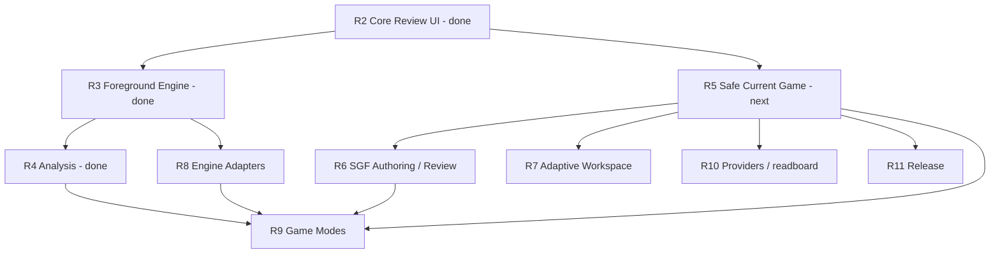
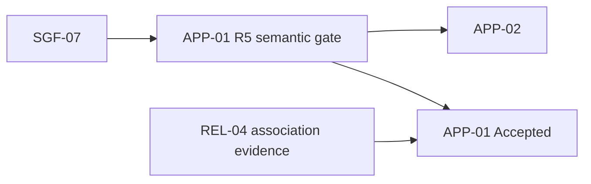
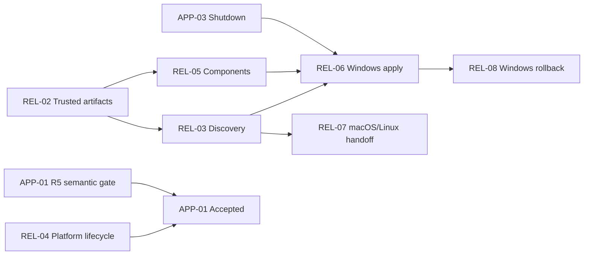

# Migration Plan

## Goal

LizzieYzy Next remains the Tauri 2, Rust, and TypeScript product already implemented in this repository. Migration means reproducing or deliberately replacing observable behavior from the Java/Swing maintenance line; it does not mean translating Java source, preserving Swing internals, importing Java Git history, or restarting the Tauri implementation.

The migration is planned as complete user workflows:

1. Open an SGF, navigate and edit its tree, then save the edited game.
2. Review a game in the core desktop UI without requiring an engine.
3. Configure, start, switch, and stop a foreground KataGo engine safely.
4. Run interactive and whole-game analysis against the selected tree node.
5. Replace the current game safely, shut down, recover the current game, and persist owner-routed settings.
6. Author SGF setup, tree structure, metadata, and markup, and review with scoring, try-play, and board display controls.
7. Persist one adaptive workspace, window geometry, appearance, and main-window always-on-top.
8. Admit multi-backend engine profiles and a Generic GTP game adapter.
9. Run Human-vs-Engine and single-game engine-vs-engine matches.
10. Preview, import, or synchronize games through Yike, Fox, Tencent kifu, and readboard.
11. Install, update, and release Canonical Artifacts on independently admitted platforms.

Each workflow crosses the Rust domain, Rust wire DTO, Tauri gateway, TypeScript API wrapper, React state, UI, and focused evidence that it actually needs. A layer-only milestone is not a migrated workflow.

## Sources Of Truth

- [JAVA_CAPABILITY_INVENTORY.md](JAVA_CAPABILITY_INVENTORY.md) is the exhaustive capability census: Entry Points, defaults, persistence, failure behavior, source references, and runtime-check status against Migration Baseline v1.
- [PARITY_MATRIX.md](PARITY_MATRIX.md) owns item-level disposition, status, evidence, remaining gap, acceptance, and each item's canonical Item Start Prerequisites in `Depends on`.
- This document owns phase membership, Deferred Promotion Gates, Delivery Order, Migration Phase Gates, and exit criteria. It references Matrix-owned Item Start Prerequisites rather than maintaining a second set.
- [ARCHITECTURE_NEXT.md](ARCHITECTURE_NEXT.md) owns architecture, module boundaries, DTO conventions, and command boundaries.
- [JAVA_BASELINE.md](JAVA_BASELINE.md) fixes the Java behavior reference at Migration Baseline v1 (`7b4027531c2b26062d0bfc27a040cc550cfbea4d`). The Next inventory baseline for this audit is `18c6d189b8b01069975c4c40ead63a010249cb8c`.
- [DEVELOPMENT.md](DEVELOPMENT.md) and [RELEASE_CHECKLIST.md](RELEASE_CHECKLIST.md) own environment smoke and release procedures.

Later Java `main` changes do not automatically change this plan. Data, SGF, Go-rule, and engine-correctness defects must be assessed; UX changes are judged individually; Swing-only implementation changes are ignored. Baseline changes follow the successor policy in `JAVA_BASELINE.md`.

Abandoned and Swing-only capabilities remain exclusions in the inventory and matrix. They are not phase work.

## Evidence Model

Progress is parity-driven, not percentage-driven.

| Evidence class | What it proves | What it does not prove |
| --- | --- | --- |
| Repository evidence | A focused fixture, test, build, or exercised command path proves deterministic behavior in this repository. | Real provider sessions, sidecar installation, native file dialogs, packaged asset paths, platform signing, or installer behavior. |
| Native/provider live evidence | A recorded native desktop or external-environment smoke proves the named path under named conditions. | General correctness outside those conditions, repository regressions, or release publication. |
| Repository Release Evidence | Envelope, channel, version, manifest, updater-state, helper, validator, and non-mutating unsigned dry-run proof of contract and artifact shape. | Production publication, signing identity, or installed behavior. |
| Release-environment evidence | The exact tag and commit, CI run, produced Canonical Artifact, channel feed, signing identity/status, Windows timestamp verification, and macOS notarization/stapling result. | Workflow configuration, the presence of secret names, or an installed product. |
| Installed Live Evidence | A recorded exercise of one Canonical Artifact on its target OS: trust state, install or unpack, primary launch, data location, update or handoff, failure recovery, and uninstall or delete. | Build success, repository validation, or another platform's admission. |

An item is accepted only when the acceptance statement in `PARITY_MATRIX.md` is met. Wiring a command plus focused offline evidence is valid repository proof. It must not be described as live Fox/Yike/Tencent/readboard, real KataGo, native desktop, updater, signing, or installer proof until that environment column is also satisfied.

Release items keep the three release classes independent. Repository Release Evidence, including unsigned dry-run, is never substituted for release-environment evidence or Installed Live Evidence. Unavailable credentials, machines, feeds, or infrastructure are `Not run`; the item stays `Missing` or `Partial`.

Screenshots prove only visible layout and presentation. Semantic behavior requires fixtures or exercised interactions. A focused test filter that runs zero tests is not evidence.

## Current Next Baseline

The existing Tauri implementation is the migration starting point and must be preserved.

### Repository-Proven Or Implemented Paths

- Rust workspace, Tauri desktop backend, React/TypeScript/Vite frontend, domain crates, structural validator, CI build paths, and golden SGF fixtures.
- Rust-owned current-game state, tree-shaped DTOs, `NodePath`, SGF mutation/serialization, Go-rule validation, and fresh projections for remaining analysis consumers.
- Native SGF Open/Save/Save As, including cancellation and failed-write preservation; browser preview remains explicitly non-authoritative.
- Variation navigation, legal move/pass editing, branch removal, personal comments, and semantic save/reopen without an engine.
- Board, exact-node analysis presentation, candidate/PV/ownership/policy paths, Java-compatible Move Rank markers, configurable win-rate/score chart, Sub-Board Variation/Raw, and synchronized Variation Replay.
- Persisted engine profiles, asset checks, KataGo command construction, one manager-owned event contract, independent selected-node and first-child-mainline lanes, incremental progress, lane-local cancellation, timeout/error propagation, and exact identity rejection.
- Java-compatible `LZ` / `LZOP` / `LZ2` / `LZOP2` SGF exchange and exact-node attachment. Save / Save As is the only active analysis persistence path; the unshipped SQLite analysis-cache product surface and runtime are removed.
- Yike and Fox runtime fetch/import command paths with normalized DTO/error boundaries.
- readboard probe and protocol-line snapshot parsing/preview command paths.
- Release asset/workflow preflight and compile-oriented dry-run paths.

### Known Workflow Gaps

- `UI-02` remains Partial: there is still no evidence that engine events are delivered while a board mutation promise is pending. That residual does not reopen R4.
- R4 Analysis has exited with all ten owner items plus pulled-forward `PREF-01` and `APP-05` Accepted.
- Remaining R5 work is the `APP-01` semantic gate, `APP-02` window file-drop, remaining `APP-03` teardown timeout/Retry/Exit anyway native evidence, and remaining `APP-04` recovery write-failure prompt. Ticket 06 on candidate `4fd710e` accepted `SGF-07` and recorded successors `UI-06` (Accepted) and `ANA-15` (Partial); `APP-03` and `APP-04` are Partial. R5 has not exited; the `APP-01` semantic gate is not claimed.
- Layout rails are fixed at `228px` and `260px`; splitters, rail visibility, window-geometry reset, and narrow Restore Default are absent.
- Review HUD player labels are hardcoded 黑棋/白棋 rather than root `PB`/`PW` (`REVIEW-09`). Main-window always-on-top is absent (`WINDOW-02`).
- Multi-backend profiles, Generic GTP, and Match Sessions are absent.
- Provider/readboard repository plumbing exists, but live sessions remain unvalidated; Yike ongoing sync and Tencent kifu import are unclaimed; readboard snapshots are previewed rather than synchronized into the active game.
- Signing, notarization, production updater apply/handoff/rollback, bundled installed-runtime resolution, and Canonical Artifact Installed Live Evidence remain incomplete.

These gaps are tracked individually in `PARITY_MATRIX.md`. Provider, adapter, game-mode, and release work stay behind their Migration Phase Gates rather than becoming the next migration frontier.

## Architecture Seams

### SGF Tree And Board Editing

`crates/sgf` continues to own SGF tree semantics, mutation, replay, and serialization. `crates/go-core` owns legal board transitions. React must not reimplement either rule set.

The wire cutover starts in `crates/app-model`, then updates the TypeScript copies in `apps/desktop/src/domain`. The shared location value is `NodePath`: a zero-based child-index path from the root (`[]`, `[0]`, `[0, 1]`). It is a location in the current tree, not a hash, fingerprint, or permanent node identity.

Required invariants:

- The DTO can represent every child, supported property, setup state, move, comment, and metadata value needed by the UI.
- React owns cursor and view state only. Rust remains authoritative for parse, legal edit, replay, and serialize operations.
- A mutation returns the resulting current tree data and a valid cursor path.
- Open creates the current game representation; Save serializes that current representation instead of the original input string.
- Personal comments have a distinct field and edit path from generated analysis or engine-game information.
- All callers move to the tree-shaped DTO in the same cutover; the flat mainline-only product path is removed when no longer used.

### Safe Current-Game Replacement

`SGF-07` is the only in-application replacement seam. Every file, clipboard, GIB, recent, New Document, native activation, drop, and provider/readboard import parses and validates a candidate before the current-game owner commits it. Parse failure, cancelled Save / Discard / Cancel, failed Save, or owner rejection preserves the complete current game: tree, selected `NodePath`, source path, dirty state, review presentation, and recent-file state. Success atomically installs one candidate and clears stale generated presentation.

`APP-01` and `APP-02` dispatch OS activation and drops into this seam. They do not duplicate replacement semantics. Domain-06 import and sync commit through the same seam.

### Desktop Interaction

`BoardCanvas` should emit coordinate, pass, and hover intent through explicit component callbacks. The owning feature state decides whether the intent navigates, edits, or previews. Components continue to call wrappers in `apps/desktop/src/api`; no raw Tauri `invoke` is added to UI components.

Candidate and PV state is scoped to the selected `NodePath` and analysis job identity. Changing node, game, or job clears stale hover and candidate state before new results are presented.

`APP-05` owns one Shortcut Registry: actions, primary keys, visible non-conflicting Java aliases, conflict checks, labels, and the Help / `?` reference. Per-action semantics remain with their owner domains and do not expand accepted `UI-05`.

### Foreground Engine And Analysis Jobs

`crates/engine-manager` becomes the sole owner of:

- Adapter-backed Foreground Engine Run identity and process lifecycle.
- No-engine, starting, ready, switching, stopping, and error state.
- Immutable adapter, profile, and capability snapshots for the current run.
- The zero-or-one Autoload Default persisted with the profile catalog.
- Monotonic switch tokens and failed-switch rollback.
- Selected-node and whole-game analysis job identity, cancellation, and stale-event rejection.

Tauri remains a command/event adapter. React observes lifecycle and job snapshots; it does not infer process identity from the selected profile. Engine Settings edits the catalog and Autoload Default without starting or switching a run. The main-workspace Engine Switcher starts or switches the run.

R3 must at least prove the `KataGoAnalysis` path. `ENG-09` and `ENG-10` extend the catalog and Generic GTP game adapter in R8; their interfaces must not pull that work into R3. Deferred `SSH-01` and `RCOMP-01` create standard Foreground Engine Runs and do not expand `ENG-01` or `ENG-09`.

For A → B switching:

1. Keep A authoritative while B starts and completes its handshake.
2. Promote B only after readiness is proven for the current switch identity.
3. Cancel A-owned jobs, bind new work to B, then stop A.
4. If B fails, keep A as ready and primary. If A no longer exists, yield the explicit no-engine state rather than promoting B.
5. Ignore completion or events whose switch token is no longer current.

Unexpected exit publishes a typed error, cancels that run's jobs, and waits for explicit Restart. Analysis jobs use the current run only when its adapter declares the required capability. A game-only Generic GTP run leaves unsupported analysis actions unavailable instead of starting a hidden dedicated engine.

All analysis callers migrate to the manager-owned lifecycle before the raw profile-to-process path is removed. No compatibility wrapper remains after the cutover.

Foreground Engine Runs, capability snapshots, Analysis Jobs, Match Sessions, and provider sessions never persist across application restart. `APP-04` restores only the current game.

### Durable Preferences And Owner-Routed Settings

`PREF-01` owns the native durable-preference mechanism and one categorized Preferences surface plus contextual entry points. A missing file loads defaults. An unreadable file is isolated, defaults are loaded, and the recovery is reported. An explicit setting changes visible state only after an atomic write succeeds; failure preserves the last durable value and reports the error. Java `config.txt` is never imported.

Semantic effects stay with their behavior owners. `PREF-01` does not claim engine autoload, analysis presentation, board display, sound, scoring, layout, window geometry, appearance, guidance, match rules, provider locators, or update-channel behavior.

### Adaptive Workspace

Next-native preferences own panel proportions. The fixed left/right rail widths become user-adjustable layout state with practical minimums that preserve the board as the primary surface.

Restore Default is intentionally narrow: it resets panel sizes and board proportion only. It does not change rail visibility, window position/size, engine settings, theme, guidance, or unrelated preferences.

### Match Sessions

Start inside `engine-manager` as a small internal coordinator. Do not create a new crate unless real dependency pressure appears.

Public behavior is one global Match Session bound by a Match Reservation that commits only after every profile, capability, exact-position admission, and run-ready check succeeds. Human-vs-Engine and single-game engine-vs-engine matches share `GAME-04` start rules and Compute Budgets. Generated session information never overwrites personal `C`. Double pass hands off to `REVIEW-03`; Stop and protocol failure return to review without fabricating `RE`.

### Providers And readboard

Keep `provider_fetch_yike`, `provider_fetch_fox`, `readboard_sidecar_probe`, and `readboard_sidecar_sync_snapshot` and their typed error boundaries. R10 completes preview, one-shot import, and ongoing synchronization on top of `SGF-07`.

Preview never mutates the current game. One-shot import fetches and parses first, then replaces once through `SGF-07`. Ongoing synchronization starts only from explicit Start sync or Play & Sync; the external source is then authoritative until stop. Play & Sync opens the public Yike room in the system browser and starts matching Next read-only sync; Next does not read browser authentication; stopping Next sync does not close the browser.

Image OCR remains unsupported unless an OCR-capable runtime, explicit parity item, and live evidence are added. Preview-only readboard sync is not complete import parity.

### Release And Installed Runtime

Platform admission is independent. Canonical Artifacts are Windows NSIS and portable, macOS DMG, and Linux AppImage. Extra CI formats stay validation artifacts until a later disposition promotes them.

Installed variants use OS app-data and preserve it by default on removal. Windows portable uses package-local `user-data/`; deleting that directory is destructive. Packages start in No-engine Mode with `app-core` only. Engine Settings acquires signed KataGo backend and default-model components as Managed Installed Components; domain 04 owns the resulting profile and engine-start behavior. A later accepted domain owner may add a separate signed component through `REL-05` without transferring its capability semantics or making that Deferred component an earlier R11 exit; `CONTRIB-01` uses this seam for its Contribution Client Component.

## Dependency Graph

Phase numbers group work and express Delivery Order. They are not Item Start Prerequisites, which remain canonical in [PARITY_MATRIX.md](PARITY_MATRIX.md). This graph records Plan-owned order and gates: R10 and R11 may proceed in either order after their own Migration Phase Gates, and other later phases may become dependency-legal beside a lower number once their hard gates are satisfied; they still must not be pulled into the named Next Executable Batch. Critical Edges may cite Matrix-owned Item Start Prerequisites for readability. Those citations are not a second `Depends on` set and must not be read as strengthening Matrix cells. Delivery Order, including `GAME-02` before `GAME-03`, does not block a start whose Matrix prerequisites are satisfied.

### How To Choose The Next Slice

1. If a Next Executable Batch is named below, do that slice. Do not mix later-phase work into it.
2. Otherwise pick an incomplete active item whose Matrix-owned Item Start Prerequisites are Accepted and whose applicable Plan-owned gate has passed. A named gate may be passed even when its cross-phase item is not yet Accepted. Final-acceptance gates are not Item Start Prerequisites for that item's earlier semantic work.
3. Prefer the lowest-numbered incomplete phase, except R10 and R11 may proceed in either order after their own Migration Phase Gates.
4. Deferred queue items are never phase exits and are never the next slice unless a later plan revision starts them.



Layout, window, and appearance in R7 wait only for `PREF-01`. `GUIDE-01` is Deferred (Ticket 21) and is not an R7 member or exit.

R4 ran after R3 and pulled only `PREF-01` and `APP-05` forward from R5; both are now Accepted. Ticket 06 accepted `SGF-07` and recorded `UI-06`/`ANA-15` without exiting R5 or passing the `APP-01` semantic gate. Remaining R5 sequencing is that gate, then `APP-02`; `APP-03`/`APP-04` stay Partial until their unrun native cases exist.

### Critical Edges

| Dependency | Dependent | Contract |
| --- | --- | --- |
| `ENG-02` | `ENG-03`, `ENG-04`, `ENG-05`, `ENG-06`, `ENG-07` | Manager-owned run identity exists before switch, jobs, autoload start, and recovery. |
| `ENG-03` | `ENG-04` | Failed switch and stale rejection are the failure mode of the same transaction. |
| `ENG-02`, `ENG-05`, `ANA-03` | `ANA-01`, `ANA-02` | One-shot and whole-game work use independent manager-owned lanes. |
| Identity-valid `ANA-01` / `ANA-02` results | `ANA-04` | Presentation consumes only current run/job/node results. |
| `SGF-03`, `ANA-01`, `ANA-03`, `ANA-05`, `PREF-01`, `APP-05` | `ANA-10` | Exact SGF children, comparable current-or-cached analysis, durable mode, and registry-owned `J` exist before the marker is accepted. |
| `UI-01`, `ANA-01`, `ANA-03` | `ANA-11` | Chart presence, selected-node analysis, and independent lanes exist before winrate-chart encoding is accepted. `PREF-01` is the persistence mechanism, not this edge. |
| `UI-01`, `ANA-04` | `ANA-12` | Sub-Board presence and Variation PV drawing exist before the persisted Variation/Raw switch is accepted. `PREF-01` is the persistence mechanism, not this edge. |
| `ANA-04`, `ANA-12` | `ANA-13` | Identity-valid active PV presentation and Sub-Board Variation/Raw exist before one synchronized Variation Replay controls both eligible surfaces. `PREF-01` is the persistence mechanism, not this edge. |
| `ANA-11`, `APP-05` | `EXPORT-03` | Deferred Winrate Chart Image Export consumes the accepted chart encoding and registry-owned `Shift+Alt+S`; `PREF-01` is only the Recent Image Export Directory storage mechanism. |
| `SGF-01` | `REVIEW-09` | HUD player names read current-game root `PB`/`PW`. |
| `ENG-09` | `ENG-10` | Multi-backend catalog and capability snapshot before Generic GTP. |
| `ENG-02`, `ENG-06`, `ENG-07`, `ENG-09` | `SSH-01` | Deferred SSH profiles reuse the shared catalog, Autoload Default, standard Foreground Engine Run, and manual recovery; each admitted stdio adapter owns its SSH compatibility evidence. |
| `ENG-02`, `ENG-07`, `ANA-01`, `ANA-03`, `PREF-01` | `RCOMP-01` | Deferred provider configuration starts explicitly into the standard run and analysis lanes, persists only non-secret settings, and inherits manual recovery. |
| `SGF-07` | `APP-01` semantic gate, `APP-02`, `SGF-08`, `SGF-09`, `SGF-10`, R10 import/sync | One replacement seam. Semantic `APP-01` work starts from this seam only. |
| `APP-01` R5 semantic gate | `APP-02` | One-file drop follows the recorded semantic open/replace contract, never final `APP-01` Accepted. |
| `PREF-01` | `SGF-09`, `REVIEW-03`, `REVIEW-07`, `REVIEW-08`, `WINDOW-02`, `LAYOUT-02`, `LAYOUT-04`, `WINDOW-01`, `APPEAR-01`, `GUIDE-01`, `GAME-04`, `RCOMP-01`, R10 recents | Durable write mechanism only. |
| `APP-03` | `REL-06` | Windows helper launch is followed by Safe Graceful Shutdown. |
| `REL-02` | `REL-03`, `REL-05` | Feeds and managed components consume trusted artifacts. |
| `REL-03`, `REL-05`, `APP-03` | `REL-06` | Windows download/apply. |
| `REL-03` | `REL-07` | macOS/Linux package handoff. |
| `REL-06` | `REL-08` | Rollback is the failure path of Windows apply. |
| `APP-01` R5 semantic gate plus `REL-04` Installed Live association | `APP-01` Accepted | Split graph: semantic gate is R5; `REL-04` is the additional R11 final-acceptance gate only. It is not an Item Start Prerequisite for `APP-01` semantic work or `APP-02`. `APP-01` still owns open/replace semantics. |
| `PROV-01` | `PROV-03` | Public locator/center before ongoing Yike sync. |
| `PROV-01`, `PROV-03` | `PROV-06` | Personal-category discovery reuses the public provider center and hands supported public locators to existing import/sync owners without duplicating them. |
| `PROV-03`, `GAME-01`, `GAME-05`, `PREF-01`, `APP-03` | `PROV-07` | Authenticated Yike read/play reuses external-authoritative sync, sole Match ownership, SGF/review handoff, non-secret preference storage, and bounded teardown; it never creates a second current-game turn owner. |
| `READ-01` | `READ-02` | Sidecar readiness before ongoing sync. |
| `READ-01`, `READ-02`, `GAME-01`, `GAME-05`, `ENG-02`, `ENG-09`, `APP-03` | `GAME-10` | Sidecar capabilities and external-authoritative sync, sole Match ownership and SGF handoff, capability-declared engine execution, and bounded teardown exist before External-board Engine Match is admitted. `GAME-10` never expands the R10 `READ-02` exit. |
| `GAME-01`, `GAME-04`, `GAME-05` | `GAME-02` | Ownership, rules, and SGF handoff before Human-vs-Engine. |
| `GAME-02` (Delivery Order) | `GAME-03` | Deliver the Human-vs-Engine session before integrated single-game PK. This does not block `GAME-03` from starting once its Matrix-owned Item Start Prerequisites are satisfied. |

### APP-01 Cross-Phase Gate

`APP-01` is the only active item split across two phases. Semantic-gate order and final-acceptance order are separate graphs.



- **R5 semantic gate:** cold and warm `.sgf` / `.gib` activation focuses one window and uses `SGF-07`. Save / Discard / Cancel cancellation or failure preserves the current game. This gate may be recorded as passed while `APP-01` is not yet Accepted. `APP-02` one-file drop follows this gate, never final `APP-01` Accepted; multiple files route to deferred `ANA-07` intake and never silently replace the current game.
- **R11 association gate:** `REL-04` supplies per-artifact file association and installed-app launch evidence. It is the additional final-acceptance gate only. Packaging does not own open/replace semantics.
- `APP-01` stays unaccepted until both gates pass. R5 may exit with the semantic gate recorded and `APP-01` still unaccepted.

Ordinary launch evidence stays on accepted `UI-01` / `UI-04` plus `REL-04` installed launch. It is not a second shell item.

### GAME Migration Phase Gate And Delivery Order

R9 must not begin until all of the following are Accepted: `ENG-02`, `ENG-03`, `ENG-04`, `ENG-07`, `ENG-09`, `ENG-10`, `SGF-07`, `APP-04`, `REVIEW-03`, `PREF-01`, and `ANA-04`. Temporary game-only process, tree, preference, or presentation paths are not substitutes.

Delivery Order inside R9 is `GAME-01` + `GAME-04` + `GAME-05`, then `GAME-02`, then `GAME-03`. It does not make `GAME-02` an Item Start Prerequisite of `GAME-03`.

### R10 / R11 Overlap

R10 and R11 numbers are Delivery Order, not a hard edge between them. Either phase may start after its own Migration Phase Gate:

- R10 Migration Phase Gate: `SGF-07`, `PREF-01`, and `APP-03` Accepted.
- R11 Migration Phase Gate: repository release work may proceed at any time for `REL-01`. End-user apply/handoff requires `APP-03` for `REL-06`. `REL-04` association evidence requires the `APP-01` semantic gate. Trusted feeds require `REL-02`.

The only product coupling between R10 and R11 is whether domain 06 later accepts a readboard payload into the `REL-05` installed manifest. That decision is not an R10 or R11 exit. Deferred `CONTRIB-01` may likewise add its separate client through the accepted `REL-05` protocol, but remains outside both phase exits until promoted.

### Owner-Routed Settings

| Observable setting | Owner item | Phase |
| --- | --- | --- |
| Durable file, atomic write, categorized Preferences surface | `PREF-01` | R5 |
| Autoload Default, first-use off | `ENG-06` | R3 |
| Identity-scoped candidates, PV mini-board, ownership, policy, and candidate-limit rendering | `ANA-04` | R4 |
| Next-move Review Marker mode and grading | `ANA-10` | R4 |
| Graph Perspective, series trio, Blunder Bar, Graph Hover, Score Lead Scale | `ANA-11` | R4 |
| Sub-Board Content Mode | `ANA-12` | R4 |
| Variation Replay enablement and interval | `ANA-13` | R4 |
| Dirty-state replacement confirmations | `SGF-07` | R5 |
| Restore last session at launch, default off | `APP-04` | R5 |
| Shortcut primary keys and aliases | `APP-05` | R5 |
| Recent Image Export Directory | `EXPORT-02`, `EXPORT-03` | Deferred |
| Recent SGF/GIB list and clear-history | `SGF-09` | R6 |
| New Document board size and default komi | `SGF-10` | R6 |
| Editable player names and komi | `SGF-13` | R6 |
| Scoring rule, area default | `REVIEW-03` | R6 |
| Coordinates default on, move numbers default off | `REVIEW-07` | R6 |
| Review move sound, default on | `REVIEW-08` | R6 |
| HUD player names from root `PB`/`PW` | `REVIEW-09` | R6 |
| Draggable workspace proportions | `LAYOUT-01` | R7 |
| Persisted workspace proportions | `LAYOUT-02` | R7 |
| Restore panel sizes | `LAYOUT-03` | R7 |
| Rail visibility | `LAYOUT-04` | R7 |
| Window geometry and reset | `WINDOW-01` | R7 |
| Main window always-on-top | `WINDOW-02` | R7 |
| Classic / High Contrast appearance | `APPEAR-01` | R7 |
| Educational tip dismissal and Reset Guidance | `GUIDE-01` | Deferred |
| Adapter kind and adapter-owned profile fields | `ENG-09` | R8 |
| SSH host/port/user/key reference/remote command | `SSH-01` | Deferred |
| Remote-compute provider/endpoint/catalog choice | `RCOMP-01` | Deferred |
| Match start defaults, Compute Budgets, PK max moves | `GAME-04` | R9 |
| Provider locators, recents, sync interval, mute-during-sync, non-secret account references | `PROV-01` … `PROV-07`, `READ-02` | R10 / Deferred |
| Provider Network Policy; no application override or Java-key migration | `PROV-01` … `PROV-07`; `RCOMP-01` when admitted | R10 / Deferred |
| Update channel and source | `REL-03` | R11 |
| Complete locale selection | `I18N-01` | Deferred |
| Contribution account, consent, client component, backend/device, concurrency, and auto-save | `CONTRIB-01` | Deferred |
| Contribute Open Watch / Close Watch | `GAME-09` | Deferred |

Update networking uses the OS proxy through `REL-03`. Next-owned remote-provider HTTP(S)/WebSocket(S) uses Provider Network Policy through `PROV-01`–`PROV-07` and Deferred `RCOMP-01` when admitted; browser-owned authorization traffic stays excluded, and no independent proxy item, application preference, or Java-key migration exists. `CONTRIB-01` is not a Provider: its process-owned Contribution Network Policy supports only a fixed unauthenticated lowercase `https_proxy`, then `http_proxy`, else direct, with no platform resolver, PAC/WPAD, `NO_PROXY`, credential, or fallback claim.

### Traceability Gap Closure

Ticket 16 identified thirteen final owner-route or conflict records without supported Parity Item IDs from Tickets 08–14. Tickets 17–27 assigned twelve records to supported IDs or explicit exclusions. Ticket 28 closes the final autoplay remainder through Missing R4 `ANA-13` Variation Replay and an explicit Engine Continuation exclusion.

All thirteen records now map exactly once to supported Parity Items or explicit exclusions. No traceability gap remains.

| Frozen ID | Resolved item or exclusion |
| --- | --- |
| `SET-NETWORK-PROXY` | Abandoned Java proxy UI/keys. Provider Network Policy on `PROV-01`–`PROV-07`; no proxy Parity Item |
| `SET-NEXT-MOVE` | Missing `ANA-10` |
| `SET-WINRATE-GRAPH` | Missing `ANA-11` |
| `SET-SUBBOARD` | Missing `ANA-12`; heatmap-on-sub and mouse-over freeze Abandoned |
| `SET-MAIN-PANEL` | Missing `REVIEW-09` and `WINDOW-02`; large-sub/large-WR presets and write-into-`C` Abandoned |
| `SET-HINT-AUTOANALYZE` | Excluded with abandoned `CAP-04-ANA-08`; `GUIDE-01` remains Deferred until a Guidance Producer is named |
| `SGF-03-ADJ-SAVE-MORE` | Deferred `EXPORT-03`; Sub-Board Image Export Abandoned |
| `SGF-03-ADJ-AUTOPLAY` | Missing `ANA-13`; Engine Continuation excluded |
| `SGF-03-ADJ-NEXT-HINT` | Missing `ANA-10` |
| `CAP-04-ENG-01` | Deferred `SSH-01` and `RCOMP-01`; neither expands `ENG-01` / `ENG-09` |
| `GM-CONTRIBUTE` | Deferred `CONTRIB-01` service plus Deferred `GAME-09` watcher |
| `CAP-06-YIKE-LIVE-CENTER` | Deferred `PROV-06` and `PROV-07`; public paths stay `PROV-01` / `PROV-03` |
| `CAP-06-READBOARD` | Deferred `GAME-10` for engine play-back; `READ-02` remains sync-only |

### Ticket 10 Roadmap Reconciliation

Independent reconstruction: [research 10](../.scratch/migration-baseline-v1-capability-audit/research/10-reconcile-r3-dependency-roadmap.md). This document owns phase membership, Deferred Promotion Gates, Delivery Order, Migration Phase Gates, and exits. Matrix `Depends on` remains the only Item Start Prerequisite set. Inventory mappings and Matrix item rows were not edited.

**Computed unique Parity Items: 108.** Status split: 16 Accepted, 19 Partial, 46 Missing, 27 Deferred. Independently parsed Plan Deferred IDs: **27**. Matrix and Plan Deferred sets are equal. Reference 27-item equality was compared afterward and was not a stop condition.

Phase membership is that complete Matrix set. R0–R2 remain frozen. R3 remains next and owns Foreground Engine lifecycle (`ENG-02`–`ENG-07`, with frozen `ENG-01`). R4–R11 follow Matrix `Depends on` and recorded dispositions. Deferred items stay in the unnumbered queue; interface existence does not promote them.

Nine Ticket 29 boundaries, under designated authorities:

| Item | Matrix Item Start Prerequisites | Plan authority |
| --- | --- | --- |
| `GAME-03` | `{GAME-01, GAME-04, GAME-05}` | `GAME-02` before `GAME-03` is Delivery Order only |
| `SGF-15` | `{SGF-04, SGF-11, SGF-12}` | Promotion Gate `SGF-07` |
| `SGF-16` | `{SGF-01, SGF-11, SGF-14}` | — |
| `REVIEW-06` | `{SGF-04, REVIEW-01, RULE-01}` | — |
| `ANA-06` | `{ANA-01, ANA-03, ENG-05}` | — |
| `ANA-07` | `{ANA-02, ANA-03}` | Promotion Gate `APP-02` |
| `ANA-09` | `{ENG-09, ANA-04}` | Promotion Gate: named engine/version product evidence; interface existence is insufficient |
| `PROV-05` | `{SGF-07}` | —; `PROV-04` is an exclusion, not a gate |
| `GAME-09` | `{GAME-01, CONTRIB-01}` | Promotion Gate: accepted `GAME-01` and accepted `CONTRIB-01`. `CONTRIB-01` is a `GAME-09` Item Start Prerequisite in the Matrix |

Every numbered phase has a Migration Phase Gate and an exit. Every Deferred item has an explicit Promotion Gate (`—` means no additional condition). Delivery Order does not duplicate or strengthen Matrix `Depends on`. Semantic settings remain with behavior owners. Repository evidence, native/provider live evidence, Repository Release Evidence, release-environment evidence, and Installed Live Evidence stay non-interchangeable.

## Roadmap

### R0 — Baseline And Inventory

**Goal:** Make the migration target immutable and progress auditable.

**Migration Phase Gate:** Historical start of the migration. This phase has exited.

Deliver:

- Migration Baseline v1 with post-baseline governance.
- Stable parity item IDs with repository/live evidence columns.
- A fixture inventory mapping frozen behavior to existing or missing Next evidence.
- Explicit deliberate divergences rather than accidental omissions.

Exit when:

- `BASE-01` is accepted.
- Every active migration claim maps to a parity item.
- The first R1 fixture batch is named and has deterministic expected behavior.

Current state: the baseline and initial matrix are established; maintaining the inventory continues with each slice.

### R1 — SGF And Board Semantics

**Goal:** Complete the local open → navigate → edit → save workflow before more integration work.

**Migration Phase Gate:** Historical. `BASE-01` is accepted. This phase has exited.

Order:

1. Convert the frozen `#317` behavior set into minimal cross-language SGF fixtures and focused Rust expectations.
2. Add the tree-shaped Rust DTO and `NodePath`, then update TypeScript copies and every caller.
3. Replace mainline-only React state with current-game plus cursor/view state.
4. Add parent/child/sibling variation navigation and position replay.
5. Add legal board move/pass editing, branch creation/removal, and personal-comment editing through Rust domain operations.
6. Save the current edited tree and prove semantic reopen.

Exit when:

- `SGF-01` through `SGF-06` and `RULE-01` are accepted.
- A native no-engine smoke opens a branching SGF, navigates branches, edits a move and comment, saves, reopens, and observes the same tree state.
- No product path still treats the first-child move list or original `sgfText` as the authoritative current game.

Current state: accepted through Tickets 01–09. The Windows native run covered launch, navigation, edit/comment/removal, cancel, Save As/reopen, and ACL-denied Save As. Case 6 passed on PID 73980 using `f2c5896` plus the Windows build fix later committed as `8289391`.

### R2 — Core Desktop Review UI

**Goal:** Make the everyday review surface complete and usable without KataGo.

**Migration Phase Gate:** Historical. R1 has exited. This phase has exited. The remaining `UI-02` residual is not this gate and is not the next slice.

Deliver:

- Recorded baseline screenshots and same-state Next comparisons under named display conditions.
- Non-blocking board pointer/keyboard intent.
- Complete variation controls and baseline review shortcuts.
- Candidate hover-preview semantics and stale-state clearing.
- Clear engine-unavailable presentation that does not block SGF work.

Exit when:

- `UI-01`, `UI-03`, `UI-04`, and `UI-05` are accepted.
- Any remaining `UI-02` evidence gap is recorded with an explicit migration disposition.
- Native smoke passes both without an engine and with engine-only actions unavailable.
- Visual evidence follows the reference rules in `DESIGN.md`.

Current state: Ticket 07 closeout on native Windows candidate `66c906f` / PID 51344 accepted `UI-01`, `UI-03`, `UI-04`, and `UI-05`. `UI-02` remains Partial solely for engine-event delivery while a board mutation promise is pending. That residual is tracked in `PARITY_MATRIX.md` and is not the next executable slice.

### R3 — Foreground Engine Lifecycle

**Goal:** Replace profile-as-selection with one adapter-backed Foreground Engine Run.

**Owns:** `ENG-02`, `ENG-03`, `ENG-04`, `ENG-05`, `ENG-06`, `ENG-07`. Accepted `ENG-01` remains the KataGo analysis profile and asset-check foundation and is not reopened.

**Migration Phase Gate:** R2 has exited. `UI-02`'s residual engine-event gap is not this gate.

**Delivery Order:**

1. `ENG-02` Foreground Engine Run identity and lifecycle (Slice R3-A).
2. `ENG-05`, `ENG-06`, and `ENG-07` after `ENG-02`.
3. `ENG-03` transactional A → B switch.
4. `ENG-04` failed switch and stale-identity rejection.

This order governs coherent R3 delivery. `ENG-03` may start once its Matrix-owned Item Start Prerequisite `ENG-02` is satisfied; listing it after `ENG-05` / `ENG-06` / `ENG-07` is Delivery Order only. `ENG-04` still waits for `ENG-03`.

**Deliver:**

- Manager-owned no-engine / starting / ready / switching / stopping / error snapshot, including an immutable adapter/profile/capability snapshot. The R3 proof path is `KataGoAnalysis`.
- Dedicated Stop and explicit Restart. Stop cancels every run-owned job, then terminates the process. Restart replaces the run from current saved profile data; it does not mutate a live run in place.
- Engine Settings versus Engine Switcher. Settings never start, switch, or mutate a run. Editing the active profile reports pending changes until Restart.
- Autoload Default as zero-or-one marked profile, first-use off, persisted with the catalog. Startup with a mark validates and starts that profile; failure leaves no engine without falling back to another profile. Changing the mark does not change the current run.
- Successful A → B promotion and failed-B rollback. The active profile cannot be deleted.
- Typed start, asset, protocol, nonzero-exit, timeout, and cancellation outcomes scoped to the current run. Unexpected exit waits for manual Restart.
- Manager-owned cancellable selected-node job identity with latest-request-wins publication and stale-result rejection.
- Clean migration of analysis callers away from raw profile process startup.

R3 acceptance is the `KataGoAnalysis` run lifecycle. `ENG-09`, `ENG-10`, analysis product items, Match Sessions, and Deferred engine/analysis items belong to later phases.

**Exit when:**

- `ENG-02` through `ENG-07` are accepted.
- Repository evidence covers start / Stop / Restart, immutable snapshots, Autoload Default persistence, A → B promotion and rollback, active-profile deletion guard, typed failure, cancellation, and stale identities, plus a controlled JSONL selected-node job start / cancel / supersede / stale-reject path.
- Real KataGo smoke proves ready, Stop, Restart, and two-profile switch.
- Native smoke proves no-engine, one-engine, and two-profile switch behavior with real KataGo assets.

Current state: Ticket 09 closeout on `90508df` accepted `ENG-02` through `ENG-07`. Native Autoload-failure banner evidence is Ticket 10 candidate SHA256 `54a66f7e956bd89c2fef8664d494c2dba0b87fa9b6bc3e96030f7b2877365a98`. R3 has exited. Recorded non-blockers (`ENG-04` delayed/stale fixture, `ENG-07` timeout fixture, native Restart-from-Error, real timeout) are not R3 reopenings.

### R4 — Analysis

**Goal:** Bind selected-node and first-child-mainline analysis to exact SGF nodes and R3 run/job identity, make Java-compatible SGF analysis the only durable source, expose Java-compatible next-move grading and chart encoding, persist Sub-Board Content Mode, and replay one active PV coherently across eligible analysis surfaces.

**Owns:** `ANA-01`, `ANA-02`, `ANA-03`, `ANA-04`, promoted `ANA-08`, and `ANA-10` through `ANA-14`. Accepted `ANA-05` remains frozen historical evidence; successor `ANA-14` supersedes its active runtime. `PREF-01` and `APP-05` retain R5 ownership but were pulled forward as prerequisites for the complete R4 batch.

**Migration Phase Gate:** `ENG-02` through `ENG-07` accepted.

**Delivery Order:**

1. Close R5 prerequisites `PREF-01` and `APP-05` without pulling the rest of R5 forward.
2. `ANA-03` unifies one run-owned job-event contract and independent UI state for selected-node and whole-game lanes.
3. `ANA-01` completes exact selected-node analysis; `ANA-02` completes root-plus-first-child-mainline analysis with incremental node results.
4. `ANA-04` binds candidates, PV, ownership, policy, and the mini-board to identity-valid exact-node results.
5. `ANA-08` adds Java-compatible SGF primary/secondary analysis parsing, projection, and primary serialization.
6. `ANA-14` attaches completed results without advancing generation, establishes dirty/save-while-running behavior, and removes the SQLite cache product path.
7. Add the shared fixed Java Auto six-rank Move Rank, then deliver `ANA-11` chart encoding and `ANA-12` Sub-Board Content Mode.
8. `ANA-13` adds synchronized Variation Replay after `ANA-12`.
9. `ANA-10` adds the Off / Variations / Graded board marker after SGF attachment, `PREF-01`, and registry-owned `J` exist.

Shared DTO, Tauri event, `App.tsx`, `AppChrome`, and preference changes were serialized through the integration owner; no temporary persistence or duplicate contract remains.

**Delivered:**

- One job-event contract carrying lane, run, job, generation, and exact `NodePath`; the selected-node and whole-game entries expose independent progress and cancellation. Selected-node supersession never cancels whole-game work.
- Capability-admitted exact selected-position analysis with normalized results, typed failure, cancellation, supersession, and stale identity fences.
- One single-stage whole-game session over root `[]` and repeated first-child paths only, with exact node-linked progress, occupied rejection, and completed-node retention after cancel/failure.
- Exact-node candidates, PV mini-board, ownership, policy, score, and candidate-limit rendering. Navigation during whole-game analysis preserves other nodes' results.
- Java-compatible SGF analysis exchange: read `LZ` / `LZOP` / `LZ2` / `LZOP2`; preserve malformed, secondary, unknown, and personal `C`; write or replace only canonical primary `LZOP` at root and `LZ` elsewhere; write no companion Analysis Context.
- Incremental exact-node attachment that marks the current game dirty without advancing generation. Save / Save As includes the invocation-time completed snapshot while jobs continue; later completion dirties again. Automatic cache preferences, status UI, frontend API, Tauri commands, and analysis-cache storage code are removed without migration for unshipped development data.
- Persisted Next-move Review Marker (`Off` / `Variations` / `Graded`) with visible and registry-owned focus-safe `J` entry points. Graded compares any positive-visit selected-node/Primary-Child primary pair as Java did, with no context gate or warning.
- Fixed Java default Auto Move Rank: Best, Good, Normal, Inaccuracy, Mistake, Blunder; winrate-loss boundaries 1/3/6/12/24 percentage points and score-loss boundaries 0.5/1.5/3/6/12. Custom thresholds and modes are not delivered.
- Winrate-chart Graph Perspective, Winrate Line / Score Lead Line, last-three-rank Blunder Bar, Graph Hover, and Score Lead Scale. Chart presence stays `UI-01`.
- Persisted Sub-Board Variation / Raw switch. Heatmap-on-sub is not delivered.
- Persisted default-off Variation Replay with validated 500 ms default interval, exact PV identity, one synchronized main-board/Sub-Board prefix, hidden-surface pause/resume, full-PV disable/end behavior, and no current-game or Analysis Job mutation. Engine Continuation is not delivered.

**Exit evidence:**

- `ANA-01` through `ANA-04`, promoted `ANA-08`, and `ANA-10` through `ANA-14` are Accepted. Pulled-forward prerequisites `PREF-01` and `APP-05` are Accepted without claiming the rest of R5.
- Repository evidence covers exact-node publication, concurrent lanes, lane-local supersession, first-child path mapping, progress, partial-result retention, typed failure, Java LZ import/export, dirty/save snapshot behavior, complete SQLite-path removal, six-rank boundaries, marker modes, chart encoding, Variation/Raw, deterministic Variation Replay, durable preferences, and the shortcut registry/reference.
- Controlled and real KataGo evidence covers response validation, timeout, stderr error, cancellation, stale results, incremental first-child-mainline attachment, Graded marker, score-lead data, and active PV updates.
- WSL workspace tests, Windows workspace tests, desktop Vitest, TypeScript checking, and Windows `cargo fmt --all -- --check` passed on integration commit `602106b53b2d52f7c9d7ee2c534979c824ea69ac` before this documentation closeout.
- Windows native smoke exercised concurrent lanes and lane-local cancel; Save while analysis continued; partial A versus final B snapshots and native reopen; fresh Java-compatible SGF analysis preservation; marker/chart/Sub-Board/Replay behavior; Help/`?` focus safety; preference restart/restoration; and unchanged legacy cache metadata.

Current state: R4 has exited. `ANA-05` remains an immutable historical acceptance record only; `ANA-14` owns its deliberate runtime replacement. Java generated-statistics mutation of personal `C`, a companion Analysis Context property, custom Move Rank settings, Engine Continuation, full-variation-first pause, separate Java replay threads, dual interval fields, and `EXPORT-01`/`EXPORT-02` remain outside this exit.

### R5 — Safe Current Game And Application Shell

**Goal:** Make current-game replacement, shutdown, recovery, and the durable-preference mechanism safe before authoring, workspace, provider, and release apply work.

**Owns:** `PREF-01`, `SGF-07`, `APP-02`, `APP-03`, `APP-04`, `APP-05`, the `APP-01` semantic gate, and successors `UI-06` and `ANA-15` (not additional exit items).

**Migration Phase Gate:** R1, R2, and R3 have exited, so the gate is satisfied; R4 has also exited. `PREF-01` and `APP-05` were accepted early in R4. `SGF-07` is Accepted from Ticket 06. Remaining R5 work is the `APP-01` semantic gate and `APP-02`; do not treat Partial `APP-03`/`APP-04` as phase exit.

**Delivery Order:**

1. `PREF-01` durable preferences and `APP-05` Shortcut Registry are already Accepted from R4 closeout.
2. `SGF-07` safe replacement is Accepted from Ticket 06.
3. Finish named residual native evidence for Partial `APP-03` (stuck-resource 10s timeout / Retry / Exit anyway) and Partial `APP-04` (recovery write-failure prompt).
4. Pass the `APP-01` semantic gate after `SGF-07`; do not wait for final `APP-01` Accepted.
5. `APP-02` window file-drop dispatch after the recorded `APP-01` semantic gate.

**Deliver:**

- Native durable preferences without importing Java configuration or absorbing owner-domain behavior.
- Parse-before-replace current-game installation, including clipboard paste into `SGF-07`.
- One-file drop follows the passed `APP-01` semantic gate; multiple supported files are explanatory and do not mutate the current game until `ANA-07` is started.
- Shutdown uses Save / Discard / Cancel. Initial Cancel does not interrupt. After confirmed leave, cancelled or failed Save keeps the engine, stops analysis, and does not complete exit. After save or discard, persist owned state and stop owned resources. A teardown timeout names the stuck resource and offers Retry or contextual “Exit anyway.”
- Recovery restores SGF tree, personal comments, current `NodePath`, source path, and dirty state only. Layout persists separately. Engine processes, analysis jobs, Match Sessions, and provider sessions are never resurrected. Normal-launch restore stays default off.
- One Shortcut Registry and searchable Shortcut Reference.

**Exit when:**

- `PREF-01`, `SGF-07`, `APP-02`, `APP-03`, `APP-04`, and `APP-05` are accepted.
- The `APP-01` semantic gate is recorded as passed. `APP-01` itself remains unaccepted pending `REL-04`.
- Native restart smoke proves preference durability and review-only recovery.
- Shutdown smoke proves cancelled save aborts exit and successful teardown stops every currently owned resource.

Current state: R5 has not exited. Ticket 06 native closeout on candidate `4fd710e` (Windows 11, Ticket 07 KataGo, worktree `safe-current-game-06`) accepted `SGF-07` and successor `UI-06`, recorded successor `ANA-15` as Partial, and moved `APP-03`/`APP-04` from Missing to Partial. Native File Exit, WM_CLOSE Cancel, clean `clean_completed`, Restore/Discard without resurrecting engine or jobs, and Q9 Save As cancel (engine kept, analysis stopped) were exercised. Not run: stuck-resource 10s timeout / Retry / Exit anyway; recovery write-failure prompt; native analysis failure presentation. The `APP-01` semantic gate is not recorded. R9 still requires Accepted `APP-04`; R10 still requires Accepted `APP-03`.

### Analysis Restoration — Continuous Current-node Analysis

**Goal:** Restore continuously updated current-position review after the safety/input batch, before R6/R7 expansion, without reopening R4's historical exit.

**Owns:** `ANA-06`, now Accepted after repository and Windows integrated verification on a06d600. This named supplemental batch preserves R0–R11 numbering and all existing owner scopes.

**Migration Phase Gate:** The Matrix-owned Item Start Prerequisites are Accepted and the [continuous-analysis spec](../.scratch/continuous-analysis-restoration/spec.md) plus [ticket set](../.scratch/continuous-analysis-restoration/issues/) are approved. The already-available preference, shortcut, input and safe-document mechanisms are reused. Full R5 exit, final `APP-01` acceptance, and future file/drop workflows are not new start prerequisites.

**Delivery Order:** 01 manual continuous streaming/cancellation/safe snapshots → 02 durable intent/following and holds → 03 configurable continuous budgets → 04 finite handoff and whole-game coexistence → 05 integrated native verification. Operational 06 is read-only ledger closeout and explicitly waits for terminal feature 04 and verification 05. The first slice already owns queue safety and fixed-limit completion; automatic following cannot ship before its inhibition rules.

**Exit when:** `ANA-06` has the spec's repository and real-engine/native acceptance evidence. Valid progress, actual targeted cancellation, contextual controls, budgets, finite handoff, logical lane coexistence, Save and recovery agree under failure and stale identities. Q15 Run failure is distinguished from normal Q9/Q14 cancellation. A ready spec or completed Closeout is not this exit.

**Current state:** Tickets 01–05 satisfy this exit on committed candidate `a06d600b0f16bd6bb61415a2907c5d839e53a0b1`. Windows real KataGo 1.16.4 evidence covers streaming, target-final cancellation, one/two-thread lanes, finite restoration, contextual controls, time/visits limits, Save/reopen, departure inhibition, controlled cancellation failure and last-successful-envelope recovery. The [verification record](../.scratch/continuous-analysis-restoration/issues/05-integrated-native-acceptance.md) separates reused repository checks from native observations and unrun platform/600-second soak checks. Ticket 06 remains the read-only ticket-set Closeout.

The [independent R5 native failure-evidence ticket](../.scratch/r5-native-failure-evidence/issues/01-native-failure-evidence.md) can start separately and keeps `APP-03`, `APP-04`, and `ANA-15` evidence attribution. Neither batch silently accepts the other or admits a core-review replacement claim.

### R6 — SGF Authoring And Review

**Goal:** Complete in-application SGF intake and the remaining no-engine authoring/review tools on top of `SGF-07`.

**Owns:** `SGF-08` through `SGF-14`, `REVIEW-01`, `REVIEW-02`, `REVIEW-03`, `REVIEW-07`, `REVIEW-08`, `REVIEW-09`.

**Migration Phase Gate:** `SGF-07` and `PREF-01` accepted.

**Delivery Order:**

1. `SGF-08` GIB import, `SGF-09` recent kifu, `SGF-10` New Document.
2. `SGF-11` setup editor, `SGF-12` structural tree editing, `SGF-13` metadata, `SGF-14` markup.
3. `REVIEW-01` direct navigation, `REVIEW-02` try-play, `REVIEW-03` scoring, `REVIEW-07` board display, `REVIEW-08` move sound, `REVIEW-09` HUD player names.

**Deliver:**

- Tygem GIB intake through `SGF-07`, then Save As SGF only.
- Deduplicated persisted recents for successful SGF/GIB file opens, reopened through `SGF-07`.
- File New / Clear Board as one untitled document at `NodePath []`.
- Interactive setup, delete/undo/redo/promote/return-to-main, player names and komi, and supported marks.
- Exact `NodePath` selection from the Next tree/list, an isolated try-play sandbox, and area/territory scoring with Confirm Result writing root `RE`.
- Persisted coordinate and move-number booleans, and default-on sound for successful local moves, passes, and forward review navigation.
- HUD player slots show current-game root `PB`/`PW`; missing or blank names show 黑棋/白棋. No board overlay and no name-visibility preference.

**Exit when:**

- `SGF-08` through `SGF-14` and `REVIEW-01`, `REVIEW-02`, `REVIEW-03`, `REVIEW-07`, `REVIEW-08`, and `REVIEW-09` are accepted.
- Fixtures cover GIB handicap/pass/malformed preservation, New Document cancellation, setup/markup save/reopen, try-play non-mutation, and scoring Confirm Result.
- Native smoke covers GIB open, recent reopen, New Document, scoring confirm, display/sound persistence across restart, and HUD names from a named SGF.

Accepted `SGF-01` through `SGF-06`, `RULE-01`, `UI-01`, `UI-03`, `UI-04`, and `UI-05` stay at their original scope.

### R7 — Adaptive Workspace

**Goal:** Persist one user-adjustable review workspace without concentrating semantic settings here.

**Owns:** `LAYOUT-01`, `LAYOUT-02`, `LAYOUT-03`, `LAYOUT-04`, `WINDOW-01`, `WINDOW-02`, `APPEAR-01`.

**Migration Phase Gate:** `PREF-01` accepted. `GUIDE-01` is Deferred (Ticket 21) and is not an R7 member or exit.

**Delivery Order:**

1. `LAYOUT-01` draggable proportions.
2. `LAYOUT-02` persisted proportions and `LAYOUT-03` narrow restore.
3. `LAYOUT-04` rail visibility, `WINDOW-01` geometry, `WINDOW-02` always-on-top, `APPEAR-01` appearance.

**Deliver:**

- Draggable left/board/right proportions with practical minimums. Java one-key large-sub / large-WR presets are not this deliverable.
- Debounced atomic layout persistence; save failure keeps the session usable and visibly retryable.
- Restore Default resets panel sizes and board proportion only.
- Left and right rails visible by default, independently collapsible, persisted through `PREF-01`.
- Window geometry validated against current displays; automatic reset only when saved geometry is invalid; explicit reset changes window geometry only.
- Main-window always-on-top, first-use off, persisted through `PREF-01`. Analysis-frame and blunder-table always-on-top stay out of scope.
- Curated Classic default and High Contrast alternate. Chrome and text follow system DPI.

**Exit when:**

- `LAYOUT-01` through `LAYOUT-04`, `WINDOW-01`, `WINDOW-02`, and `APPEAR-01` are accepted.
- Native restart smoke proves proportions, rail visibility, window geometry, always-on-top, and appearance.
- Reset smoke proves unrelated visibility, engine, and owner-routed settings are unchanged.

### R8 — Engine Adapters

**Goal:** Extend accepted KataGo-only profiles into an adapter catalog and a bounded Generic GTP game adapter before Match Sessions.

**Owns:** `ENG-09`, `ENG-10`.

**Migration Phase Gate:** `ENG-02` through `ENG-07` accepted. This phase is a GAME prerequisite, not part of R3 or R9.

**Delivery Order:**

1. `ENG-09` multi-backend profiles and declared capabilities.
2. `ENG-10` Generic GTP game adapter.

**Deliver:**

- One catalog with stable profile identity, adapter kind, shared executable/argument/working-directory fields, and adapter-owned settings. Save validates the adapter contract atomically. A run snapshots verified capabilities; profile edits remain pending until Restart or switch.
- Generic GTP handshake, exact-position synchronization, Compute Budget mapping, and typed command/parse/timeout/exit/unsupported-capability outcomes. Cancellation and stale run/job/game identities cannot publish a move.
- Unsupported actions disabled or rejected before process or current-game mutation. Rich-analysis extensions are not this phase.

**Exit when:**

- `ENG-09` and `ENG-10` are accepted.
- Repository evidence covers profile/capability handshake, GTP fixtures, exact-position admit/reject, budget mapping, and stale-identity non-publication.
- Real-engine evidence includes one supported non-KataGo GTP handshake, exact position sync, `genmove`, budget mapping, and Stop.
- Native smoke shows capability labels and pre-invocation unsupported-analysis explanation.

### R9 — Game Modes

**Goal:** Add Human-vs-Engine and single-game engine-vs-engine Match Sessions without mixing them into review-state inference.

**Owns:** `GAME-01`, `GAME-02`, `GAME-03`, `GAME-04`, `GAME-05`.

**Migration Phase Gate:** `ENG-02`, `ENG-03`, `ENG-04`, `ENG-07`, `ENG-09`, `ENG-10`, `SGF-07`, `APP-04`, `REVIEW-03`, `PREF-01`, and `ANA-04` are Accepted.

**Delivery Order:**

1. `GAME-01` match ownership and transactional start, `GAME-04` shared rules and Compute Budgets, `GAME-05` SGF/review handoff.
2. `GAME-02` Human-vs-Engine.
3. `GAME-03` single-game engine-vs-engine.

This order governs coherent R9 delivery; `GAME-03` may start earlier once its Matrix-owned Item Start Prerequisites are satisfied.

**Deliver:**

- One coordinator owning Idle/Starting/Playing/Paused/Ending/Error and the sole current-game Match Session.
- All-or-nothing reservation: failure preserves the prior board, dirty state, source path, selected `NodePath`, foreground run, and durable defaults.
- Shared new-versus-continue start model. New-game defaults are 19×19, komi 7.5, handicap 0.
- Human match: one human role and one engine run, legal human move/pass, resign, Stop, and role-based live-analysis policy only when capabilities permit.
- PK match: two distinct run identities, pause/resume, Stop, double pass, max moves, and per-side typed failure.
- Committed moves update the domain-03 current game. Generated information stays out of personal `C`. `APP-04` recovery never restores a Match Session or Engine Run.

**Exit when:**

- `GAME-01` through `GAME-05` are accepted.
- Controlled JSONL and GTP fixtures cover handshake, exact-position admission, Compute Budgets, all-or-nothing start, one-session exclusion, pause/resume, Stop, failure, and stale rejection.
- SGF fixtures cover new and continued positions, handicap/setup admission, resign `RE`, double-pass scoring handoff, save/reopen, and review-only recovery.
- Real-engine smoke covers one KataGo JSONL Human-vs-Engine move and Stop, a two-process KataGo PK start/pause/resume/Stop path, and one supported non-KataGo GTP engine.
- Native smoke covers visible new/continue/pass/resign/Stop and PK start/pause/resume/Stop, failure-to-review, save/reopen, and restart without a live session.

Fixture-only backend evidence cannot mark a GAME item Accepted.

### R10 — Providers And readboard

**Goal:** Complete external preview, one-shot import, and ongoing synchronization on the R5 replacement and shutdown seams.

**Owns:** `PROV-01`, `PROV-02`, `PROV-03`, `PROV-04`, `READ-01`, `READ-02`, `READ-03`. Accepted `READ-03` remains the OCR-unsupported foundation.

**Migration Phase Gate:** `SGF-07`, `PREF-01`, and `APP-03` accepted. Engine lifecycle is not required for `PROV-01`, `PROV-02`, `PROV-04`, or `READ-01`.

**Delivery Order:**

1. `PROV-01` Yike preview/import and `READ-01` sidecar readiness.
2. `PROV-02` Fox preview/import and `PROV-04` Tencent kifu preview/import.
3. `PROV-03` Yike ongoing sync / Play & Sync after `PROV-01`.
4. `READ-02` readboard ongoing sync after `READ-01` and `SGF-07`.

**Deliver:**

- Native provider center for public Yike `recommend` / `local` and recognized URL families, including unite rooms. Preview never mutates the current game; Import uses one-shot `SGF-07`.
- Fox `chessid` / `uid` / `user_name` and Tencent username/`chessId` preview, pagination, bounded recents, and one-shot import. Fox is not live sync and is not combined with Tencent.
- Yike Start sync and Play & Sync under the ongoing-synchronization model. Play & Sync is dual-channel: system browser for that room's login and webpage moves; Next public read-only signed path only. Native account-authorized read/play is Deferred `PROV-07`, not an R10 expansion.
- Sidecar probe/ready/incompatible/unavailable/timeout/restart as `READ-01`; equivalent one-way external-authoritative sidecar sync as `READ-02`, including disconnect and stop-to-editable.
- `PROV-01`–`PROV-07` shared contracts: Yike 10s deadline; Fox and Tencent 20s connect and 25s read; at most three retries after the initial attempt, and only for idempotent transient reads; provider writes never automatically retry; ignore stale results; preserve last-good board on failure. `PROV-01`–`PROV-06` persist no provider user secret. Deferred `PROV-07` may persist one provider-issued authorization only in the System Credential Store; Deferred `RCOMP-01` owns its separate confirmed System Credential Store/session-only contract.
- `PROV-01`–`PROV-07`, plus Deferred `RCOMP-01` when admitted, resolve process-environment override, Windows/macOS platform proxy including system-owned PAC/WPAD, or Linux proxy environment variables on every Next-owned remote HTTP(S)/WebSocket(S) request; honor `NO_PROXY` and redirect destinations; and exclude system-browser traffic, local readboard, inbound WebBoard, SSH, and updates.
- Proxy authentication and TLS trust are system-managed. Next stores no proxy credentials, adds no custom-CA or certificate bypass, never falls back direct, and preserves provider state while sanitized source/`host:port` diagnostics offer Retry.

**Exit when:**

- `PROV-01` through `PROV-04` and `READ-01` through `READ-03` are accepted.
- Repository evidence names concrete non-zero focused tests for parsers, URL families, atomic import/sync transitions through `SGF-07`, cancellation, stale-result suppression, timeout/retry classification, last-good recovery, and stop-to-editable. Shared Provider Network Policy fixtures prove precedence, `NO_PROXY`, per-target/redirect resolution, HTTP(S) routing, platform-resolved PAC, no-direct fallback, system trust, and sanitization; WebSocket evidence becomes due with the first admitted WebSocket provider item.
- Live evidence is separate per mode and records public Yike categories, every accepted Yike URL family, Play & Sync handoff, Fox and Tencent lookup plus pagination, upstream failure and latency, and readboard ready/sync/disconnect/restart. Before a Shipped Platform accepts its first remote-provider path, installed live evidence also records its platform proxy source, `NO_PROXY`, a real HTTPS provider operation, and an operator-installed enterprise CA; Windows/macOS additionally cover fixed system proxy and PAC. WebSocket live evidence becomes due with its provider item.

`PROV-05`–`PROV-07`, `RCOMP-01`, `PUB-01`, and `GAME-10` do not block this exit. Deferred provider items require no current live evidence and inherit Provider Network Policy when admitted. `PROV-06` promotion first proves guest Personal semantics; `PROV-07` promotion requires its official authorization plus per-family read/write, System Credential Store, sole-Match, and Installed Live Evidence contracts. Deferred `GAME-10` requires no current engine play-back evidence and does not expand `READ-02`; promotion requires its own repository and Installed Live Evidence. Existing Partial plumbing is evidence toward the numbered R10 items, not completion.

### R11 — Release

**Goal:** Turn repository builds into independently admitted, updateable, supportable desktop releases.

**Owns:** `REL-01` through `REL-10` and final `APP-01` acceptance.

**Migration Phase Gate:** `REL-01` may proceed at any time as a maintainer gate. `REL-06` requires `REL-03`, `REL-05`, and `APP-03`. `APP-01` final acceptance requires the R5 semantic gate plus `REL-04` association evidence.

**Delivery Order:**

1. `REL-01` preflight/dry-run.
2. `REL-02` trusted production artifacts, then `REL-03` discovery/offer and `REL-05` managed installed components.
3. `REL-04` platform package lifecycle per Canonical Artifact, independently.
4. `REL-06` Windows download/apply after `REL-03` + `REL-05` + `APP-03`.
5. `REL-07` macOS/Linux handoff after `REL-03`.
6. `REL-08` failure/rollback/recovery after `REL-06`.
7. `REL-09` diagnostics/support bundle and `REL-10` product identity in parallel.



**Deliver:**

- Validators and non-mutating dry-run on the exact release commit, with their limits stated. This is not publication proof.
- Signed envelopes and verified payloads on stable/beta feeds. Windows production artifacts are Authenticode-signed and timestamped; macOS artifacts are signed, notarized, and stapled. Unsigned public-validation prereleases are labeled as such and never enter an updater feed.
- Help-triggered manual discovery: stable/beta, official/GitHub, persisted valid choices, SemVer comparison, OS proxy, and typed no-update/no-package/network/signature failures without mutating the install.
- Independent Installed Live Evidence for Windows NSIS, Windows portable, macOS DMG, and Linux AppImage, including declared runtime, data location, upgrade, and uninstall/delete. Installed removal preserves app-data by default. Portable launch covers present and absent WebView2.
- Installed manifest of `app-core` plus acquired KataGo backend/default-model components. No-engine launch works without optional components. Later domain-owned components, including an admitted `CONTRIB-01` client, join only after their owner is Accepted and do not retroactively expand the R11 exit.
- Windows NSIS and portable component apply with resume/cancel/fallback, helper elevation when required, shutdown only after successful helper launch, manifest update, and restart without changing user data.
- macOS/Linux verified full-package download and DMG/folder handoff without overwriting the running tree.
- Windows reverse rollback, result journal, restored-version restart, and incomplete-restoration repair path. Maintainer GitHub-release withdrawal is not this item.
- Bounded ordinary logs default on, full trace default off, sanitized cancellable support-bundle export, and About that reads the packaged SemVer and channel.

**Exit when:**

- Global release items `REL-01` through `REL-05`, `REL-09`, and `REL-10` are accepted, and `APP-01` is accepted after its R5 semantic gate plus `REL-04` association evidence.
- Each Shipped Platform additionally accepts only its applicable branch and Installed Live Evidence row: Windows requires `REL-06` and `REL-08`; macOS and Linux require `REL-07`. Windows-only `REL-06`/`REL-08` and macOS/Linux-only `REL-07` are not required for every platform. Platform-inapplicable items are not required.
- Each Shipped Platform has its own production-trust gate and complete Installed Live Evidence row. An unshipped platform does not block admitting another.
- Unsigned artifacts remain explicitly labeled unsigned.
- Dry-run and other Repository Release Evidence are not substituted for release-environment or Installed Live Evidence.

Linux may publish an AppImage without a repository/package-manager signature only when updater envelope/payload verification and release notes state the exact trust and dependency contract.

### Deferred Queue

These items are stable and unnumbered. Each has an owner and a Plan-owned Promotion Gate in addition to its Matrix-owned Item Start Prerequisites; `—` means no additional promotion condition. None is an R3–R11 exit criterion until a later plan revision starts it.

| ID | Owner | Promotion Gate | Admission |
| --- | --- | --- | --- |
| `I18N-01` | Preferences surface | After functional migration | Complete resources for every supported locale, persisted locale, deterministic fallback, no mixed partial-language state. |
| `GUIDE-01` | Guidance | Later disposition names a Guidance Producer whose owner is in a numbered phase | Leave Deferred only after a later disposition names a Guidance Producer whose owner is in a numbered phase (`Missing`/`Partial`/`Accepted`). The same ticket may admit the owner and name the producer. Persist dismissals only for named Educational Tips; dedicated Reset Guidance re-enables those tips; Safety Confirmations stay non-dismissible. `SET-HINT-AUTOANALYZE` is excluded with `CAP-04-ANA-08`. `ANA-06` ponder-limit and Ticket 25 GMA/readboard notices do not auto-start this item; later naming is allowed after those owners are in a numbered phase. Unnamed persist-dismiss stays with the producing capability. Empty Reset Guidance is not acceptance-sized. |
| `SGF-15` | SGF authoring | `SGF-07` | Explicit setup/move semantics, bounds/occupancy validation, reversible edits, non-mutating rejection, save/reopen. |
| `SGF-16` | SGF authoring | — | Whole-tree color swap, rotate, and mirror with consistent coordinate-bearing properties. |
| `REVIEW-04` | Review | — | Deterministic branch traversal to matching moves; no-match is non-mutating. |
| `REVIEW-05` | Review | does not reopen accepted `UI-05` history | Validated persisted main-board interval only. Does not reopen `UI-05` history. |
| `REVIEW-06` | Review | — | Reproducible ladder predicate; failure does not partially mutate the tree. |
| `EXPORT-01` | SGF authoring | — | Selected root-to-leaf branch as standalone SGF without mutating tree order, source, cursor, or dirty state. |
| `EXPORT-02` | Review | — | Current main-board review view to a documented image format without changing current-game or review state; successful image writes share the Recent Image Export Directory with `EXPORT-03`. |
| `EXPORT-03` | Analysis export | — | At least one identity-valid selected-line point; invocation-time frozen `ANA-11` encoding; deterministic 1600 × 600 PNG with fixed perspective/series labels and no hover or application chrome; File → 更多保存 and registry-owned `Shift+Alt+S`; native default name; shared Recent Image Export Directory updated only on success; confirmed atomic overwrite; cancel/failure preserves target and all application state. |
| `ENG-08` | Engine catalog | — | User-directed catalog reorder persists identities without changing Settings selection, Autoload Default, active run, pending edits, or job binding. |
| `SSH-01` | SSH engine execution | — | One shared catalog; non-secret SSH profile fields plus System Credential Store/session-only fallback; every admitted stdio adapter preserves its declared capabilities; explicit Autoload Default marking; standard run, typed failure, explicit Restart, no local fallback or restart recovery; bounded deadlines fixed on promotion; repository and per-Shipped-Platform live evidence. |
| `CONTRIB-01` | Contribution service | — | Promote only for official `katagotraining.org` with a separate signed client component built from an admitted KataGo tag for Windows/Linux CUDA and macOS Metal. Require versioned consent, System Credential Store/session-only fallback, argv-safe ephemeral config, Contribution Network Policy, curated backend/device and 1–16 games (default 1), one globally exclusive typed run, terminal auth/config/version failures, one cancellable 60-second reconnect window, explicit Retry, 30-second graceful-to-force Stop, no respawn/recovery, explicit component repair, default-off user-directory per-game auto-save, narrow local-data clearing, sanitized repository evidence, and a real production upload plus lifecycle/component/proxy/credential/save evidence on every Shipped Platform. Other services, custom commands/SSH, ONNX, `+bs50`, ROCm, OpenCL, raw config, and raw console require a successor or remain excluded. Service actions appear only after acceptance. |
| `ANA-07` | Analysis | `APP-02` | Session-only SGF queue. Must not replace or dirty the current game. Queue state is not restored after restart. |
| `ANA-08` | Analysis | — | Frozen Java analysis-header import and Next export/reopen. No false SQLite↔SGF sync claim. |
| `ANA-09` | Engine adapters | Named engine/version product evidence | Named engine/version fixtures into the existing analysis model. Missing fields stay unavailable. Interface existence does not start this item. |
| `GAME-06` | Game modes | — | Session-only PK batch with durable completed-game output. Restart does not restore an unfinished queue. |
| `GAME-07` | Game modes | a separately approved clock policy | Application-owned remaining-time model. A Compute Budget timeout is not this item. |
| `GAME-08` | Game modes | a HumanSL-compatible profile | Independent AI Coach Match Session, not a hidden option of `GAME-02`. |
| `GAME-09` | Game modes plus contribution service | accepted `GAME-01`, accepted `CONTRIB-01` | Promote only as an explicitly opened watcher for an active Contribution Run. A transient tree selects active contributed games, navigates moves, and follows the latest move without replacing or dirtying the authoritative current game. Close Watch restores the exact prior game/cursor while contribution continues; Pause retains an open watcher; Stop Contribution, failure, or exit closes and restores; restart restores neither run nor watcher. Automatic rotation/next-game playback, non-19 filtering, result/rules/console controls, manual batch Save All, and service/network/auto-save ownership stay outside this item. No disabled watcher entry appears before acceptance. Repository fixtures and real-service Installed Live Evidence on every Shipped Platform prove exact preservation, stale-game rejection, navigation, Pause, Close, Stop/failure restoration, and restart. |
| `GAME-10` | Game modes plus readboard | does not expand the R10 exit | Promote as one External-board Engine Match item only after active external-authoritative sync, target and per-mode engine capabilities, Match ownership, SGF handoff, and teardown are accepted. Final-decision and Leading-candidate modes share one Armed/Pending lifecycle and authoritative-snapshot commit rule. Promotion fixes bounded deadlines, adds the item to a numbered phase without expanding R10, and requires deterministic repository evidence plus real sidecar/target Installed Live Evidence for both modes on every admitted platform. |
| `PROV-05` | Providers | —; `PROV-04` is an exclusion, not a gate | Non-Yike Tencent/huanle live protocols as a separate item from kifu import. |
| `PROV-06` | Providers | — | Keep Recommend as default and category/page session-only. Promote only after real guest Personal semantics, pagination/filter/outcome fixtures, and explicit public-locator handoff are proven. If authentication is required, remain Deferred until a later plan revision adds `PROV-07`; never absorb account auth or duplicate import/sync. |
| `PROV-07` | Providers plus game modes | — | Promote only with one documented provider-supported Yike account authorization, System Credential Store persistence, bounded clearable locator recents, and an explicitly named initial locator-family set. Transactional Start and session switch prove account/side/exact-position/turn admission, visible provider-authoritative clock gating, sole Match ownership, one Pending Provider Move, Move/Pass/non-dismissible-confirmed Resign, exact readback commit, alternate-successor authority, no write retry, bounded read retry, Error/Reconcile reservation, warned Stop/Disconnect, authoritative terminal `RE`, and no live-session recovery. Repository evidence and per-Shipped-Platform live evidence cover every admitted family, credential lifecycle, Provider Network Policy, timeout/auth expiry, conflict, and restart. |
| `RCOMP-01` | Remote compute providers | — | Separate provider configuration with both Zhizi and Custom `ws/wss` modes; explicit start into a standard run; System Credential Store/session-only fallback; Provider Network Policy; typed failure, explicit Restart, no session rebuild/local fallback/restart recovery; per-mode repository and per-Shipped-Platform live evidence; bounded deadlines fixed on promotion. |
| `PUB-01` | Providers | — | LAN board publish start/stop and copy-access URL. Trial internals stay excluded. |

## Next Executable Batch

R4 Analysis has exited with `ANA-01`–`ANA-04`, promoted `ANA-08`, `ANA-10`–`ANA-14`, `PREF-01`, and `APP-05` Accepted. Ticket 06 accepted `SGF-07` without exiting R5. Remaining executable R5 work is the `APP-01` semantic gate and `APP-02`; `APP-03`/`APP-04` need their unrun native cases before Accepted. Do not pull R6–R11 work into that slice; `ENG-09` / `ENG-10` and the `UI-02` residual remain separate.

Slice R3-A (Foreground engine identity and lifecycle) is complete. The historical scope below is audit record, not the current batch.

### Slice R3-A — Foreground engine identity and lifecycle

Scope:

- Give `engine-manager` an authoritative no-engine / starting / ready / stopping / error snapshot with an immutable adapter/profile/capability snapshot.
- Expose that snapshot through Tauri commands and events.
- Stop treating profile selection as process identity.
- Keep Engine Settings edits from starting or switching a run.
- Prove this path with `KataGoAnalysis`. Leave Generic GTP and multi-backend catalog acceptance to R8.

Acceptance:

- `ENG-02` is accepted with repository evidence and native no-engine versus one-engine smoke.
- Analysis callers observe manager-owned identity rather than inferring a process from the selected profile.

`ENG-06` stays in R3 with default off and catalog persistence, but it is not this first slice.

## Verification Strategy

For each slice:

1. Run the narrowest fixture, crate test, frontend build/type check, or controlled process check that exercises the changed contract.
2. Run native desktop smoke when the changed behavior depends on Tauri, app data, file dialogs, process lifecycle, or visual interaction.
3. Run provider or sidecar live smoke only for the R10 modes in that item's acceptance statement, recorded separately from repository evidence.
4. For R11, record Repository Release Evidence, release-environment evidence, and Installed Live Evidence as distinct rows. Do not promote an item on dry-run or unsigned validation alone.
5. Update the affected parity rows with the exact evidence and remaining gap.
6. Broaden to workspace-wide validation only when a shared DTO or command boundary makes scoped checks insufficient; use a full suite at most once as the integration gate for that batch.

Structural and release validators remain bounded gates, not substitutes for feature evidence:

```bash
python3 scripts/validate_scaffold.py --verbose
python3 scripts/validate_release_assets.py --verbose
python3 scripts/validate_release_workflow.py --verbose
```

Use the scaffold validator when workspace, command, or document structure changes. Use the release validators in R11 or when release-support files change.

Provider/readboard acceptance must name the concrete Rust package or test filter and confirm that tests executed. Live environment results stay separate and follow `DEVELOPMENT.md`.

## Parallel Execution

When a slice is parallelized:

- One owner controls Rust domain/wire/Tauri changes.
- One owner controls TypeScript API/state/UI changes after the wire contract is fixed.
- One owner controls planning, smoke/release documentation, and parity evidence.
- Release workflow work remains a separate ownership area.
- Shared DTO and command contracts are decided before parallel edits.
- Parent integration owns focused validation; workers do not run repository-wide suites while sibling changes are incomplete.
- Reviewers may inspect all areas but do not silently rewrite another owner's files.

After R3 exits, R4, R5, and R8 may be assigned in parallel when their Migration Phase Gates are satisfied. R10 and R11 may overlap after theirs. R9 waits for the GAME Migration Phase Gate.

## Migration Principle

The Java/Swing codebase is a frozen behavior reference, not the implementation skeleton for Next. Begin each item with observable behavior and the smallest evidence that would catch its loss. Implement that behavior behind the established Tauri/Rust/TypeScript boundaries, migrate every caller, remove the obsolete path, and record repository and live evidence separately.